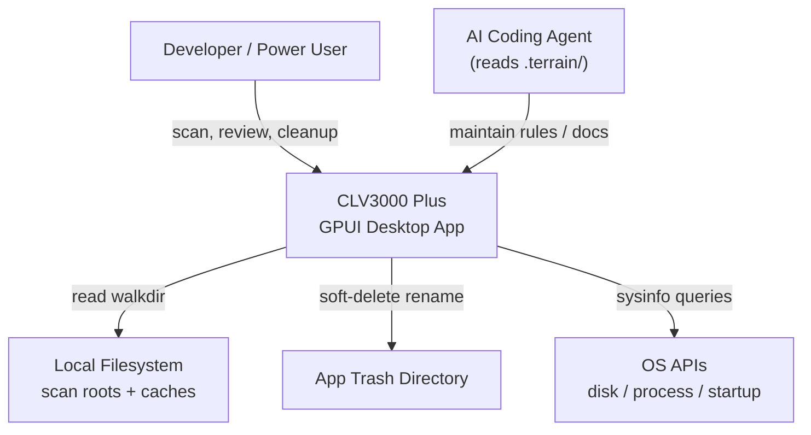

# CLV3000 Plus

If you have used Claude Code, Cursor, Codex, Trae, or similar AI coding tools, you have probably accumulated project folders you never opened again — each carrying `node_modules`, `target`, agent caches, and session logs that quietly consume tens of gigabytes. CLV3000 Plus is a native desktop utility built in Rust that scans your development directories, explains what can be removed in plain language, and deletes only what you explicitly select — usually via soft-delete to an app-managed trash folder so mistakes are recoverable.

The app targets macOS, Windows, and Linux. It is deliberately local-only: no network calls, no telemetry, no cloud account. Its standout capability is **AI agent experiment detection** — recognizing folders left behind by coding agents and surfacing structured reasons (marker files, naming patterns, long inactivity) that generic disk cleaners do not understand.

## What It Can Do

CLV3000 Plus combines a fast filesystem scanner, a risk-aware deletion engine, and a GPUI-native interface into one lightweight package. Think of it as a specialized housekeeping service for developer machines that speak both "human" (simple mode) and "engineer" (expert mode).

**Agent leftover discovery** — Scans for marker directories (`.cursor`, `.claude`, `.agents`, etc.), `AGENTS.md` / `CLAUDE.md` files, and known agent CLI session paths (Codex, Claude, Cursor, Trae, OpenCode, TraeX). Projects are grouped with `AgentReasonPart` explanations rendered in Chinese, English, or Japanese.

**Multi-stack build cache cleanup** — Matches 133+ typed rules across Rust, Node, Android, iOS, Flutter, Python, .NET, Go, Unity, and more. Rules live in `crates/clv-core/src/settings/project_rules.rs` and `global_rules.rs`, with descriptions as stable `RuleDescription` IDs (R001–R133).

**Safe deletion workflow** — Items carry `RiskLevel::Safe | Caution | Protected`. Only Safe items are pre-selected. Soft-delete (default) moves paths to an app trash directory; permanent delete is optional. Protected system paths are blocked in `crates/clv-core/src/paths.rs`.

**System utilities** — Dashboard disk usage (`clv-platform/disk.rs`), process viewer with kill (`process.rs`), and startup item management (`startup.rs`) round out the workstation toolkit.

## C4 Context Diagram

The diagram below shows who uses the system, what stays inside the app boundary, and which external resources are touched — all on the local machine.

The critical design choice visible here is the **narrow write boundary**: besides settings JSON and trash moves, the app does not modify arbitrary system locations. Scanning is read-heavy; deletion is explicit and user-driven.

## Technology Choices

Rust was chosen for the same reasons Codex-family tools use it: predictable performance on filesystem walks, low memory overhead, and safe concurrency when background scan threads feed the UI. GPUI provides a GPU-rendered native UI without embedding a browser runtime.

| Domain | Choice | Why |
|--------|--------|-----|
| Language | Rust (edition 2024) | Fast directory traversal, memory safety |
| UI | GPUI 0.2 + gpui-component | Native desktop, low resource use |
| Workspace layout | 3 crates: clv-app, clv-core, clv-platform | Pure domain logic separated from OS/UI |
| Traversal | walkdir (depth 8) | Controlled project tree walks |
| System info | sysinfo | Cross-platform disk and process data |
| Settings | serde_json in config dir | Simple, inspectable persistence |
| i18n | Typed enums + JSON codegen | Stable rule IDs across zh/en/ja |

## Scope: What It Does and Does Not Do

**In scope** — Reclaiming disk from build artifacts, tool caches, virtual environments, and AI agent sessions; explaining each item with translated rule text; expert mode for full paths and protected items; trilingual UI.

**Out of scope** — Cloud backup, remote machine scanning, malware removal, automatic silent deletion, or modifying source code inside projects. The scanner may list a `target` or `node_modules` directory; it does not parse or refactor your application code.

**Source references** — Application entry: `crates/clv-app/src/main.rs:23`; domain exports: `crates/clv-core/src/lib.rs`; central state: `crates/clv-app/src/app/state.rs:57`.
