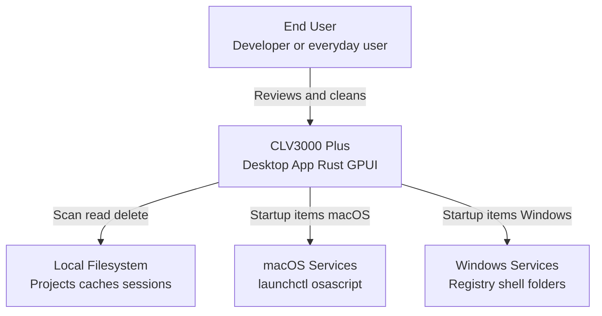

# CLV3000 Plus

If you use AI coding agents—Cursor, Claude Code, Codex, Windsurf, Trae, OpenCode, or similar—you have probably accumulated trial projects, fat `node_modules` folders, Rust `target` directories, and session logs that quietly consume tens of gigabytes. CLV3000 Plus is a lightweight desktop app for macOS and Windows that scans your machine, explains what each reclaimable item is, how much space it uses, and lets you delete safely after review.

Built in Rust (the same performance-oriented stack as Codex), the app stays fast and low on CPU and memory even on older hardware. It is designed for semi-technical and everyday users who want clarity before clicking "clean," with an optional Expert mode for developers who want full paths and finer control.

## What It Can Do

**Agent project discovery**—The scanner groups cleanup hits by project root and applies heuristics: agent marker files (`.cursor`, `AGENTS.md`), name patterns (`cursor`, `codex`, `agent`), and "zombie" projects untouched for 30+ days. You see a dedicated Agent view with reasons in plain language.

**Multi-stack cache cleanup**—Hundreds of `CleanupRule` entries in `crates/clv-core/src/settings.rs` cover Rust (`target`), Node (`node_modules`, `.next`, `.vite`), Python (`__pycache__`, `.venv`), Android/iOS build outputs, .NET `bin/obj`, Unity `Library`, Terraform `.terraform`, and global tool caches (Cargo registry, npm, Gradle, pip).

**Agent tool session data**—`discover_agent_session_targets()` in `crates/clv-core/src/agent_sessions.rs` maps known paths for Codex sessions, Claude Code projects, Cursor chat history, Windsurf/Trae caches, OpenCode storage, and WorkBuddy traces—with risk labels separating safe caches from irrecoverable conversation history.

**System utilities**—Startup item toggle (macOS LaunchAgents/login items; Windows Registry Run keys and Startup folders) and a process viewer with kill support via `clv-platform`.

**Safe defaults**—Soft-delete moves items to an app trash folder (`soft_delete: true` by default); `RiskLevel::Safe` items are pre-selected; Protected items (e.g. Rust toolchains) are hidden in Simple mode.

## C4 Context Diagram

The diagram below shows CLV3000 Plus as a local desktop system interacting only with the filesystem and OS services—no cloud dependency.

The intentional boundary is **local-only operation**: the app never uploads file lists or paths to a server. All intelligence is rule-based heuristics plus user-configured scan roots.

## Technology Choices

Rust was chosen for memory safety and predictable performance during deep directory walks. GPUI provides a native GPU-accelerated UI without embedding a full browser runtime. Configuration is a single JSON file—no database server to install or maintain.

| Area | Choice | Why |
|------|--------|-----|
| Language | Rust (edition 2024) | Fast scans, safe concurrent file ops |
| UI | GPUI 0.2 + gpui-component | Native desktop, custom themes |
| Workspace | 3 crates: core, platform, app | Clear separation of logic vs OS vs UI |
| Persistence | serde JSON settings | Simple, inspectable user config |
| FS traversal | walkdir + custom sizing | Controlled depth, skip `.git` |

## Scope: What It Does and Does Not Do

**It does:** Scan configured directories; classify reclaimable build caches and agent artifacts; soft-delete with trash recovery; manage startup items and list/kill processes on macOS/Windows; support zh/en/ja UI and four visual themes.

**It does not:** Run unattended cloud backups; repair registry beyond startup approval flags; support Linux startup management fully; guarantee recovery of deleted session JSONL (Caution items are labeled explicitly); or replace full-disk encryption or antivirus tools.

It is a **focused disk hygiene companion for the agent era**—not a general PC optimizer that touches every corner of the OS.
