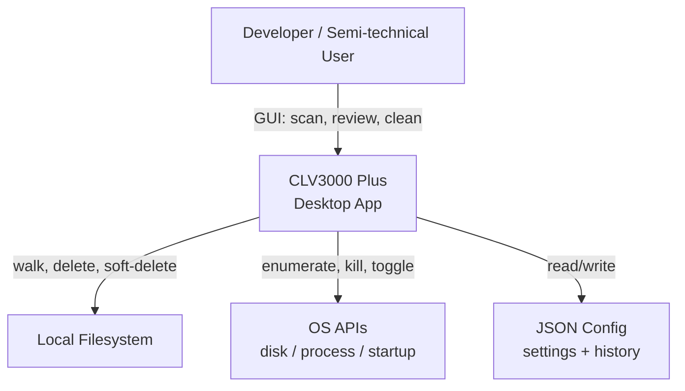

# CLV3000 Plus

If you use AI coding agents—Cursor, Claude Code, Codex, Windsurf, and the rest—you have probably left behind a trail of half-finished projects, fat `node_modules` folders, and agent session caches that quietly consume tens of gigabytes. CLV3000 Plus is a native desktop app for Windows and macOS that scans your machine, explains what can be removed in plain language, and lets you clean up only after you have reviewed the list.

Think of it as a disk janitor that understands developer workflows: it knows what `target/` means, which Cursor folders are safe to clear, and which toolchains you should probably not touch unless you are in expert mode.

## What It Can Do

**Agent-aware cleanup**—The app does not just grep for large folders. It looks for agent markers (`.cursor`, `AGENTS.md`, `.agents`, and similar), groups related scan hits into trial projects, and tells you why each project was flagged—long unused, agent markers present, inactive for 30+ days.

**Multi-stack cache detection**—A large rule catalog in `clv-core` covers Rust (`target`, `.cargo`), Node (`node_modules`, npm/pnpm caches), Python, Android, iOS, Flutter, .NET, Go, and more. Global caches under your home directory are scanned separately from per-project build outputs.

**Simple vs expert mode**—Everyday users see human-readable rule descriptions and only "safe" items selected by default. Expert mode exposes full paths, protected toolchains, and broader selection.

**System utilities beyond cleanup**—Startup item management (macOS LaunchAgents / Windows Registry), process list with kill action, disk health on the dashboard, customizable themes and zh/en/ja localization.

## C4 Context Diagram

The diagram below shows who uses the system, what sits inside the app boundary, and which OS services it relies on.

The app has no network dependency for core features; everything runs locally on the user's machine.

## Technology Choices

CLV3000 Plus is built in Rust with the same performance mindset as Codex-class tooling: native binary, thin release profile (LTO, strip), and worker threads for disk-heavy work so the UI stays responsive.

| Area | Choice | Why |
|------|--------|-----|
| Language | Rust 2024 | Memory safety, fast filesystem walks, single static binary |
| UI | GPUI 0.2 + gpui-component | GPU-accelerated native UI (Zed ecosystem) |
| Workspace layout | 3 crates: `clv-app`, `clv-core`, `clv-platform` | Clear separation: UI / domain / OS |
| Persistence | JSON via `directories` | Zero setup; per-user config on each OS |
| Scanning | `walkdir` + rule engine | Predictable, extensible rule catalog |
| OS metrics | `sysinfo` | Cross-platform disk and process data |

Entry point: `crates/clv-app/src/main.rs` loads settings, initializes GPUI, and opens the main window at 1280×720.

## Scope: What It Does and Does Not Do

**In scope**

- Scanning user-configured roots and known global cache locations
- Risk-rated cleanup with optional soft-delete trash
- Agent project heuristics and session/cache paths for major coding agents
- macOS and Windows startup and process management pages

**Out of scope**

- Linux desktop parity for startup management
- Remote or cloud storage cleanup
- Server-side accounts, sync, or telemetry backends
- SQL database or migration-based persistence

The product intentionally stays local-first: your disk layout never leaves your machine unless you share files yourself.
