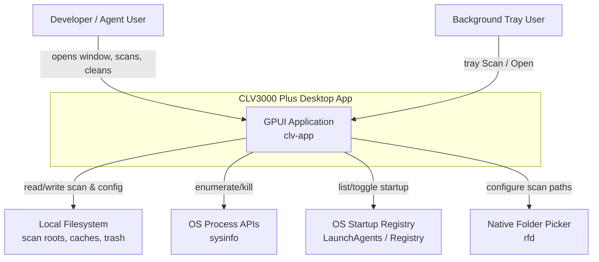

# CLV3000 Plus

CLV3000 Plus is a native desktop utility that helps developers and AI-agent users reclaim disk space on their workstations. If you have ever spun up a quick experiment with Claude Code, Cursor, Codex, or similar tools and forgotten about the folder, you know the problem: each abandoned project carries `node_modules`, build caches, and agent session data that quietly consume tens of gigabytes. This app scans your machine, explains what it found in plain language, and lets you delete safely—with an undo path via app-managed trash.

Built in Rust with the GPUI framework (the same technology family as Codex), the app stays lightweight: fast scans, low CPU and memory, and no Electron overhead.

## What It Can Do

The app's capabilities orbit around one idea: **make disk cleanup understandable before it becomes destructive**.

**Agent leftover detection**—Unlike generic cleaners, CLV3000 Plus recognizes AI coding agent experiment folders by name patterns, marker files (`.cursor`, `AGENTS.md`), and inactivity signals. It also scans known session cache locations for Claude, Cursor, Codex, Trae, and OpenCode. You see project name, size, why it was flagged, and how long it has been idle before deciding.

**Multi-stack build artifact cleanup**—The scanner understands 13+ technology stacks (Rust `target/`, Node `node_modules/`, Python `.venv/`, Android `build/`, and more) via a typed rule table with 140+ descriptions in three languages.

**Safe deletion with restore**—By default, cleanup moves items to an app-managed trash folder rather than permanently deleting them. Cleanup history tracks freed space over 7/30/90 days, and individual items can be restored from the Dashboard.

**System utilities**—Startup item management, process viewer with kill support, large-file surfacing during scan, disk health dashboard, and a system tray for quick scans.

## C4 Context Diagram

The diagram below shows who uses the system and what external resources it touches. Everything stays on the local machine—there is no cloud backend.

The key design choice visible here: the app is a **local trust boundary**. It never phones home; all destructive capability is gated by user selection and risk levels inside the app.

## Technology Choices

Rust was chosen not just for raw speed but because filesystem-heavy workloads benefit from memory safety without a garbage collector pause. GPUI provides GPU-accelerated native rendering—lighter than wrapping a web view. JSON file persistence keeps configuration transparent and editable without introducing a database server for a single-user desktop tool.

| Technology area | Choice | Why |
|----------------|--------|-----|
| Language & runtime | Rust (edition 2024) | Fast directory walks, low idle footprint, memory safety |
| UI framework | GPUI 0.2 + gpui-component | Native GPU UI vs Electron bundle size |
| Filesystem traversal | walkdir | Reliable recursive directory walking |
| Persistence | serde_json + directories crate | Simple local config under XDG-style paths |
| Process info | sysinfo 0.39 | Cross-platform process enumeration |
| System tray | tray-icon + muda | Native menu bar integration |
| i18n | Typed enums + codegen | Prevents mixed-language display bugs |

## Scope: What It Does and Does Not Do

**In scope**: Scanning configured directories and known global caches; detecting agent experiment projects and session data; soft-delete cleanup with history and restore; trilingual UI (Chinese, English, Japanese); Simple and Expert display modes; startup and process management on supported platforms.

**Out of scope**: Cloud sync or remote management; automatic deletion without confirmation; package re-installation after cache cleanup; network-based telemetry; malware or content analysis. The app tells you what *can* be removed—it never removes anything you have not explicitly selected.
