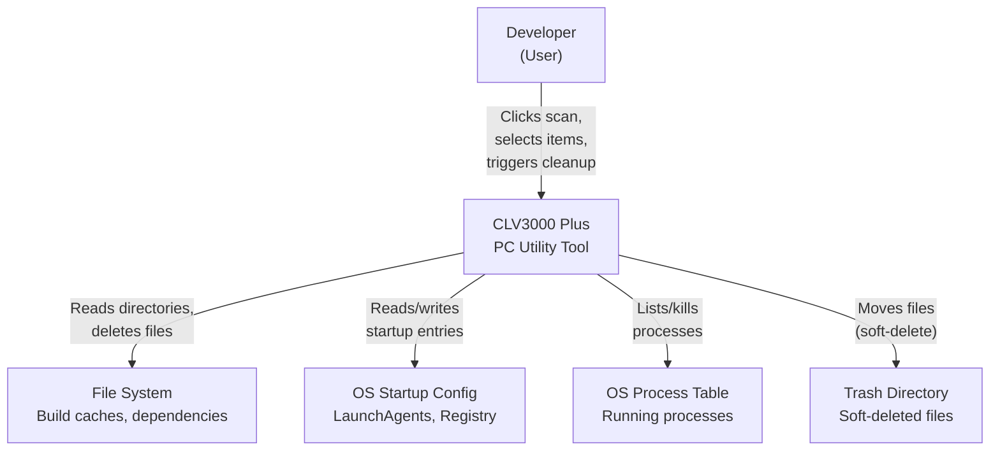

# CLV3000 Plus

Every developer knows the feeling: you open your laptop, glance at your disk usage, and wonder where all those gigabytes went. The answer is usually hiding in plain sight -- `node_modules` folders from projects you abandoned months ago, `target/` directories from Rust builds that took forever, Xcode derived data that's been piling up since 2023, and a growing collection of AI agent experiment projects that you created with Claude, Cursor, or Codex and promptly forgot about.

CLV3000 Plus is a native desktop utility that solves this problem. Built with Rust and GPUI for maximum performance, it scans your development directories, identifies cleanable artifacts across 13 technology stacks, and helps you reclaim disk space safely. Its standout feature is the ability to detect AI coding agent experiment projects -- a capability no other cleanup tool offers.

## What It Can Do

CLV3000 Plus's core capabilities read like a maintenance checklist for a developer's workstation. Each feature addresses a specific pain point that accumulates over time.

**Smart Cleanup** -- Scans your configured directories (~/Projects, ~/Documents, ~/Desktop, etc.) and identifies build caches, dependency directories, and temporary files across Rust, Node.js/Web, Python, Java, Android, iOS, Flutter, KMP, .NET, and C/C++ projects. Each item is classified with a risk level (Safe / Caution / Protected) so you know exactly what's safe to remove.

**Agent Project Detection** -- Automatically identifies experiment projects created by Claude, Cursor, Codex, Copilot, Windsurf, Aider, Devin, Bolt, v0, Replit, and other AI coding agents. Uses both directory name patterns (14 patterns) and marker files (`.cursor/`, `.claude/`, `AGENTS.md`, etc.) to spot these projects, even when they're buried deep in your file system.

**Startup Item Management** -- Lists and toggles macOS LaunchAgents, login items, and Windows registry startup entries. Shows impact levels (High/Medium/Low) to help you decide what's worth keeping.

**Process Management** -- Displays running processes sorted by memory, CPU, or name, with the ability to terminate resource-hungry processes directly from the app.

**Dual Mode** -- Simple mode (default) shows only safe items with human-readable descriptions, hiding protected paths and risky operations. Expert mode reveals full paths, more cleanable items, and advanced options.

## C4 Context Diagram (System Overview)

The following diagram shows CLV3000 Plus in its ecosystem -- who uses it, what it talks to, and where its boundaries lie. The system is fundamentally a local workstation tool with no cloud dependencies.

The diagram reveals a key design decision: CLV3000 Plus is a local-only tool. There are no network connections, no cloud APIs, and no telemetry. All operations happen on the user's machine, which means the tool works offline and never sends your file paths or project data anywhere.

## Technology Choices and the Thinking Behind Them

The choice of Rust + GPUI wasn't just about being modern. For a utility that needs to traverse potentially massive directory trees and compute sizes for thousands of files, Rust's performance and memory safety are essential. GPUI provides a native GPU-accelerated UI without the overhead of Electron or Tauri -- no bundled Chromium, no WebView dependency, just a lean native binary.

| Technology Domain | Specific Choice | Why This Choice |
|------------------|----------------|----------------|
| Language | Rust (edition 2021) | Memory safety + high performance for file I/O heavy work |
| UI Framework | GPUI 0.2.2 + gpui-component 0.5.1 | Native GPU-accelerated UI, no web technology overhead |
| File System | walkdir 2 + directories 6 | Recursive traversal + platform-standard config/data paths |
| System Info | sysinfo 0.39 | Cross-platform process enumeration and termination |
| Serialization | serde + serde_json | Settings persistence in human-readable JSON |
| Error Handling | anyhow + thiserror | Flexible application errors + typed library errors |
| Logging | tracing + tracing-subscriber | Structured logging with environment filter |
| Platform (macOS) | plist 1 | LaunchAgent plist file parsing |

## What CLV3000 Plus Can and Cannot Do

Understanding a tool's boundaries is just as important as understanding its capabilities. CLV3000 Plus makes deliberate choices about what it does and doesn't attempt.

**What it does**: Identifies and cleans build caches and dependency directories for 13 technology stacks. Detects abandoned AI agent experiment projects. Manages startup items on macOS and Windows. Provides process visibility and termination. Offers a safe-by-default cleanup experience with soft-delete and 7-day trash retention.

**What it does not do**: It doesn't monitor your file system in real-time -- scans are triggered manually. It doesn't integrate with IDEs or terminals. It doesn't track historical cleanup data or provide analytics. It doesn't work on Linux for startup items (processes and cleanup work fine). It doesn't clean Docker images, browser caches, or system updates -- those are outside its scope.
