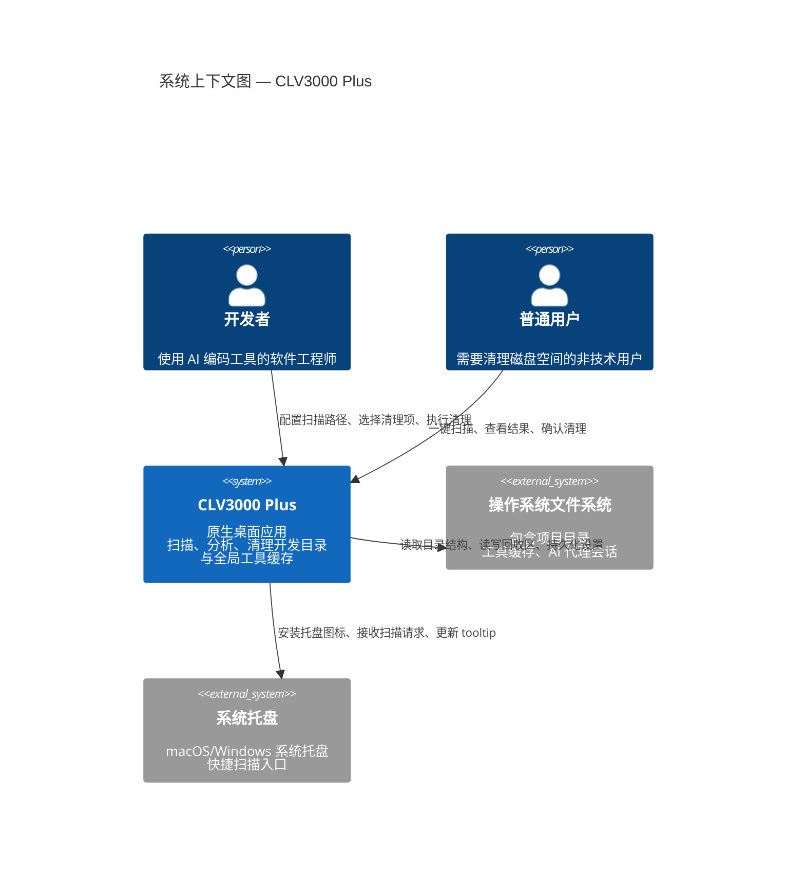

# CLV3000 Plus

如果你是一位开发者，大概率经历过这样的场景：终端里敲 `df -h`，发现系统盘只剩下 12GB，其中 40GB 消失得无影无踪。你翻遍 `~/Projects`，发现里面有几十个项目——Rust 的 `target`、Node 的 `node_modules`、Python 的 `.venv`，还有几个月前用 Claude Code 跑的一个实验性项目，从未被打开过第二次。每一个都在静静地吞噬磁盘空间，而你甚至不知道它们加起来占了多少。这种"磁盘空间慢性失血"是开发者的日常痛点，现有工具要么只能处理单一技术栈，要么要求你手动指定目录，要么干脆是一个 Web 应用——用 Web 来清理文件系统，总让人觉得哪里不对。

CLV3000 Plus 的设计初衷就是解决这个问题。它是一款原生桌面应用，扫描你配置的开发目录和全局工具缓存，基于预定义规则识别 13 种以上技术栈的可清理构建产物，并通过回收区机制安全删除——整个过程不需要你了解任何技术细节。与传统的磁盘清理工具不同，CLV3000 Plus 理解开发项目的结构：它知道 Rust 项目里 `target/` 是编译缓存，Node 项目里 `node_modules/` 是依赖目录，而 `~/.cargo/registry/cache/` 是全局下载缓存。它不只是告诉你"这个文件夹很大"，而是告诉你"这个 `target/` 目录属于一个 Rust 项目，占用 2.3GB，是安全可清理的编译产物"。

但 CLV3000 Plus 真正的差异化能力在于它能检测 **AI 编码工具留下的实验项目**。当你用 Claude Code、Cursor、Codex、Trae 或 OpenCode 测试一个想法时，会在磁盘上留下项目文件夹和会话缓存。这些项目往往被遗忘，但它们的缓存结构与普通项目截然不同——CLV3000 Plus 能识别这些"AI 代理残留"，并以结构化的方式呈现它们的来源原因（比如"Claude Code 会话缓存"或"Cursor 实验项目"）。这是目前市场上竞品无法做到的功能。

## 它能做什么

CLV3000 Plus 的核心能力可以分为几个层面来理解。如果把整个应用比作一个城市垃圾处理系统，那么扫描器就是垃圾运输车——它按照预定义的路线（扫描规则）遍历所有"垃圾产生点"（开发目录和缓存目录），把发现的"可回收物"（构建产物、依赖目录、AI 缓存）收集起来分类标记。

**基于规则的智能扫描** 是整个系统的基础引擎。扫描器（`Scanner`）遍历用户配置的扫描根目录（默认包含 `~/Projects`、Documents、Desktop 等），对每个目录应用 140 条预定义规则（`CleanupRule`），识别出可清理项。每条规则都绑定了技术栈类型（`TechStack`）、风险等级（`RiskLevel`）、清理分类（`CleanupCategory`）和本地化描述（`RuleDescription`）。扫描器还支持"嵌套剪枝"——当一个目录匹配了某条规则后，不会在它的子目录里重复匹配，避免误删项目源码。

**多维度风险分级** 是安全机制的核心。每个可清理项都会被标注为 `Safe`（安全）、`Caution`（谨慎）或 `Protected`（受保护）三个风险等级之一。`Safe` 级别的项目（如 `target/`、`node_modules/`）在默认模式下被预选；`Caution` 级别（如 `~/.cargo/registry/cache`）需要用户手动确认；`Protected` 级别（如工具链本身）在 UI 中被标记为不可操作。此外，`paths.rs` 中硬编码了系统级受保护路径（Unix 的 `/`、`/System`、Windows 的 `%SystemRoot%`），任何删除操作都会被直接拒绝。

**AI 代理项目检测** 是 CLV3000 Plus 的核心差异化能力。`detect_agent_projects()` 函数在扫描完成后对发现的项目进行二次分析，通过路径信号（`agent_path_signals`）和名称模式匹配（`agent_name_patterns`）识别出 Claude、Cursor、Codex、Trae、OpenCode 等 AI 工具的实验项目。只有当项目处于非活跃状态超过 14 天时，基于标记文件（如 `.claude`、`.cursor`、`.codex`）的检测才会生效——这避免了将正在使用的 AI 辅助开发项目误判为残留。每个被识别的项目都附带结构化的 `AgentReasonPart` 原因，以三语（中/英/日）呈现。

**安全回收区机制** 是清理引擎的安全网。清理操作不直接删除文件，而是通过 `move_entry` 将文件移入应用管理的回收区目录。这个过程会处理文件只读属性（先清除 `readonly` 标志再移动），并在跨设备场景下自动回退为复制+删除。每个被移入回收区的条目都记录为 `TrashedEntry`（包含原始路径、回收路径、大小），用户可以在 Dashboard 上随时恢复。回收区按 `soft_delete_days`（默认 7 天）自动清理过期条目，整个历史记录以 JSON 格式持久化在配置目录中（保留 90 天）。

**多语言与主题系统** 覆盖了全球化需求。应用支持中文、英文、日文三语界面，扫描规则描述和 AI 代理原因都通过类型化枚举（`RuleDescription`、`AgentReasonPart`）+ 代码生成的方式实现国际化——维护者只需编辑 `scripts/rule-description-translations.json` 翻译表，运行 `generate-rule-descriptions.py` 脚本即可生成所有语言的文本。主题方面提供 Defender、Blossom、Neon、Aurora 四套配色方案，通过 `ThemePreference` 在设置中切换。

**进程管理与启动项管理** 是辅助功能层。`ProcessView` 通过 `sysinfo` 库枚举系统进程，支持按名称搜索和排序，用户可以终止占用资源的进程。`StartupView` 则展示系统的登录启动项，帮助用户优化开机速度。这些功能虽然不是核心扫描清理能力的一部分，但为"系统健康"这个整体目标提供了更全面的视角。

## C4 Context 图（系统全景）

为了清晰地展示 CLV3000 Plus 在整个系统中的位置，我们需要先理解它与外部世界的关系。以下 C4 Context 图描绘了系统上下文：用户通过桌面应用与系统交互，系统直接读取文件系统并操作系统托盘，不依赖任何外部服务或网络。

这个全景图揭示了几个关键的设计约束。首先，CLV3000 Plus 与外部系统的交互是严格受限的：它只读写本地文件系统（不发起任何网络请求），只与操作系统托盘集成（不依赖外部 API 或云服务）。这种"纯本地"的设计意味着用户的数据永远不会离开他们的机器——对于一个需要扫描和删除文件的工具来说，隐私保护是不可谈判的底线。其次，两个角色（开发者和普通用户）通过同一个应用的不同模式（Expert 模式和 Simple 模式）获得差异化的体验，这在架构上体现为 `AppSettings.expert_mode` 控制的 UI 展示层切换。

## 技术选型背后的思考

每一个技术选型背后都有一段权衡的故事。CLV3000 Plus 作为一个需要同时处理文件系统遍历、原生 UI 渲染和跨平台兼容的桌面应用，技术栈的选择必须在性能、安全性和开发效率之间找到平衡点。以下是主要的技术决策及其背后的考量。

在编程语言层面，Rust 是唯一的选择——不是因为它流行，而是因为它的所有权模型从根本上消除了内存安全问题，而 release profile 中的 `opt-level = "z"` + `strip = true` + `panic = "abort"` 确保了极致的二进制体积和运行时性能。其他语言在"安全删除文件系统内容"这个场景下，内存管理的不确定性是不可接受的风险。

UI 框架的选择则经历了一番思考。Electron 曾是一个候选方案——它生态成熟、跨平台能力强——但对于一个文件清理工具来说，捆绑 Chromium 引擎意味着应用本身就占用数百 MB 内存，这与"释放磁盘空间"的产品使命背道而驰。gpui-kit 0.6（Longbridge GPUI 工具箱）提供了原生 GPU 渲染的轻量级方案，最终被选中。它不仅满足了性能需求，还通过内置的组件库（`Input`、`Button`、`DataTable`、`Progress` 等）大大减少了 UI 开发的工作量。

持久化和配置管理选择了最简单但最可靠的方案。CLV3000 Plus 的数据量很小（设置文件、扫描历史、回收区记录），完全不需要引入数据库引擎。serde + serde_json 提供了类型安全的序列化，directories crate 负责跨平台的路径解析（macOS 用 `~/Library/Application Support`，Windows 用 `%APPDATA%`，Linux 用 XDG 路径），整个持久化层不到 200 行代码。

| 技术领域 | 具体选择 | 为什么这样选 |
|---------|---------|------------|
| 编程语言 | Rust 2024 edition | 内存安全零成本抽象；release profile 用 `opt-level = "z"` + `strip = true` + `panic = "abort"` 极致压缩二进制体积；所有权模型杜绝文件系统操作中的 use-after-free |
| 桌面 UI | gpui-kit 0.6（Longbridge GPUI） | 原生 GPU 渲染，无 Chromium 捆绑；内置组件库（Input/Button/DataTable/Progress）减少 UI 开发量；支持主题系统（AppColors + ThemePreference） |
| 文件持久化 | serde + serde_json | 数据量极小（设置+历史<1MB），JSON 人类可读可调试；零依赖引入复杂性；`#[derive(Serialize, Deserialize)]` 减少样板代码 |
| 文件系统遍历 | walkdir | 惰性迭代器模式高效处理深层目录树；支持按深度过滤和符号链接控制；内置 `min_depth`/`max_depth` 剪枝能力 |
| 跨平台路径 | directories 6.x | 自动解析 XDG/APPDATA/Application Support；避免手写平台判断逻辑；`ProjectDirs::from("com", "clv3000", "plus")` 一行代码定位配置目录 |
| 进程与系统信息 | sysinfo | 跨平台进程枚举/终止；内存/CPU 用量查询；支持 `ProcessCategory` 分类过滤 |
| i18n 策略 | 代码生成（Python 脚本 + JSON 翻译表） | 类型安全的枚举 ID（`RuleDescription::R001`）避免运行时字符串匹配；翻译表与代码分离，翻译者无需懂 Rust；`generate-rule-descriptions.py` 自动同步 |
| 系统托盘 | tray-icon + muda | 原生托盘图标（macOS NSStatusItem / Windows Shell_NotifyIcon）；muda 提供跨平台菜单构建；支持 tooltip 动态更新 |
| 日志框架 | tracing + tracing-subscriber | 结构化日志；`release_max_level_warn` 在 release 构建中自动消除 debug/trace 级别日志的编译开销 |

这个技术栈的选择原则可以总结为"每个组件只做一件事，并且做到最好"。没有引入 ORM 框架，因为数据模型太简单；没有引入异步运行时（如 tokio），因为核心的文件遍历是 I/O 密集型任务，同步的 walkdir 遍历配合 GPUI 的异步任务调度（`services/scan` 中的工作线程 + mpsc）已经足够；没有引入配置解析库（如 figment），因为 `AppSettings` 的字段数量一只手就能数过来。

## CLV3000 Plus 能做什么，不能做什么

理解一个工具的最佳方式是同时了解它的能力和边界。CLV3000 Plus 的能力边界是清晰且有意设计的——它不是万能的磁盘清理工具，而是一个专注于"开发者工作站"场景的专用工具。

**它能做到的事情：**

- **扫描 13+ 技术栈的构建产物和依赖目录**：Rust（`target/`）、Node.js（`node_modules/`、`.next/`、`.turbo/`）、Python（`.venv/`、`*.egg-info`）、Java/Gradle（`.gradle/`、`build/`）、Android（`build/`、`.gradle/`）、iOS（`DerivedData/`）、Flutter（`build/`）、KMP（`build/`）、.NET（`bin/`、`obj/`）、C++（`cmake-build-*/`）、Go、Ruby、PHP、Unity 等。
- **检测 AI 编码工具的实验项目和会话缓存**：Claude Code（`.claude`、`~/.claude/`）、Cursor（`.cursor`、`~/.cursor/`）、Codex（`.codex`、`~/.codex/`）、Trae（`~/.trae/cli`）、OpenCode（OpenCode data dirs）等 AI 工具留下的项目文件夹和缓存。
- **基于风险等级的安全删除**：三级风险分级（Safe/Caution/Protected），受保护路径硬编码阻止系统目录删除，回收区机制支持误删恢复。
- **本地化与主题**：中/英/日三语界面，Defender/Blossom/Neur/Aurora 四套主题。
- **辅助系统管理**：进程查看器（按内存/CPU 排序、搜索、终止）、启动项管理、磁盘用量查看。

**它不能做到的事情：**

- **不会扫描或删除用户个人文件**：它只处理开发相关的构建产物、依赖目录和工具缓存，不会触碰文档、照片、视频等个人内容。
- **不提供"一键清理全部"按钮**：即使是 `Safe` 级别的项目，也需要用户确认后才执行清理——这是有意为之的安全设计，避免自动化带来的风险。
- **不做实时监控**：它是一个按需运行的工具，不是守护进程。扫描需要手动触发（或通过系统托盘的 Scan 按钮），不存在后台持续监控文件变化的功能。
- **不支持网络操作**：所有处理都在本地完成，不上传数据、不连接云服务、不进行在线更新检查。这意味着它的规则库更新需要跟随应用版本发布。
- **不管理 Docker 容器或虚拟机**：它能清理 Docker 的缓存文件（`~/.docker/`），但不会操作 Docker 容器或虚拟机镜像本身。
- **不替代版本控制系统**：它不会分析 Git 历史、不管理分支、不执行任何 VCS 操作。清理 `target/` 或 `node_modules/` 不会影响 `.git/` 目录。
