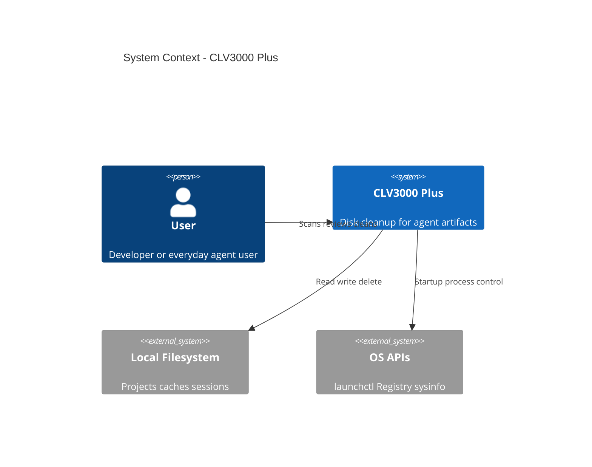
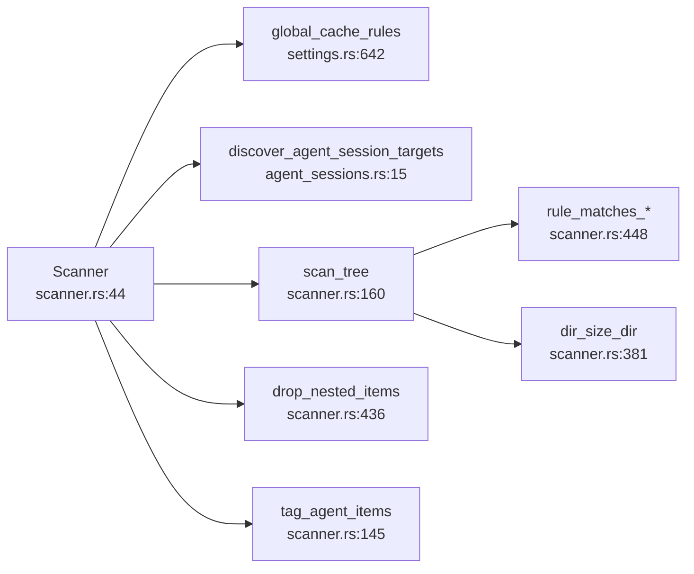
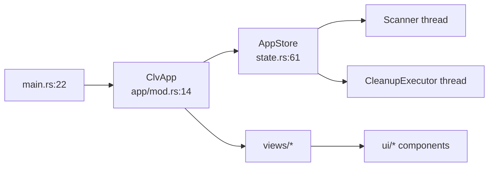
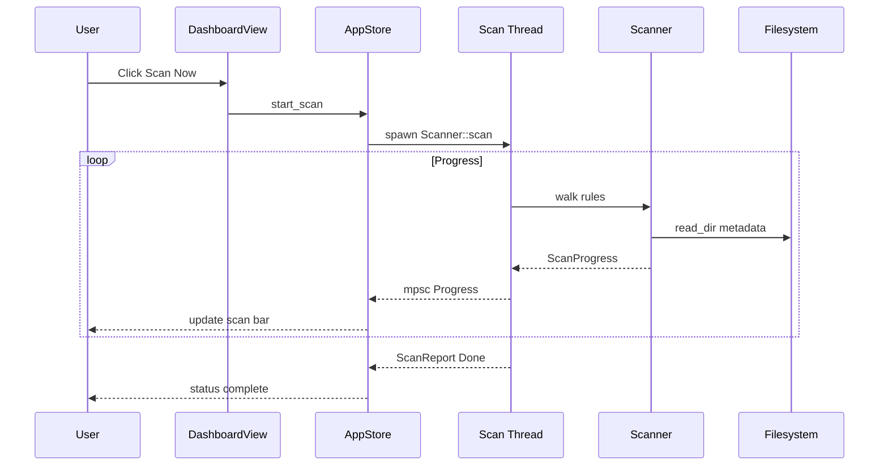
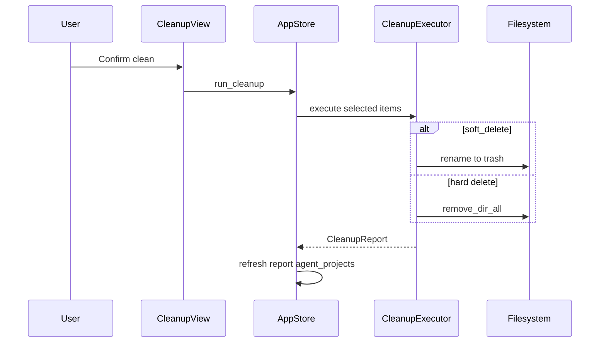

# System Architecture: CLV3000 Plus

**Version:** 1.0  
**Classification:** Internal architecture documentation  
**Generated:** 2026-08-22

---

## 1. Architecture Overview

### 1.1 Design Philosophy

CLV3000 Plus is structured as a **three-crate Rust workspace** so that filesystem logic never depends on GPUI, and OS-specific code never pollutes domain rules. The mental model is: **core knows what to delete**, **platform knows how to talk to the OS**, and **app knows how to show it**.

Four principles show up consistently in code:

**1. Safety before convenience**  
Every scan hit carries a `RiskLevel` (`models.rs:76-80`). Protected toolchains (e.g. `.rustup/toolchains`) are marked in rules and hidden from Simple mode. Active projects modified within three days get Safe rules downgraded to Caution in `try_add_rule_path` (`scanner.rs:312-317`).

**2. Background work off the UI thread**  
Directory walks and deletions run on `std::thread`; GPUI receives updates through `mpsc` channels polled in `cx.spawn` (`state.rs:260-331`). This keeps the window responsive during multi-minute scans.

**3. Rule-driven discovery**  
Instead of hardcoding "find node_modules" in the UI, `project_rules()` and `global_cache_rules()` in `settings.rs` define hundreds of matchers. New stacks are added by extending rules, not rewriting views.

**4. Local-only trust boundary**  
No network crate in `Cargo.toml`; all operations are filesystem and OS API calls.

### 1.2 Core Architecture Patterns

| Pattern | Implementation | Purpose |
|---------|----------------|---------|
| Layered modules | clv-core / clv-platform / clv-app | Isolate domain, OS, UI |
| Pipeline-filter | Scanner phases: global → sessions → tree → prune → agent tag | Ordered scan stages |
| Entity store | `Entity<AppStore>` single source of truth | GPUI-native state |
| Adapter (platform) | `#[cfg(target_os)]` in startup.rs | macOS vs Windows |
| Soft-delete trash | Rename to app trash dir | Recoverability |

### 1.3 Technology Stack

| Layer | Technology |
|-------|------------|
| Language | Rust 2024, workspace version 1.1.0 |
| UI | GPUI 0.2.2, gpui-component 0.5.1 |
| System info | sysinfo 0.39 (disks, processes) |
| Serialization | serde, serde_json |
| Paths | directories 6, walkdir 2 |
| Windows registry | winreg (startup module) |
| macOS plist | plist (LaunchAgent labels) |

---

## 2. System Context (C4 Level 1)

---

## 3. Container View (C4 Level 2)

### 3.1 Domain Module Responsibilities

| Module / Crate | Path | Responsibility | Key Types |
|----------------|------|----------------|-----------|
| Scanner | `crates/clv-core/src/scanner.rs` | Rule-based FS walk | `Scanner`, `MIN_SCAN_ITEM_BYTES` |
| Cleanup | `crates/clv-core/src/cleanup.rs` | Execute deletions | `CleanupExecutor`, `CleanupReport` |
| Agent | `crates/clv-core/src/agent.rs` | Project heuristics | `detect_agent_projects` |
| Agent sessions | `crates/clv-core/src/agent_sessions.rs` | Tool session paths | `AgentSessionTarget` |
| Settings | `crates/clv-core/src/settings.rs` | Rules + JSON config | `CleanupRule`, `AppSettings` |
| Models | `crates/clv-core/src/models.rs` | Domain types | `ScanItem`, `ScanReport` |
| App store | `crates/clv-app/src/app/state.rs` | UI orchestration | `AppStore`, `AppPage` |
| Views | `crates/clv-app/src/views/` | Page Render impls | `DashboardView`, `CleanupView`, ... |
| Platform | `crates/clv-platform/src/` | OS integration | `kill_process`, `list_startup_items` |

---

## 4. Component View (C4 Level 3)

### 4.1 Scanner Component Architecture

**Responsibilities:**
- `scan()` orchestrates all phases and returns `ScanReport`
- `ProgressThrottle` limits UI updates to 300ms intervals
- `prune_roots` prevents duplicate nested matches under `node_modules`

### 4.2 App Layer Component Architecture

---

## 5. Key Flows

### 5.1 Scan Flow

### 5.2 Cleanup Flow

---

## 6. Technical Implementation

### 6.1 Concurrency

- GPUI main thread: rendering, input, `cx.spawn` async tasks
- `std::thread` for `Scanner::scan` and `CleanupExecutor::execute`
- `mpsc::sync_channel(64)` for scan progress (backpressure on burst events)
- `cx.background_executor().timer()` for polling loops (200ms scan, 80ms cleanup)

### 6.2 Performance Optimizations

- Skip directories: `.git`, `.svn`, `.hg`, `.terrain` (`scanner.rs:379`)
- Max walk depth 8 (`scanner.rs:171`)
- Dir size cap 100,000 entries (`scanner.rs:378`)
- No `canonicalize()` on scan paths (iCloud hang avoidance, `scanner.rs:300`)
- `LazyLock` for static rule vectors (`settings.rs:174`)

### 6.3 Platform Abstraction

`clv-platform` uses conditional compilation:
- `process.rs`: Unix `libc::kill` vs Windows `TerminateProcess`
- `startup.rs`: `macos` module vs `windows` module with separate listing/toggle logic

---

## Appendix: Architecture Decision Records

**ADR 1: Three-crate split**  
- **Decision:** core / platform / app workspace members  
- **Reason:** Test core without UI; keep OS code out of rule engine  
- **Consequence:** `clv-app` depends on both siblings; no circular deps

**ADR 2: Soft delete default**  
- **Decision:** `soft_delete: true` in `AppSettings::default`  
- **Reason:** Reduce fear of irreversible mistakes for non-expert users  
- **Consequence:** Trash directory growth; `purge_old_trash` for TTL

**ADR 3: JSON settings instead of database**  
- **Decision:** serde JSON at `com.clv3000.plus` config path  
- **Reason:** Minimal persistence needs; no scan history requirement  
- **Consequence:** Scan results lost on quit; rescan required

**ADR 4: GPUI over web UI**  
- **Decision:** Native GPUI desktop shell  
- **Reason:** Performance, OS integration, no embedded browser  
- **Consequence:** Platform-specific build for macOS/Windows assets
