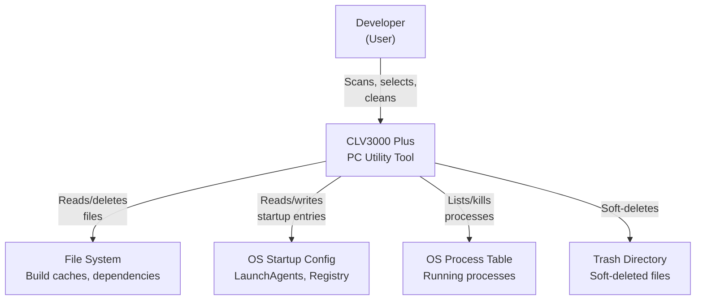
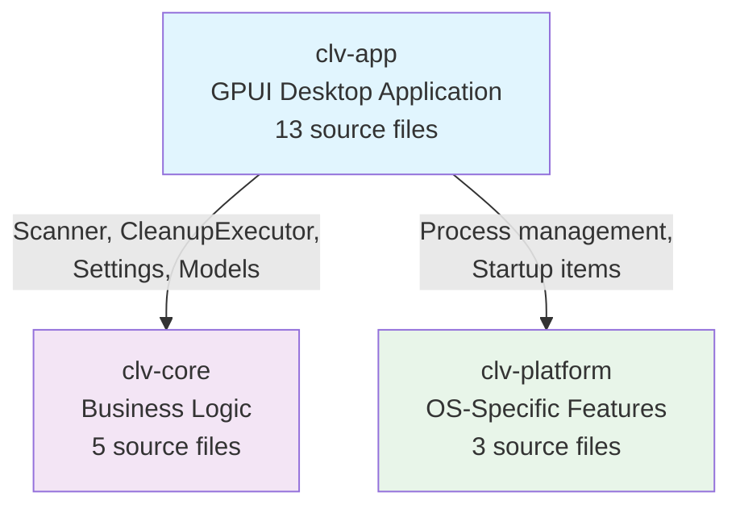
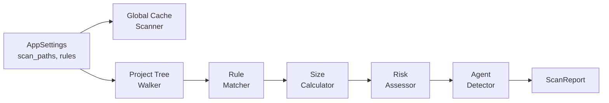
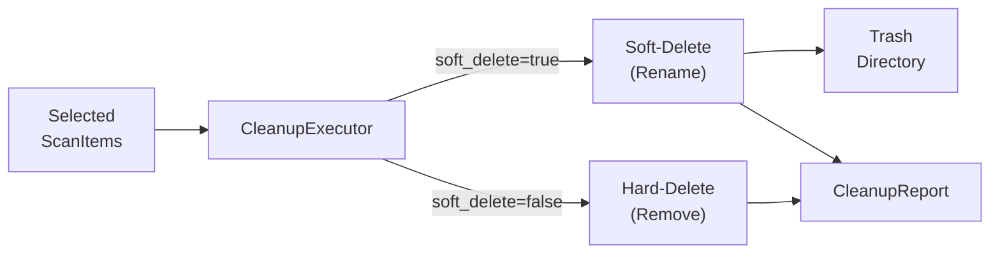
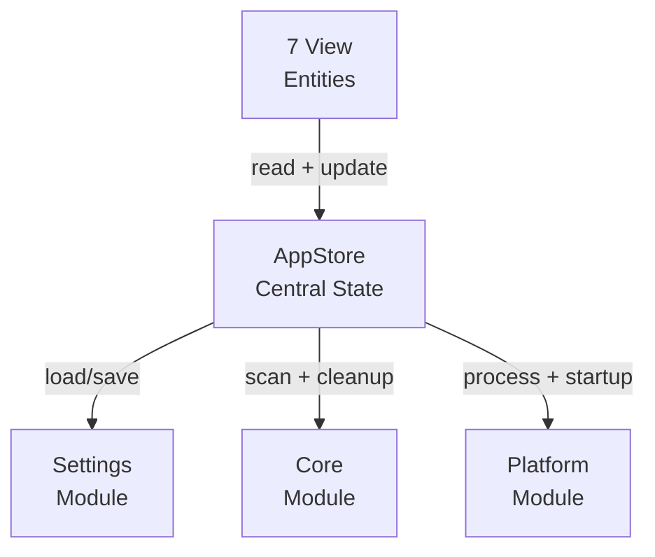
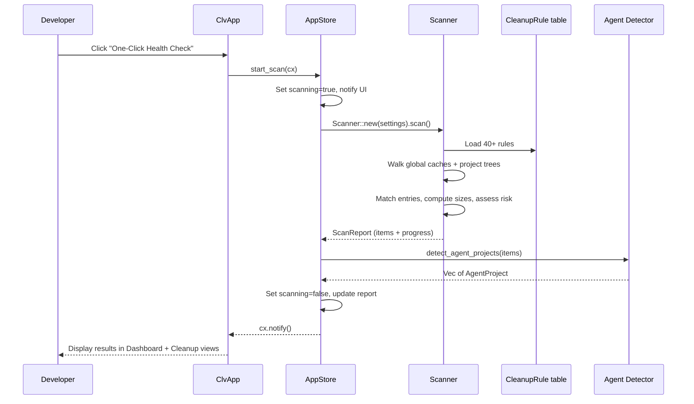
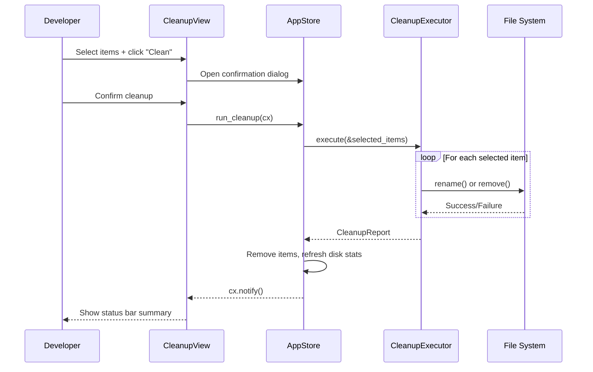

# Architecture Document: CLV3000 Plus

**Version:** 1.0
**Classification:** Internal Architecture Document
**Generated Date:** 2026-08-20

---

## 1. Architecture Overview

### 1.1 Design Philosophy

CLV3000 Plus is built on three core design principles that shape every architectural decision:

**Rule-Driven Cleanup** -- The entire cleanup logic is expressed as a table of `CleanupRule` structs in `settings.rs` (see `clv-core/src/settings.rs:99`). Each rule declares a path pattern, tech stack, risk level, category, and description. This means adding support for a new framework (e.g., Deno) requires only appending a rule entry -- no logic changes. The tradeoff is slightly more indirection, but the extensibility is worth it: 30 project rules + 10 global cache rules cover 13 tech stacks without a single `if` statement in the scanner.

**Risk-Aware Classification** -- Every discovered item carries a `RiskLevel` (Safe / Caution / Protected) defined in `clv-core/src/models.rs:60`. In Simple mode, only Safe items are shown and auto-selected. This "safe by default" philosophy prevents accidental deletion. Expert mode relaxes this, but Protected items are always hidden from non-expert users. The risk levels act like a traffic light system: green means go, yellow means think twice, red means don't touch.

**Soft-Delete Safety Net** -- By default, `CleanupExecutor` (`clv-core/src/cleanup.rs:31`) moves files to a timestamped trash directory rather than permanently deleting them. The trash auto-purges after 7 days. This is the "undo button" philosophy: partial success is better than catastrophic failure.

### 1.2 Core Architecture Patterns

The application follows a three-layer crate architecture with strict unidirectional dependencies:

| Pattern | Implementation | Purpose |
|---------|---------------|---------|
| Three-layer crate workspace | clv-core + clv-platform + clv-app | Separation of concerns, testability |
| Rule engine | `CleanupRule` structs in `settings.rs` | Declarative cleanup definitions |
| State centralization | `AppStore` in `state.rs` | Single source of truth for all UI state |
| Async scan | `cx.spawn(async { ... })` in `start_scan()` | Non-blocking UI during file system traversal |
| Conditional compilation | `#[cfg(target_os)]` in `startup.rs` | Platform-specific implementations without trait overhead |
| Progressive disclosure | Simple/Expert mode toggle | Risk-appropriate UI complexity |

### 1.3 Technology Stack Overview

| Layer/Domain | Tech Choice | Rationale |
|-------------|-------------|-----------|
| Language | Rust (edition 2021) | Memory safety + performance for file I/O |
| UI | GPUI 0.2.2 + gpui-component 0.5.1 | Native GPU-accelerated rendering, no web overhead |
| File System | walkdir 2 + directories 6 | Recursive traversal + platform-standard paths |
| System | sysinfo 0.39 | Cross-platform process enumeration |
| Config | serde + serde_json | JSON settings persistence |
| Errors | anyhow + thiserror | Flexible app errors + typed library errors |
| Logging | tracing + tracing-subscriber | Structured logging with env-filter |
| macOS | plist 1 | LaunchAgent plist parsing |

---

## 2. System Context (C4 Level 1)

---

## 3. Container View (C4 Level 2)

The three-crate workspace forms the container boundary. The dependency arrows are strictly one-directional: `clv-app` depends on both `clv-core` and `clv-platform`, but neither core crate depends on the other or on the app.

### 3.1 Domain Module Responsibilities

| Module | Path | Responsibility | Key Abstractions |
|--------|------|---------------|-----------------|
| models | `clv-core/src/models.rs` | All shared data types | `TechStack`, `ScanItem`, `ScanReport`, `RiskLevel` |
| scanner | `clv-core/src/scanner.rs` | Directory tree scanning and item discovery | `Scanner::scan()` |
| cleanup | `clv-core/src/cleanup.rs` | File removal with soft-delete safety | `CleanupExecutor::execute()` |
| agent | `clv-core/src/agent.rs` | AI agent experiment project detection | `detect_agent_projects()` |
| settings | `clv-core/src/settings.rs` | Configuration + 40+ cleanup rule definitions | `AppSettings`, `CleanupRule`, `project_rules()` |
| platform::process | `clv-platform/src/process.rs` | Process listing and termination | `list_processes()`, `kill_process()` |
| platform::startup | `clv-platform/src/startup.rs` | Startup item management | `list_startup_items()`, `set_startup_enabled()` |
| app | `clv-app/src/app/` | Application shell, state management | `AppStore`, `ClvApp` |
| views | `clv-app/src/views/` | 7 UI screens | `DashboardView`, `CleanupView`, etc. |

---

## 4. Component View (C4 Level 3)

### 4.1 Scanner Component Architecture

The scanner is the most complex component. It follows a pipeline pattern: global cache scan → project tree walk → rule matching → size computation → risk assessment → agent post-processing.

### 4.2 Cleanup Component Architecture

### 4.3 App State Management

---

## 5. Key Flows

### 5.1 Scan Flow (Primary Workflow)

### 5.2 Cleanup Flow

---

## 6. Technical Implementation

### 6.1 Key Architecture Patterns

**Rule-Based Declarative Cleanup**: The `CleanupRule` struct (`clv-core/src/settings.rs:99`) encodes what to look for, how to classify it, and how to describe it to the user. The scanner simply iterates these rules. This separation of "what to do" from "how to do it" makes the system extensible without modifying core logic.

**Centralized State**: `AppStore` (`clv-app/src/app/state.rs:41`) is the single source of truth. Every view reads from it, every action updates it. When scan completes, updating `last_report` automatically propagates to all views. This is simpler than per-view state management and eliminates synchronization bugs.

**Async Scan, Sync Everything Else**: Only the scan operation runs asynchronously (via `cx.spawn()`). Cleanup, process listing, and startup management are synchronous. This is a deliberate "stability over speed" choice -- the UI stays responsive during potentially long scans, but cleanup is immediate and predictable.

### 6.2 Concurrency and Parallelism

The scan is the only concurrent operation. It uses GPUI's `cx.spawn()` to run `Scanner::scan()` on a background thread. Progress callbacks safely update UI state via `weak.update()`, which handles the case where the view might be dropped during the scan.

### 6.3 Performance Optimization Strategies

- **Deduplication**: `seen_paths: HashSet<PathBuf>` in `Scanner::scan()` prevents processing the same path twice (important with symlinks or overlapping scan paths)
- **Max depth**: WalkDir limited to 8 levels prevents runaway recursion in deep directory structures
- **Static rule data**: All `CleanupRule` data is `&'static [CleanupRule]` -- zero allocation when accessing rules
- **Top-50 process display**: Only renders the first 50 processes, avoiding UI lag on systems with many processes

---

## Appendix: Architecture Decision Records

**ADR 1: Rule table over hardcoded logic**
- **Decision**: All cleanup targets defined as `CleanupRule` structs in a static table (`clv-core/src/settings.rs:109`)
- **Alternative rejected**: Hardcoded `if` chains matching file names
- **Why**: Adding a new framework requires only appending a rule entry, no logic changes. The rule carries metadata (risk level, description) that powers the UI automatically.

**ADR 2: GPUI over Electron/Tauri**
- **Decision**: Use GPUI (native Rust GPU UI) instead of web-based frameworks
- **Alternative rejected**: Tauri (Rust + WebView), Electron
- **Why**: GPUI produces a truly native binary with no WebView dependency. For a utility app that should start instantly and use minimal resources, this is the right tradeoff.

**ADR 3: Soft-delete as default**
- **Decision**: Default to moving files to a trash directory rather than permanent deletion
- **Alternative rejected**: Hard-delete only
- **Why**: Safety for a tool that modifies the file system. The 7-day auto-purge balances safety with disk space recovery.

**ADR 4: AppStore as single state container**
- **Decision**: All mutable app state lives in one `AppStore` struct, passed as `Entity<AppStore>` to all views
- **Alternative rejected**: Per-view state with message passing
- **Why**: Simplifies state coordination. When scan completes, updating `last_report` automatically propagates to all views.

**ADR 5: Conditional compilation over trait abstraction**
- **Decision**: Use `#[cfg(target_os)]` for platform-specific code instead of a trait-based abstraction layer
- **Alternative rejected**: Trait-based `Platform` interface
- **Why**: With only two target platforms (macOS and Windows), the trait abstraction would add complexity without benefit. Conditional compilation is simpler and produces the same binary.
