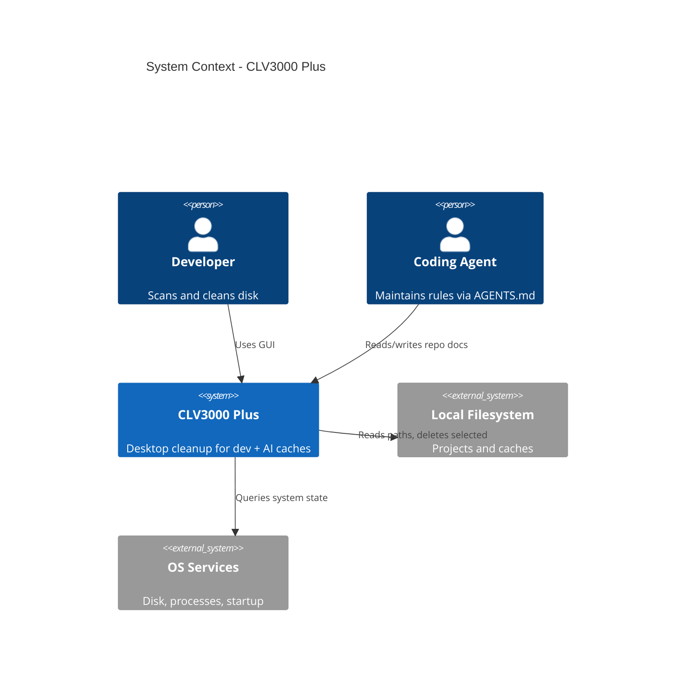
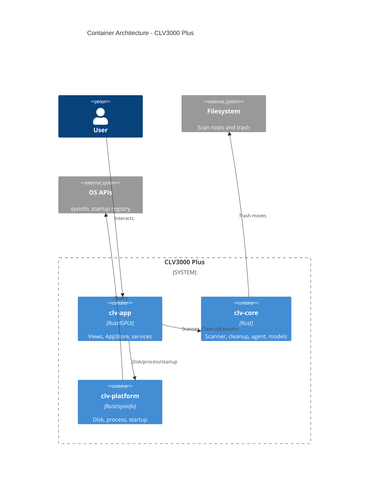
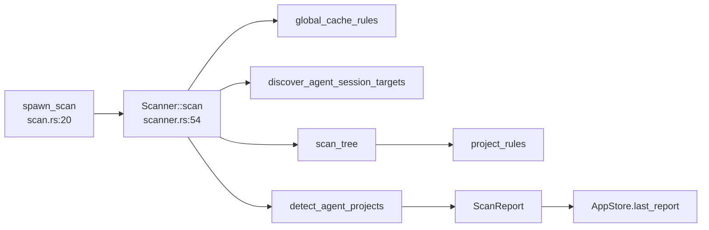
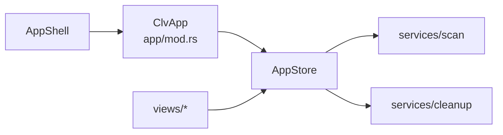
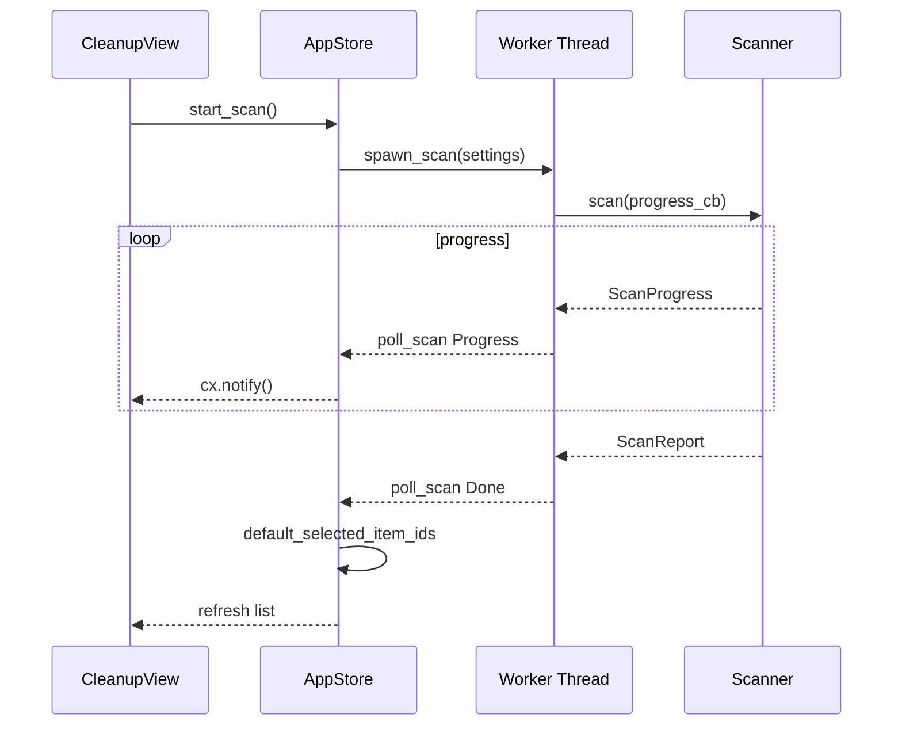
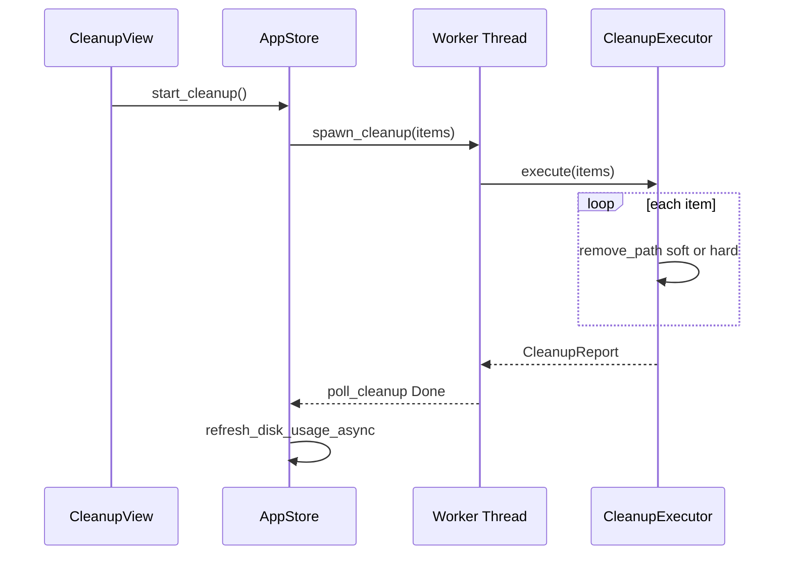

# System Architecture: CLV3000 Plus

**Version:** 1.0  
**Classification:** Internal architecture documentation  
**Generated:** 2026-08-23

---

## 1. Architecture Overview

### 1.1 Design Philosophy

CLV3000 Plus is structured so that **dangerous operations never live in the presentation layer**. The GPUI views render state and forward clicks; `clv-core` owns scan rules and deletion logic; `clv-platform` isolates OS calls. This separation is not academic — it allows `cargo test -p clv-core` to validate scanner pruning, bucket classification, and i18n rules without launching a GUI.

Four principles recur throughout the codebase:

**1. Single source of UI truth (`AppStore`)**  
Views do not cache scan results or selection. `AppStore` in `crates/clv-app/src/app/state.rs:57` holds `last_report`, `selected_item_ids`, and job flags. When scan completes, one notification updates every subscribed view — like a hospital chart every ward reads from the same record.

**2. Typed messages, not display strings**  
`ScanItem.description` is `RuleDescription` (`models.rs:118`), not `String`. User-visible text is resolved at the UI boundary via `RuleDescription::text(lang)` or `i18n/labels.rs`. This prevents English rule text leaking into business logic and enables stable R001–R133 IDs across languages.

**3. Rule-driven discovery**  
The scanner does not embed a giant list of `if path.contains("node_modules")` branches in one function. Instead, `project_rules()` and `global_cache_rules()` return `CleanupRule` vectors matched by `rule_matches_dir_name`, markers, and prefixes (`scanner.rs:203–224`). New stacks are data changes, not control-flow surgery.

**4. Risk-gated destruction**  
`RiskLevel` orders Safe < Caution < Protected (`models.rs:56–60`). Default selection includes Safe only (`default_selected_item_ids`, `models.rs:101`). Expert mode unlocks Protected visibility; `is_protected_system_path` blocks system roots regardless.

### 1.2 Core Architecture Patterns

| Pattern | Implementation | Purpose |
|---------|----------------|---------|
| Layered crates | clv-app → clv-core + clv-platform | Testable domain, thin OS adapter |
| Central state entity | GPUI `Entity<AppStore>` | Consistent UI, no duplicated scan cache |
| Worker thread + poll | `services/scan.rs`, `services/cleanup.rs` | Keep UI responsive during I/O |
| Lazy view singletons | `ClvApp` in `app/mod.rs:56–80` | Defer page construction until first visit |
| Pipeline scan phases | global → agent sessions → tree walk | Predictable progress messaging |
| Nested match pruning | `drop_nested_items` | Avoid duplicate child entries |

### 1.3 Technology Stack

| Layer | Technology |
|-------|------------|
| Language | Rust 2024, workspace resolver 2 |
| UI | GPUI 0.2.2, gpui-component 0.5.1 |
| FS walk | walkdir 2 |
| System | sysinfo 0.39 |
| Config | serde/serde_json, directories 6 |
| Release | thin LTO, strip (`Cargo.toml:34–37`) |

---

## 2. System Context (C4 Level 1)

---

## 3. Container View (C4 Level 2)

### 3.1 Domain Module Responsibilities

| Module | Path | Responsibility | Key Types |
|--------|------|----------------|-----------|
| scanner | `clv-core/src/scanner.rs` | Discover cleanable paths | `Scanner`, `ProgressThrottle` |
| cleanup | `clv-core/src/cleanup.rs` | Execute deletion | `CleanupExecutor`, `CleanupReport` |
| agent | `clv-core/src/agent.rs`, `agent_sessions.rs` | AI project/session detection | `AgentProject`, `AgentSessionTarget` |
| settings | `clv-core/src/settings/` | Rules + persistence | `AppSettings`, `CleanupRule` |
| models | `clv-core/src/models.rs`, `category.rs` | Domain types | `ScanItem`, `TechStack`, `RiskLevel` |
| platform | `clv-platform/src/` | OS adapters | `primary_disk_usage`, `ProcessEnumerator` |
| app-store | `clv-app/src/app/state.rs` | Central UI state | `AppStore`, `AppPage` |
| views | `clv-app/src/views/` | Feature pages | `CleanupView`, `AgentView`, … |

---

## 4. Component View (C4 Level 3)

### 4.1 Scan Pipeline Components

**Component duties:**
- `spawn_scan` — spawns worker thread, sync_channel for progress
- `Scanner` — orchestrates phases, throttles progress to 300ms
- `scan_tree` — WalkDir with prune_roots for matched subtrees
- `detect_agent_projects` — merges items + marker discovery

### 4.2 UI State Components

---

## 5. Key Flows

### 5.1 Scan Sequence

### 5.2 Cleanup Sequence

---

## 6. Technical Implementation

### 6.1 Concurrency

Scan and cleanup run on `std::thread::spawn` (`services/scan.rs:23`, `services/cleanup.rs`). GPUI's `cx.spawn` polls `mpsc` receivers on the executor. Disk usage and process kill use short-lived threads from `AppStore` (`state.rs:141`, `state.rs:121`). No async runtime (Tokio) — blocking I/O is isolated to workers.

### 6.2 Performance Optimizations

- **Progress throttle** — 300ms minimum between progress UI updates (`scanner.rs:34`)
- **MIN_SCAN_ITEM_BYTES** — 1MB threshold skips tiny noise (`scanner.rs:20`)
- **Prune roots** — Matched directories skip deeper rule evaluation (`scanner.rs:168–178`)
- **Lazy views** — Pages constructed once on first visit (`app/mod.rs:56`)
- **ProcessEnumerator reuse** — Avoids reallocating `sysinfo::System` each poll (`process.rs:32`)

### 6.3 i18n Architecture

Rule text: JSON table → Python codegen → `RuleDescription` enum → `text(lang)`. UI labels: `i18n/labels.rs` with `scan_category_label`, `rule_description_label`. Agent reasons: `AgentReasonPart` + `format_agent_reason`.

---

## Appendix: Architecture Decision Records

**ADR 1: Three-crate workspace**  
- **Decision:** Split app, core, platform  
- **Rejected:** Monolithic crate mixing GPUI and walkdir  
- **Consequence:** Core tests run fast; platform cfg stays isolated  

**ADR 2: Soft-delete default**  
- **Decision:** Rename to app trash dir with UUID suffix  
- **Rejected:** Immediate `remove_dir_all` as default  
- **Consequence:** Users can recover; `purge_old_trash` manages retention  

**ADR 3: Selection on AppStore, not ScanItem**  
- **Decision:** `selected_item_ids` HashSet on store  
- **Rejected:** `selected` flag on each `ScanItem`  
- **Consequence:** Scan report stays immutable snapshot; selection resets cleanly per scan  

**ADR 4: Typed CleanupCategory**  
- **Decision:** Enum with `cleanup_bucket()` mapping  
- **Rejected:** Free-form category strings  
- **Consequence:** Filter tabs and i18n keys stay consistent (`category.rs:39`)
