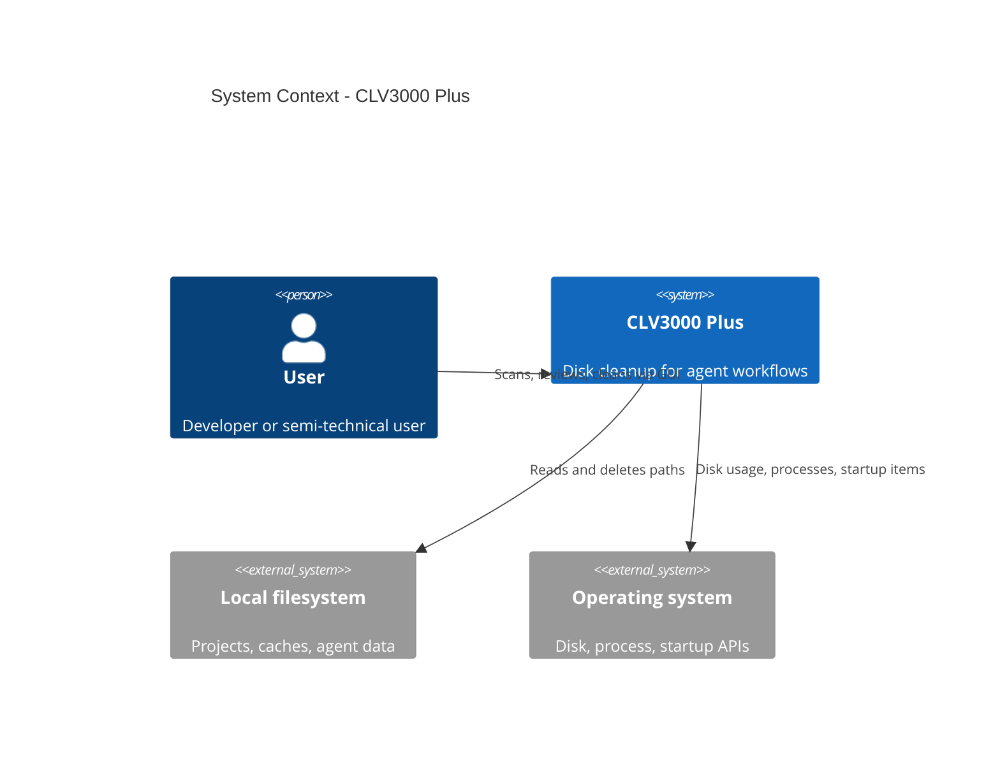
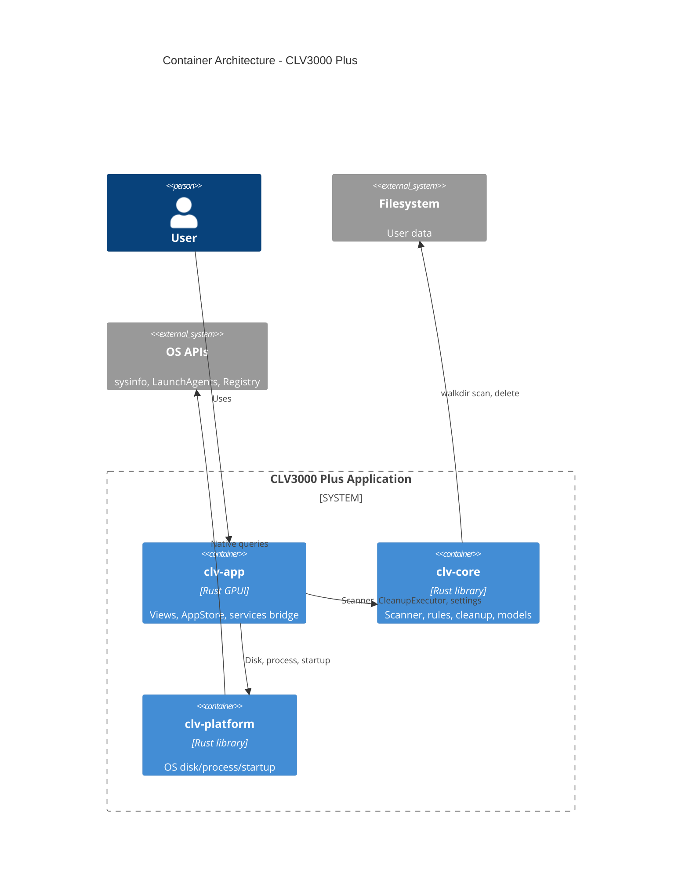
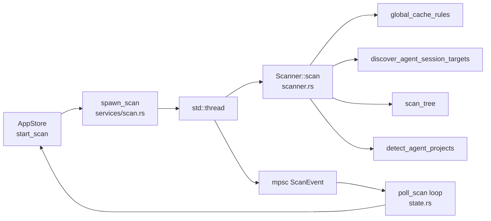
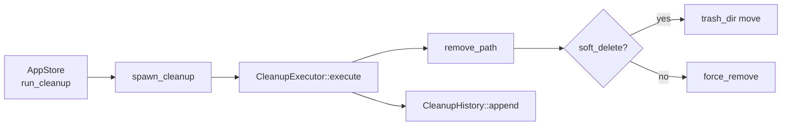
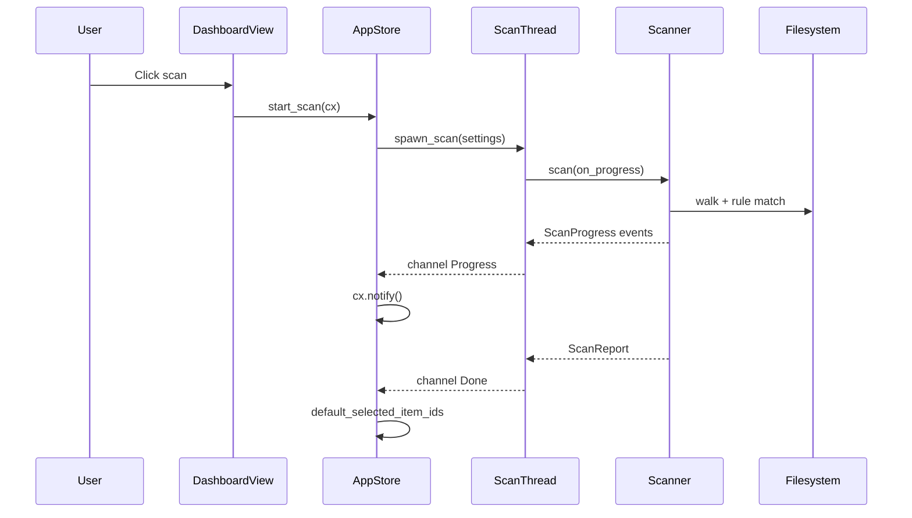
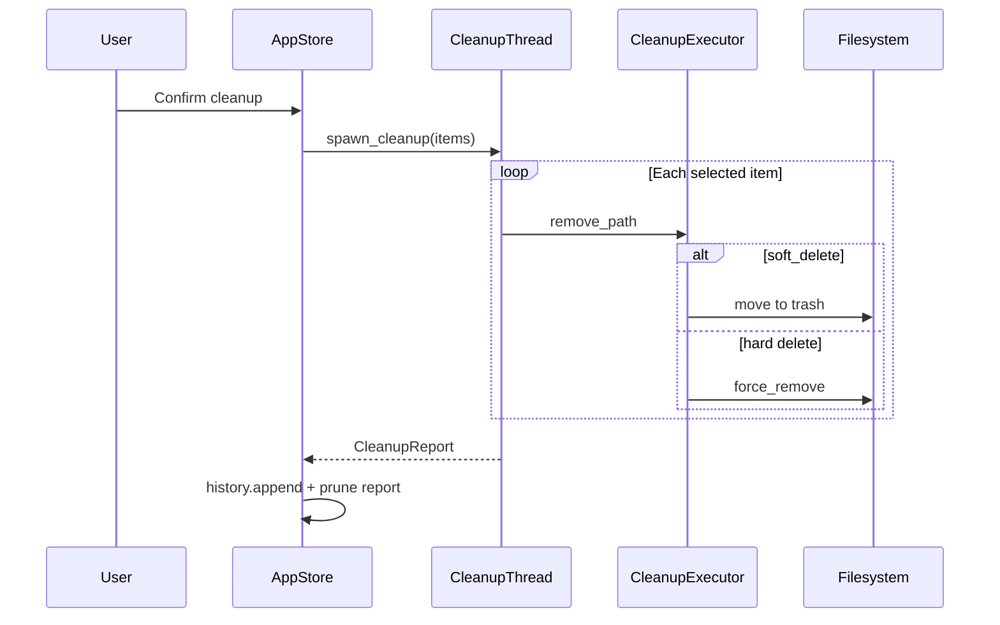

# System Architecture: CLV3000 Plus

**Version:** 1.0  
**Classification:** Internal architecture documentation  
**Generated:** 2026-08-26

---

## 1. Architecture Overview

### 1.1 Design Philosophy

CLV3000 Plus follows a **local-first, layered desktop** architecture. The hardest work—walking directories and deleting gigabytes of data—never runs on the GPUI render thread. Instead, the UI acts as a control panel: it displays state from `AppStore`, spawns worker threads for scan and cleanup, and polls channels every few hundred milliseconds for progress updates.

**Separation of concerns across three crates**

1. **`clv-core`** — Pure domain logic: rules, scanner, cleanup executor, models. No UI or OS-specific startup code.
2. **`clv-platform`** — Thin OS adapter for disk totals, processes, and boot items.
3. **`clv-app`** — GPUI shell, views, i18n, theme, and the bridge (`services/`) between UI and workers.

**Rule-driven detection**

Rather than hard-coding "delete `node_modules`" in scanner logic, the app maintains a **`CleanupRule` catalog** (`settings/rule.rs`). Each rule carries stack, risk, category, optional marker requirements, and i18n `RuleDescription`. The scanner applies rules uniformly—adding a new stack is mostly data, not a new algorithm.

**Risk as a product feature**

`RiskLevel` (`models.rs:56-60`) gates default selection and executor behavior. This is how the app promises "safe by default" in simple mode while still allowing experts to touch protected toolchains.

### 1.2 Core Architecture Patterns

| Pattern | Implementation | Purpose |
|---------|----------------|---------|
| Layered crates | app → core + platform | Testable domain without UI |
| Worker + channel | `services/scan.rs`, `services/cleanup.rs` | Non-blocking UI during I/O |
| Entity store (GPUI) | `Entity<AppStore>` | Single source of UI truth |
| Rule catalog | `global_rules.rs`, `project_rules.rs` | Extensible detection |
| Soft-delete quarantine | `trash_dir()` + `move_entry` | Recoverability |

### 1.3 Technology Stack

| Layer | Technology | Notes |
|-------|------------|-------|
| UI framework | GPUI 0.2.2, gpui-component 0.5.1 | Native GPU rendering |
| Language | Rust edition 2024 | Workspace version 1.2.0 |
| Async runtime | GPUI `cx.spawn` + timers | Not full Tokio—GPUI executor |
| Filesystem | walkdir 2 | Project tree walks |
| OS info | sysinfo 0.39 | Disks and processes |
| Config | serde_json + directories 6 | Cross-platform paths |
| Logging | tracing (debug only) | `clv_app=info` filter in debug |

---

## 2. System Context (C4 Level 1)

---

## 3. Container View (C4 Level 2)

### 3.1 Domain Module Responsibilities

| Module / Crate | Path | Responsibility | Key types |
|----------------|------|----------------|-----------|
| Scanner | `clv-core/src/scanner.rs` | Rule-based filesystem inventory | `Scanner`, `MIN_SCAN_ITEM_BYTES` |
| Cleanup | `clv-core/src/cleanup.rs` | Delete / soft-delete execution | `CleanupExecutor`, `CleanupHistory` |
| Agent | `clv-core/src/agent.rs` | Trial project grouping | `detect_agent_projects` |
| Agent sessions | `clv-core/src/agent_sessions.rs` | Known agent cache paths | `AgentSessionTarget` |
| Settings | `clv-core/src/settings/` | Config + rule definitions | `AppSettings`, `CleanupRule` |
| Models | `clv-core/src/models.rs` | Shared enums and reports | `ScanItem`, `ScanReport` |
| AppStore | `clv-app/src/app/state.rs` | UI state + workflows | `AppStore`, `AppPage` |
| Services | `clv-app/src/services/` | Thread spawn + poll | `spawn_scan`, `spawn_cleanup` |
| Views | `clv-app/src/views/` | Page components | `DashboardView`, `AgentView`, … |
| Platform | `clv-platform/src/` | OS integration | `primary_disk_usage`, `list_startup_items` |

---

## 4. Component View (C4 Level 3)

### 4.1 Scan Pipeline Components

**Component duties**

- **AppStore** — Sets UI flags, clones `AppSettings`, spawns GPUI async poll loop (`state.rs:287-354`).
- **spawn_scan** — Creates sync channel (capacity 64), runs `Scanner::scan` on worker thread (`scan.rs:20-31`).
- **Scanner** — Three-phase scan: global caches, agent sessions (optional), user roots; then prune nested hits (`scanner.rs:75-122`).
- **ProgressThrottle** — Emits progress at most every 300ms unless forced (`scanner.rs:22-42`).

### 4.2 Cleanup Pipeline Components

---

## 5. Key Flows

### 5.1 Scan Sequence

### 5.2 Cleanup Sequence

---

## 6. Technical Implementation

### 6.1 Nested Item Pruning

When `node_modules` matches a rule, nested `.cache` inside it should not appear as a separate line item—the parent already accounts for size. Tests in `lib.rs:57-93` verify this behavior. This avoids double-counting and confusing duplicate entries.

### 6.2 Concurrency and Parallelism

| Concern | Strategy |
|---------|----------|
| UI responsiveness | Disk work on `std::thread`, never on GPUI thread |
| Progress updates | `try_send` on sync channel; UI coalesces via poll |
| Disk usage refresh | `std::thread::spawn(primary_disk_usage)` from `state.rs:154-167` |
| Process kill | Same pattern — `kill_process_pid` at `state.rs:129-151` |

### 6.3 Performance Optimizations

- **1 MB minimum scan item** — `MIN_SCAN_ITEM_BYTES` (`scanner.rs:20`) filters tiny hits.
- **Progress throttling** — 300ms interval reduces UI churn during deep walks.
- **ProcessEnumerator** — Reuses one `sysinfo::System` instance (`process.rs:32-46`).
- **Release profile** — LTO thin, single codegen unit, strip symbols (`Cargo.toml:34-37`).

---

## Appendix: Architecture Decision Records

**ADR 1: Three-crate split**

- **Decision:** `clv-core` has no GPUI dependency.
- **Reason:** Domain tests run without GPU/UI; rules stay portable.
- **Consequence:** App must clone settings into worker threads.

**ADR 2: mpsc over async scan**

- **Decision:** `std::sync::mpsc` sync channels for scan/cleanup events.
- **Alternatives rejected:** Async stream on GPUI executor—disk walk is CPU/IO bound and simpler on a plain thread.
- **Consequence:** Poll loops with 80–200ms timers in `AppStore`.

**ADR 3: JSON persistence**

- **Decision:** settings + history as JSON files.
- **Alternatives rejected:** SQLite, cloud sync.
- **Consequence:** No query layer; history pruned in memory (`cleanup.rs:75-78`).

**ADR 4: Soft delete by default**

- **Decision:** `soft_delete: true` in `AppSettings::default()` (`settings/mod.rs:37`).
- **Reason:** User trust—mistakes recoverable from app trash folder.
- **Consequence:** `purge_old_trash` must run periodically for retention (`cleanup.rs:285-309`).
