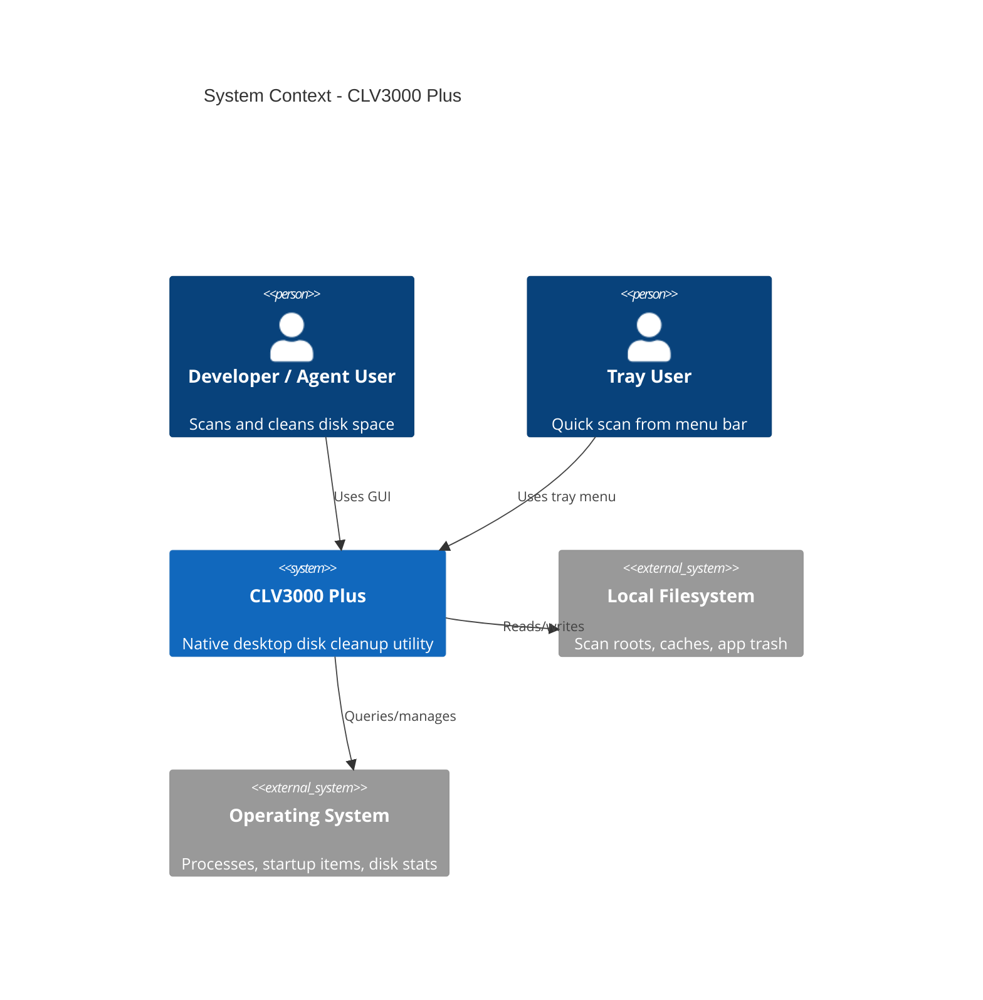
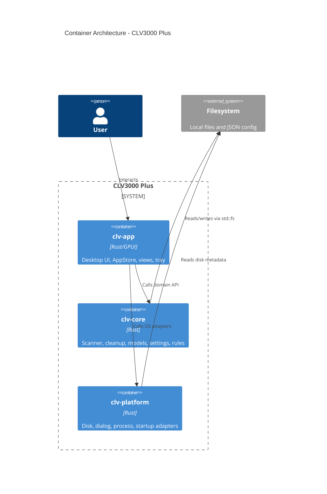
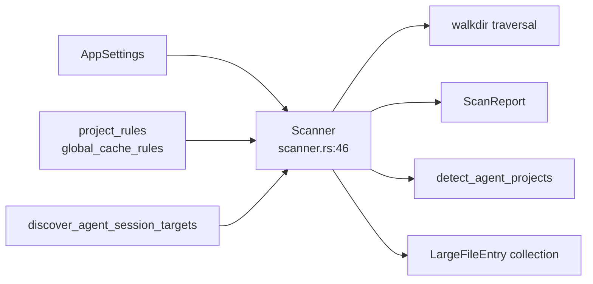
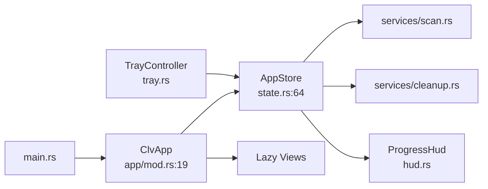
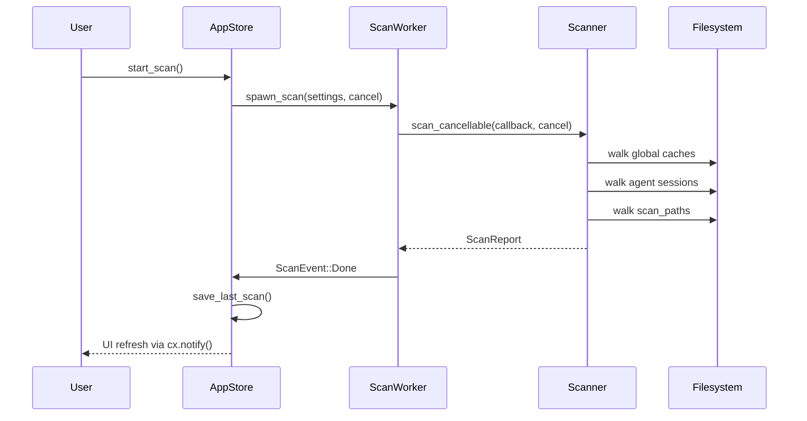
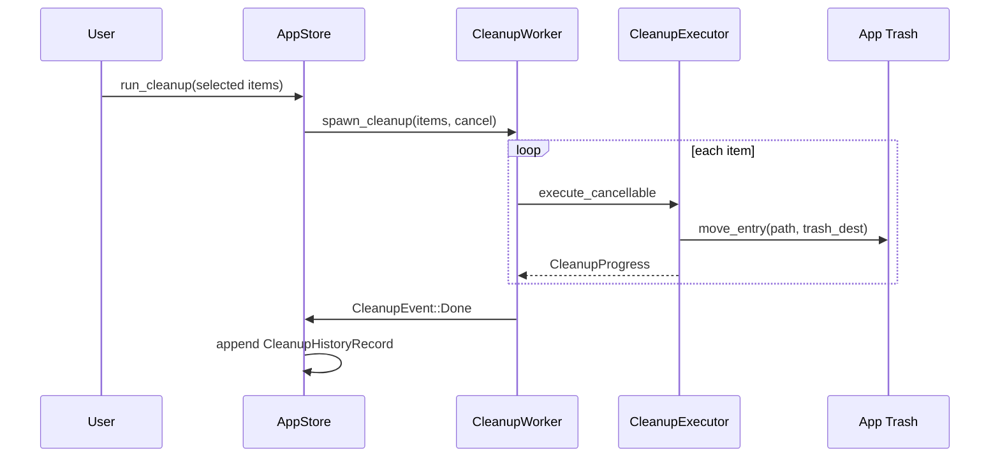

# System Architecture: CLV3000 Plus

**Version:** 1.0  
**Classification:** Internal architecture documentation  
**Generated:** 2026-08-28

---

## 1. Architecture Overview

### 1.1 Design Philosophy

CLV3000 Plus is structured like a **layered factory**: the presentation floor (`clv-app`) handles what users see; the production floor (`clv-core`) contains pure scanning and cleanup logic with no knowledge of windows or menus; the loading dock (`clv-platform`) talks to the operating system for disk stats, folder pickers, and process lists. This separation means you can unit-test the scanner against real filesystem fixtures without spinning up a GUI, and you can swap platform adapters without touching business rules.

Three principles anchor every design decision:

**1. Safety before speed**  
Deletion is gated by `RiskLevel` (Safe → Caution → Protected), hard-blocked system paths in `paths.rs`, nested-match pruning so you never delete a parent and its orphaned children separately, and soft-delete by default. The scanner finds aggressively; the cleanup engine deletes conservatively.

**2. Single source of UI truth**  
All views read from one `AppStore` entity (`crates/clv-app/src/app/state.rs:64`). Scan results, selection state, progress counters, and cleanup history live in one place—views never cache stale copies of scan data.

**3. Typed messages, not string soup**  
Rule descriptions and agent reasons are Rust enums (`RuleDescription`, `AgentReasonPart`) resolved to display text at the UI boundary. This prevents the classic i18n bug where English descriptions leak into Japanese UI.

### 1.2 Core Architecture Patterns

| Pattern | Implementation | Purpose |
|---------|----------------|---------|
| Layered crates | `clv-app` → `clv-core` → (no reverse deps) | Testable domain logic isolated from UI/OS |
| Entity store (GPUI) | `AppStore` as central Entity | Reactive UI updates via `cx.notify()` |
| Worker thread + mpsc | `services/scan.rs`, `services/cleanup.rs` | Keep GPUI thread responsive during long I/O |
| Pipeline scan phases | Global caches → agent sessions → project roots | Predictable scan ordering with localized phase labels |
| Rule table engine | `CleanupRule` matchers in settings | Declarative patterns instead of hard-coded if-chains |
| Soft-delete trash | App-managed directory with restore metadata | User recoverability without OS trash integration complexity |

### 1.3 Technology Stack

| Layer | Components |
|-------|------------|
| Presentation | GPUI 0.2, gpui-component 0.5, custom theme/ui kit |
| Domain | Scanner, CleanupExecutor, Agent detection, Settings/Rules |
| Platform | sysinfo, rfd, tray-icon, muda, directories |
| Build | Cargo workspace, thin LTO release profile, `build.rs` asset embedding |

---

## 2. System Context (C4 Level 1)

---

## 3. Container View (C4 Level 2)

### 3.1 Domain Module Responsibilities

| Module | Path | Responsibility | Key abstractions |
|--------|------|----------------|------------------|
| Scanner | `crates/clv-core/src/scanner.rs` | Rule-based filesystem inventory | `Scanner`, `ProgressThrottle` |
| Cleanup | `crates/clv-core/src/cleanup.rs` | Soft-delete, restore, history | `CleanupExecutor`, `TrashedEntry` |
| Agent | `crates/clv-core/src/agent.rs` | Experiment project detection | `detect_agent_projects` |
| Settings | `crates/clv-core/src/settings/` | Rules, markers, persistence | `AppSettings`, `CleanupRule` |
| AppStore | `crates/clv-app/src/app/state.rs` | UI state + job orchestration | `AppStore`, `AppPage` |
| Services | `crates/clv-app/src/services/` | Background threads | `spawn_scan`, `spawn_cleanup` |
| Views | `crates/clv-app/src/views/` | Feature pages | `DashboardView`, `CleanupView`, … |
| Platform | `crates/clv-platform/src/` | OS integration | `ProcessEnumerator`, `pick_folders` |

---

## 4. Component View (C4 Level 3)

### 4.1 Scanner Component Architecture

**Component roles:**
- `Scanner::scan_cancellable` — orchestrates three scan phases with cancel checks
- `try_add_rule_path` / `scan_tree` — match individual paths against rules
- Nested pruning — suppresses child hits when parent already matched (see test at `lib.rs:64`)

### 4.2 App Layer Component Architecture

---

## 5. Key Flows

### 5.1 Scan Sequence

### 5.2 Cleanup Sequence

---

## 6. Technical Implementation

### 6.1 Concurrency Strategy

Long I/O runs on dedicated `std::thread` workers—not the GPUI main thread. Progress arrives via `mpsc` channels and is polled on GPUI timers. Cancellation uses shared `Arc<AtomicBool>` flags checked inside scan/cleanup loops. This trades some threading complexity for predictable UI responsiveness without pulling in Tokio.

### 6.2 Performance Optimizations

- **Progress throttling** (300ms) reduces UI churn during fast scans (`scanner.rs:23-44`)
- **Minimum item size** filter (`MIN_SCAN_ITEM_BYTES` = 1 MB) reduces list noise
- **Lazy view creation** — pages instantiated on first visit, cached thereafter (`app/mod.rs:76`)
- **Release profile** — thin LTO + strip for smaller binaries (`Cargo.toml:37-40`)

### 6.3 Safety Mechanisms

- `is_protected_system_path` blocks `/`, `/System`, Windows system roots (`paths.rs:165`)
- Protected-risk items skipped unless Expert mode (`cleanup.rs:181-186`)
- Active agent repos (recent marker activity) excluded from agent project list (`agent.rs:47-51`)

---

## Appendix: Architecture Decision Records

**ADR 1: Three-crate workspace**  
- **Decision**: Split into clv-app / clv-core / clv-platform  
- **Reason**: Pure domain testability and clear dependency direction  
- **Consequence**: Slightly more complex Cargo setup; much easier to embed headless scanning

**ADR 2: JSON persistence over SQLite**  
- **Decision**: Store settings, scan, and history as JSON files  
- **Reason**: No relational queries; user-debuggable files  
- **Consequence**: No transactional guarantees; acceptable for single-user desktop scope

**ADR 3: App-managed trash vs OS trash integration**  
- **Decision**: Copy/move to `{data_local}/trash/` with metadata in history JSON  
- **Reason**: Cross-platform consistency; explicit restore API  
- **Consequence**: Duplicates disk usage temporarily; users gain predictable restore UX

**ADR 4: Typed RuleDescription enum vs free-form strings**  
- **Decision**: 140 codegen'd enum variants with per-language translation table  
- **Reason**: Consistent trilingual UX; searchable rule IDs in Expert mode  
- **Consequence**: Adding rules requires updating JSON + running codegen script
