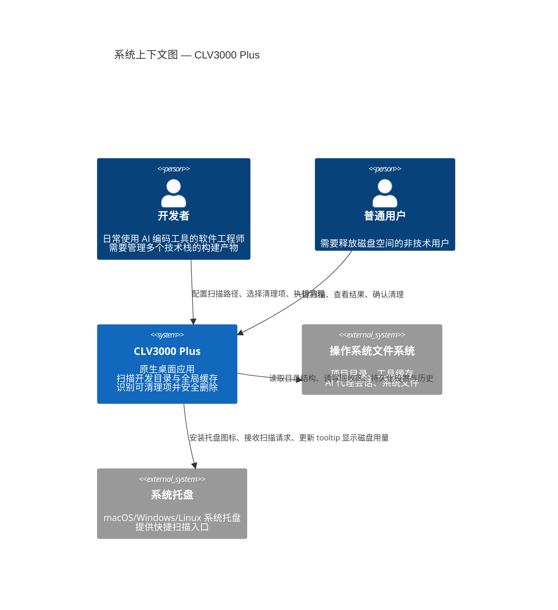
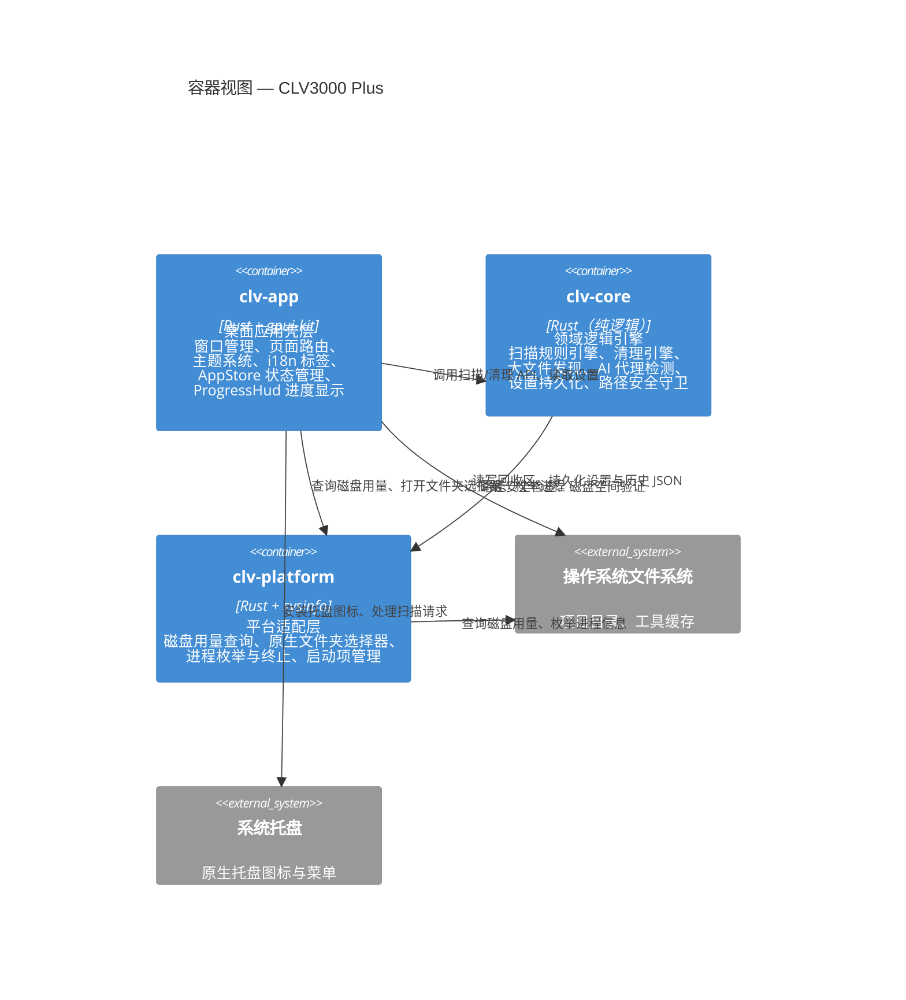
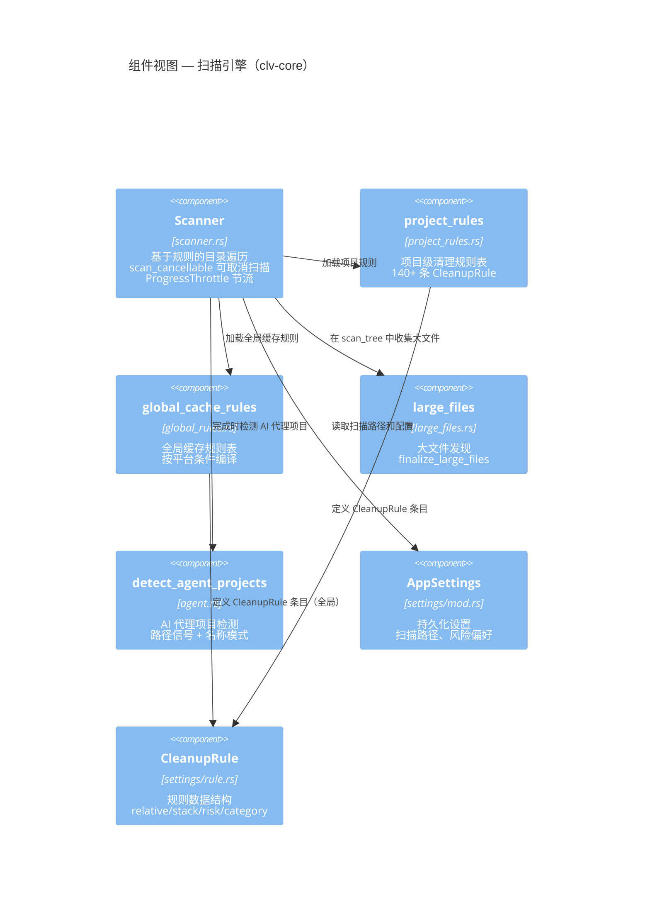
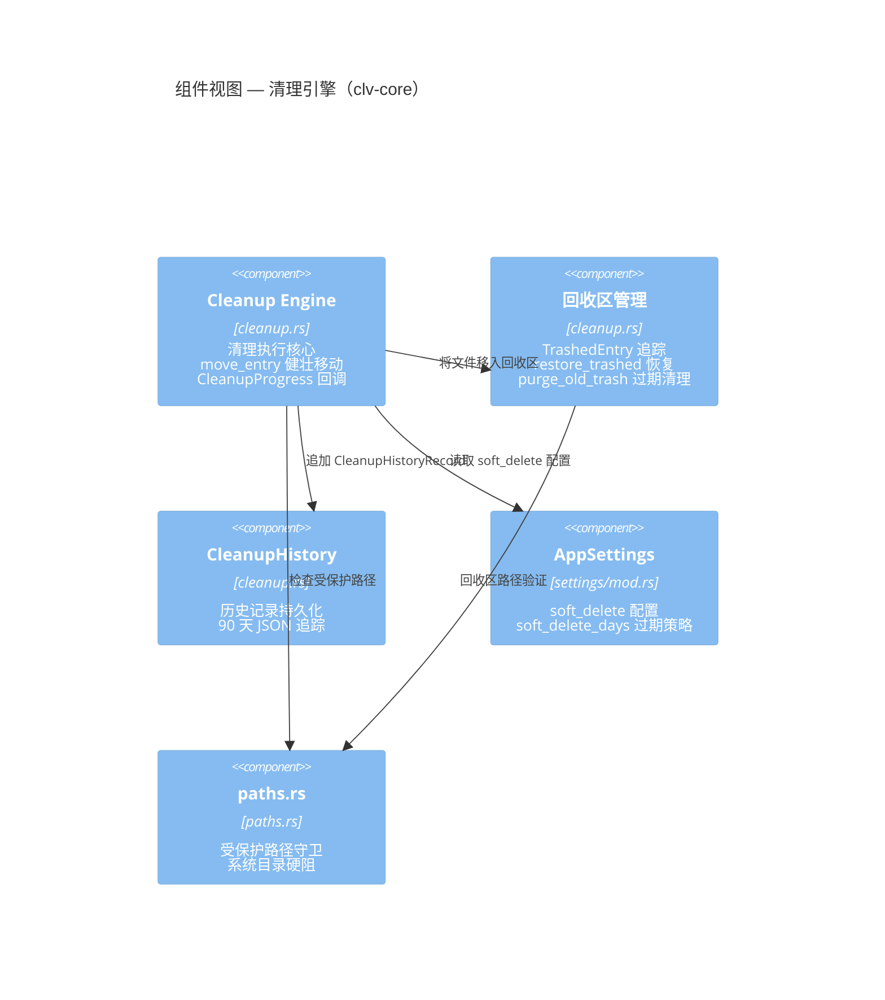
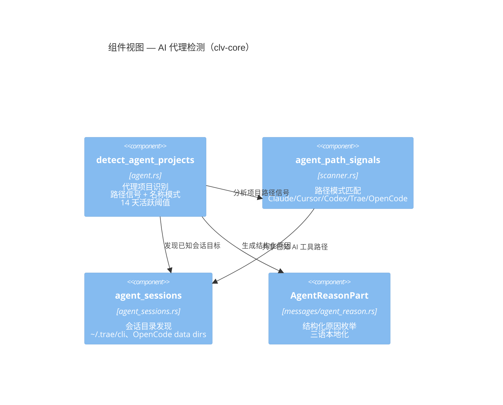
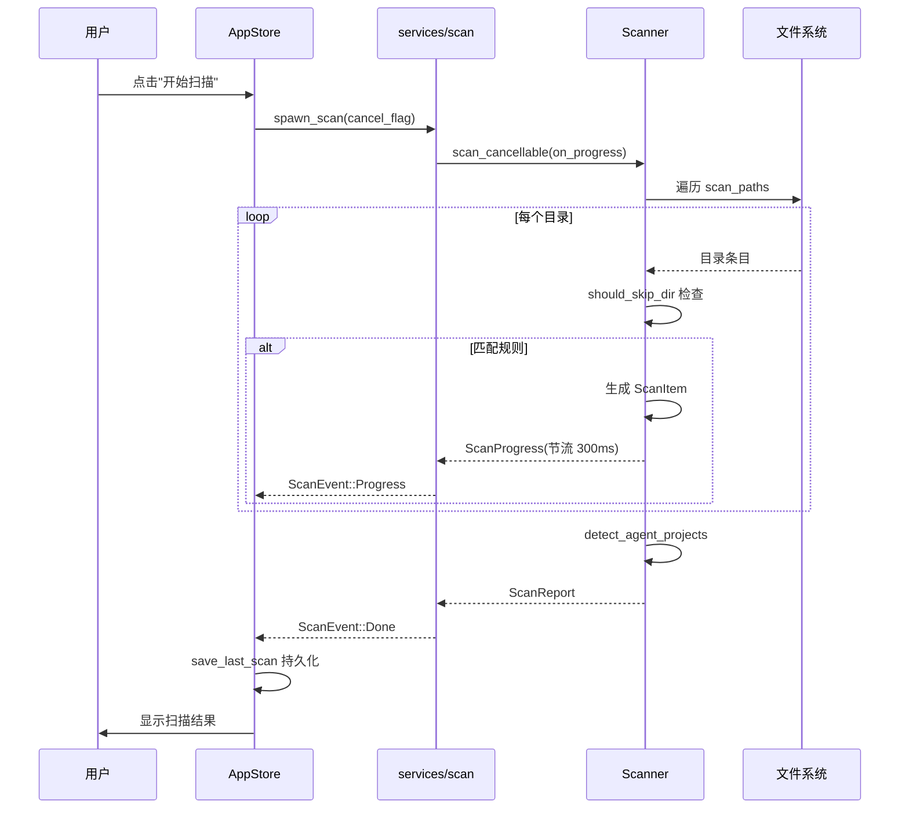
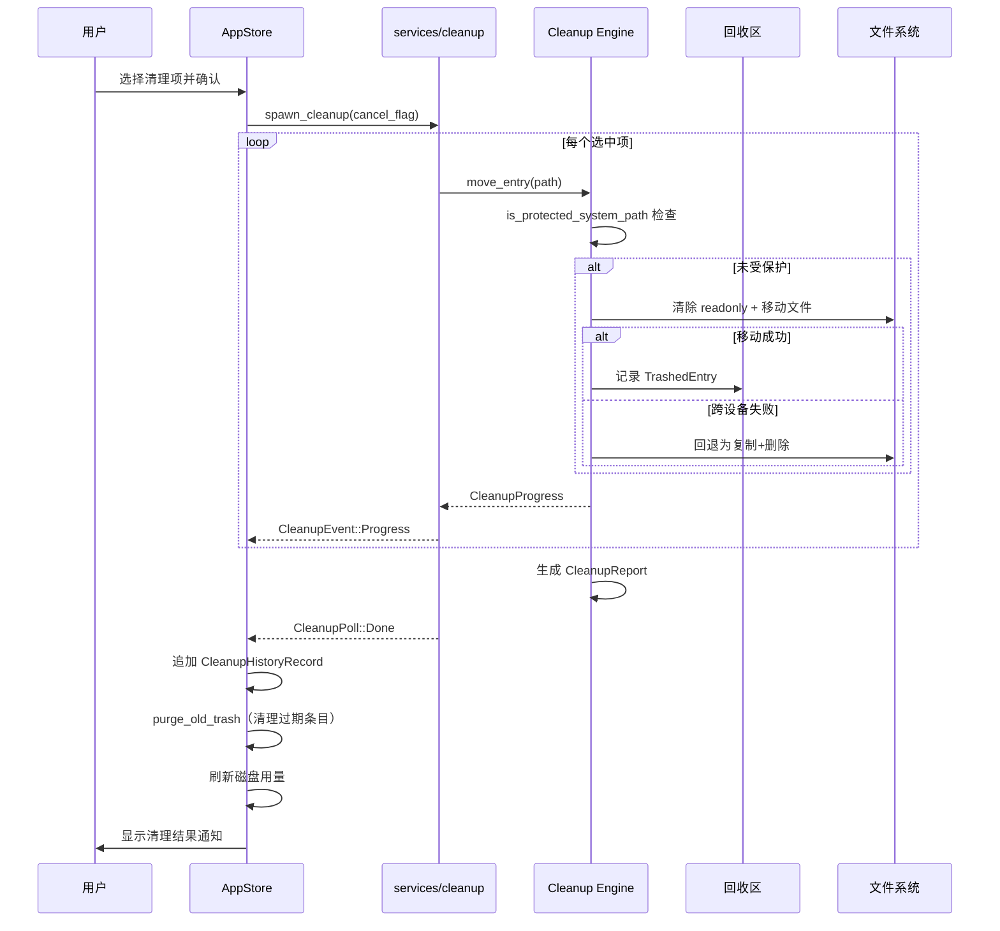

# 系统架构文档：CLV3000 Plus

软件架构不是画出来的——它是在无数次"如果这样做会怎样"的追问中长出来的。CLV3000 Plus 的架构也不例外。当你决定要构建一个能安全扫描和清理开发者工作站的桌面工具时，第一个需要回答的问题不是"用什么 UI 框架"，而是"扫描引擎和清理引擎之间的边界应该画在哪里"。如果它们共享太多状态，一个模块的 bug 就会传染到另一个；如果它们完全解耦，又需要一个中间层来协调。CLV3000 Plus 选择了三层 Cargo 工作区的分层架构，让展示层、领域逻辑层和平台适配层各司其职。这篇文档将详细拆解这个架构的每一个决策。

## 1. 架构概述

在深入具体的模块和流程之前，我们需要先理解驱动整个架构设计的几个核心理念。这些理念不是事后总结的"最佳实践"，而是在开发过程中逐步明确的约束条件——它们决定了哪些方案被接受，哪些被拒绝。

### 1.1 设计理念

**规则驱动扫描**是第一个不可妥协的原则。CLV3000 Plus 的扫描能力完全由预定义的规则表（`project_rules` 和 `global_cache_rules`）驱动，而不是通过启发式猜测或机器学习模型。这个选择背后的考量很实际：文件清理工具的首要目标是可预测性——用户需要确信工具不会因为"学到"了错误的模式而删除不该删的东西。规则表让每一条可清理项都有明确的技术栈归属、风险等级和本地化描述，用户（和维护者）可以审计每一条规则。当然，这也意味着新增技术栈支持需要手动添加规则，但这正是"确定性"所付出的合理代价。

**类型化风险分级**是安全机制的基石。`RiskLevel` 枚举（`Safe` / `Caution` / `Protected`）不是简单地标注"危险程度"，而是直接控制 UI 的交互行为：`Safe` 级别在默认模式下被预选，`Caution` 级别需要用户主动勾选，`Protected` 级别在 UI 中被完全屏蔽。这种"类型即行为"的设计消除了"风险等级只是个标签"的可能性——在 `clv-core` 的清理引擎中，`Protected` 级别的项在 `run_cleanup_safe` 中被直接过滤，根本不会进入删除队列。

**软删除默认**是最后一个安全兜底。`AppSettings.soft_delete` 默认为 `true`，`soft_delete_days` 默认为 7 天。这意味着即使用户确认了清理操作，文件也不会被立即销毁，而是移入应用管理的回收区目录（`trash_dir`）。`TrashedEntry` 结构体完整记录了原始路径、回收路径和文件大小，用户随时可以通过 `restore_trashed_entry` 恢复。这个设计直接源于"误删文件"的恐惧——对于一个文件清理工具来说，能恢复比能清理更重要。

**渐进式深度控制**体现在扫描的多个维度上。扫描器通过 `should_skip_dir` 函数在遍历过程中实时剪枝：当一个目录匹配了某条规则后，其子目录不会被重复扫描（嵌套剪枝），避免误删项目源码；`ProgressThrottle` 节流器将进度事件的发送频率限制在 300ms 一次，防止 UI 线程被海量进度事件淹没；`AtomicBool` 取消标志让扫描在任何时候都可以被用户中断，中断后设置 `scan_restart_pending` 以便立即重新扫描。

### 1.2 核心架构模式

CLV3000 Plus 的架构可以用几个核心模式来概括。首先是 **三层 Cargo 工作区分层**——这是整个系统最基础的组织方式。展示层（`clv-app`）、领域逻辑层（`clv-core`）和平台适配层（`clv-platform`）形成单向依赖：`clv-app` 依赖 `clv-core` 和 `clv-platform`，`clv-core` 依赖 `clv-platform`，没有任何反向依赖。这意味着 `clv-core` 的扫描引擎和清理引擎可以在没有 UI 的情况下独立运行和测试，为未来的 CLI 工具或自动化集成留出了空间。

其次是 **规则引擎模式**。扫描规则不是散落在代码各处的 `if-else` 分支，而是集中定义在 `project_rules.rs` 和 `global_cache_rules.rs` 中的结构化数据。每条 `CleanupRule` 包含相对路径（`relative`）、技术栈（`stack`）、风险等级（`risk`）、清理分类（`category`）、描述 ID（`description`），以及可选的标记文件（`requires_marker`）、前缀模式（`relative_prefix`）和父目录要求（`requires_parent`）。这种数据驱动的模式让新增规则只需要添加一行 `CleanupRule::project(...)` 调用，而不需要修改扫描逻辑本身。

最后是 **事件驱动进度模型**。扫描和清理都是异步任务，通过 `services/scan.rs` 和 `services/cleanup.rs` 中的工作线程 + mpsc 通道与 UI 层通信。`ScanEvent::Progress` 和 `CleanupEvent::Progress` 事件在工作线程中产生，通过 GPUI executor 轮询回灌到 `AppStore`，由 `ProgressHud` 实体渲染进度条。这种模型确保了 UI 始终保持响应——即使底层的文件遍历需要数十秒。

| 架构模式 | 在 CLV3000 Plus 中的体现 | 解决的问题 |
|---------|------------------------|-----------|
| 三层 Cargo 工作区分层 | `clv-app` → `clv-core` → `clv-platform`，单向依赖 | 展示层与领域逻辑解耦；`clv-core` 可独立测试和复用 |
| 规则引擎 | `CleanupRule` 结构体 + `project_rules()` / `global_cache_rules()` 静态表 | 新增技术栈支持只需添加规则条目，不修改扫描逻辑 |
| 事件驱动进度 | `ScanEvent` / `CleanupEvent` + mpsc 通道 + GPUI executor 轮询 | UI 保持响应；进度实时更新；支持取消操作 |
| 单一状态存储 | `AppStore` 持有所有可变状态，视图通过订阅观察 | 消除状态同步问题；所有状态变更都经过 `AppStore` 的方法 |
| 延迟单例视图 | `ClvApp` 首次访问时创建各页面视图并缓存 entity | 减少启动时间；避免未使用的视图消耗资源 |
| 回收区模式 | `move_entry` → 回收区目录 + `TrashedEntry` 追踪 | 误删可恢复；`purge_old_trash` 自动清理过期条目 |

### 1.3 技术栈概述

以下表格总结了 CLV3000 Plus 使用的核心技术栈。每一个依赖都经过了"是否真的需要"的拷问——这个项目不追求"用最新的库"，而是追求"用最对的库"。

| 层级 | 技术 | 版本 | 用途 |
|------|------|------|------|
| 语言 | Rust | 2024 edition | 系统编程、内存安全、高性能文件 I/O |
| UI 框架 | gpui-kit | 0.6 | 原生 GPU 渲染桌面 UI，内置组件库 |
| 序列化 | serde + serde_json | 1.x | 设置持久化、扫描历史、回收区记录 |
| 文件遍历 | walkdir | 2.x | 深层目录树惰性迭代遍历 |
| 路径解析 | directories | 6.x | 跨平台配置/缓存/数据目录定位 |
| 系统信息 | sysinfo | 0.39 | 进程枚举、内存/CPU 查询 |
| 系统托盘 | tray-icon + muda | 0.19 / 0.15 | 原生托盘图标和菜单 |
| 原生对话框 | rfd | 0.15 | 跨平台文件夹选择器 |
| i18n | 代码生成 | Python 脚本 | 类型安全的三语翻译枚举 |
| 日志 | tracing | 0.1 | 结构化日志，release 级别 warn |

## 2. 系统上下文（C4 Level 1）

系统上下文图回答的核心问题是："这个系统存在于什么样的环境中？它与谁交互？"对于 CLV3000 Plus 来说，答案出奇地简洁——它存在于用户的桌面上，与文件系统和系统托盘交互，不依赖任何外部服务。

这张图揭示了几个重要的系统边界特征。首先，CLV3000 Plus 是一个**纯本地系统**——它不连接互联网，不调用外部 API，不发送遥测数据。这意味着用户的所有操作数据都留在本地，隐私保护是架构层面的保证而非合规承诺。其次，系统与操作系统文件系统的关系是**非对称的**：读取操作覆盖广泛的目录（项目目录、工具缓存、AI 代理会话），而写入操作严格限制在回收区目录和应用配置目录内——这种"宽读窄写"的设计是安全性的第一道防线。最后，系统托盘不仅是展示入口，还是一个**双向通道**：用户可以通过托盘触发扫描，托盘的 tooltip 会动态显示当前磁盘用量。

## 3. 容器视图（C4 Level 2）

容器视图深入一层，回答"系统由哪些可独立部署的组件构成"。对于 CLV3000 Plus 来说，这个问题等价于"Cargo 工作区里的三个 crate 各自承担什么职责"。理解容器视图是理解整个系统如何运作的关键。

容器视图中有一个容易被忽略的细节：`clv-core` 依赖 `clv-platform`，而 `clv-app` 同时依赖两者。这意味着平台适配层不仅服务于 UI，也为领域逻辑提供服务——具体来说，`clv-core` 中的路径安全检查需要知道系统的磁盘挂载点信息（`primary_disk_usage`），以避免在清理前让用户做出可能导致磁盘空间不足的决定。三个容器的依赖方向是严格单向的：`clv-app` → `clv-core` → `clv-platform`，没有循环依赖。

## 4. 组件视图（C4 Level 3）

组件视图深入到每个容器内部，揭示具体的模块划分和职责边界。对于一个中等规模的 Rust 应用来说，清晰的组件划分直接决定了代码的可维护性。

### 4.1 扫描器组件

扫描器是整个系统中最复杂的组件——它需要在遍历文件系统的同时应用规则、收集大文件信息、检测 AI 代理项目，并保持进度更新。理解它的内部结构对于理解系统行为至关重要。

扫描器的内部工作流程可以比作一位经验丰富的图书管理员：它先拿到"书单"（`AppSettings.scan_paths`），然后按照"分类索引"（`CleanupRule` 规则表）逐一检查每个书架。当它在一个书架上找到匹配的书籍时，不会去检查这个书架的每个抽屉（嵌套剪枝），因为"书架上找到了目标"意味着抽屉里的东西属于同一个项目，不应该被当作独立的清理项。扫描过程中，它每 300ms 发送一次进度更新（`ProgressThrottle`），并在遍历 `scan_tree` 时顺便记录超过 1MB 的大文件（`LargeFileEntry`）。

### 4.2 清理引擎组件

清理引擎是系统的"回收中心"——它接收扫描器标记的可清理项，按照风险等级和用户选择执行安全删除。它的设计核心是"宁可慢一点，也不能删错"。

清理引擎的 `move_entry` 函数是整个删除操作的原子单元。它首先检查文件是否位于受保护路径（`is_protected_system_path`），如果不在保护范围内，则尝试清除文件的只读属性后移动文件。如果移动失败（比如跨设备场景），它会回退为"复制 + 删除"策略。每个被移动的文件都生成一条 `TrashedEntry` 记录，包含原始路径、回收路径和文件大小，最终追加到 `CleanupHistory` 中。`purge_old_trash` 函数在应用启动时运行，清理超过 `soft_delete_days`（默认 7 天）的过期回收条目。

### 4.3 代理检测组件

AI 代理项目检测是 CLV3000 Plus 最独特的功能模块。它的设计目标是在"不误判活跃项目"的前提下，识别出被遗忘的 AI 编码实验。

代理检测的逻辑可以类比为"社区巡逻员"：它不是在扫描阶段实时判断的，而是在扫描完成后对所有发现的项目进行二次分析。`agent_path_signals` 函数检查项目路径是否包含 AI 工具的标记文件（如 `.claude`、`.cursor`、`.codex`、`.trae`、`.opencode`），`agent_name_patterns` 函数则检查项目名称是否匹配已知的实验模式。关键的安全机制是 `MARKER_INACTIVE_DAYS`（14 天）：仅包含标记文件但最近修改过的项目不会被列为 AI 残留——这避免了将正在使用 AI 辅助开发的活跃项目误判为实验垃圾。每个被识别的项目都附带结构化的 `AgentReasonPart`（如 `NameContainsPattern("cursor-*")`、`MarkerFileDetected(".claude")`），在 UI 层通过 `format_agent_reason` 按当前语言格式化展示。

## 5. 关键流程

理解组件之间的静态关系后，我们需要通过动态流程来理解系统"动起来"时的行为。以下是两个核心流程的详细分析。

### 5.1 扫描流程

扫描是用户与系统交互的起点，也是系统最频繁执行的操作。理解扫描流程有助于理解系统的性能设计和用户体验决策。

扫描流程中有几个值得注意的设计决策。首先，`spawn_scan` 接收一个 `AtomicBool` 取消标志，这让用户可以随时中断扫描——中断后，`AppStore` 设置 `scan_restart_pending` 以便用户立即发起新的扫描，而不需要等待当前扫描完全停止。其次，进度事件经过 `ProgressThrottle` 节流（300ms 间隔），防止在快速遍历小文件时产生数百个进度事件淹没 UI 线程。最后，`detect_agent_projects` 在扫描完成后才运行——它不需要遍历文件系统，而是对已收集的 `ScanItem` 列表进行二次分析，这意味着它可以在毫秒级完成。

### 5.2 清理流程

清理是整个系统中最敏感的操作——一个错误的决策可能导致不可逆的数据丢失。因此，清理流程的设计处处体现着"安全优先"的哲学。

清理流程的安全机制可以分为三层。第一层是**类型系统层**：`run_cleanup_safe` 在清理开始前过滤掉所有 `Protected` 级别的项，确保受保护的内容永远不会进入删除队列。第二层是**路径守卫层**：`move_entry` 在执行每个文件操作前检查 `is_protected_system_path`，即使规则层有遗漏，路径守卫也能拦截系统级目录的删除。第三层是**回收区层**：即使前两层都未拦截，文件也没有被"删除"，而是被移动到回收区，用户可以在 `soft_delete_days`（默认 7 天）内通过 `restore_trashed_entry` 恢复。这三层防护形成了纵深防御体系，将误删风险降到最低。

## 6. 技术实现

架构设计的优雅最终需要通过技术实现来验证。CLV3000 Plus 在几个关键技术点上做了值得深入分析的选择。

### 6.1 架构分层的实现

三层工作区的分层不是简单的目录划分，而是通过 Cargo 的特性系统和依赖声明来强制执行的。`clv-app` 的 `Cargo.toml` 声明了对 `clv-core` 和 `clv-platform` 的依赖，但 `clv-core` 只依赖 `clv-platform`，`clv-platform` 不依赖任何内部 crate。这种单向依赖在编译时就被 Rust 的模块系统强制执行——如果 `clv-core` 试图引用 `clv-app` 中的类型，编译器会直接报错。

`clv-core` 的"纯逻辑"特性是这个分层的关键价值所在。扫描引擎（`Scanner`）、清理引擎（`cleanup.rs`）和代理检测（`detect_agent_projects`）都不依赖任何 UI 框架或平台特定的类型——它们接收 `AppSettings` 作为输入，返回 `ScanReport` 或 `CleanupReport` 作为输出。这意味着同样的扫描逻辑可以在 CLI 工具、自动化脚本或测试中复用，而不需要启动 GPUI 窗口。

### 6.2 并发模型

CLV3000 Plus 的并发设计遵循一个简单的原则：**I/O 在工作线程，UI 在主线程**。扫描和清理都是 I/O 密集型任务（文件系统遍历、文件移动），如果在 UI 线程中执行，会导致窗口卡顿和进度条冻结。解决方案是通过 `services/scan.rs` 和 `services/cleanup.rs` 中的 `spawn_scan` / `spawn_cleanup` 函数，在工作线程中执行实际的文件操作，通过 mpsc 通道将进度事件发送回 UI 线程。

`AppStore` 作为单一状态存储，通过 GPUI executor 的 `poll` 机制定期检查 mpsc 通道中的事件。这种"轮询"模型虽然不如事件驱动模型高效，但对于 CLV3000 Plus 的使用场景（扫描通常持续数秒到数十秒，不需要亚毫秒级的响应）来说已经足够，而且大大简化了状态同步的复杂度——所有状态变更都经过 `AppStore` 的方法，不存在多线程竞争或状态不一致的问题。

### 6.3 性能优化策略

CLV3000 Plus 的性能优化集中在三个层面。在 **编译层面**，release profile 使用 `lto = "fat"` + `codegen-units = 1` 进行全程序链接优化，`opt-level = "z"` 优先优化二进制体积，`strip = true` 移除调试符号，`panic = "abort"` 消除 unwind 表的体积。这些优化让最终的应用二进制控制在几 MB 以内。

在 **运行时层面**，`walkdir` 的惰性迭代器模式确保了深层目录树的遍历不会一次性加载所有条目到内存；`ProgressThrottle` 将进度事件的发送频率限制在 300ms 一次，减少了通道消息的堆积；`should_skip_dir` 的嵌套剪枝避免了重复扫描已匹配规则的子目录。

在 **持久化层面**，`save_last_scan` 将扫描结果序列化为 JSON 写入配置目录，下次启动时通过 `load_last_scan` 快速恢复上次扫描结果，避免用户每次都等待完整的重新扫描。`CleanupHistory` 的 90 天修剪策略（`purge_old_trash`）确保历史记录不会无限增长。

## 附录：架构决策记录（ADR）

以下记录了 CLV3000 Plus 开发过程中五个关键的架构决策。每个决策都记录了"考虑了什么方案、最终选择了什么、为什么这样选择"，以便未来的维护者理解当时的设计上下文。

### ADR-001：选择 GPUI 而非 Electron 作为桌面 UI 框架

**背景**：CLV3000 Plus 需要一个跨平台的桌面 UI 框架来渲染扫描结果、清理进度和设置界面。

**考虑的方案**：
- **Electron**：生态成熟，Web 技术栈，跨平台能力强，但捆绑 Chromium 引擎，应用本身占用 200-400MB 内存。
- **gpui-kit 0.6（Longbridge GPUI）**：原生 GPU 渲染，无 Chromium 捆绑，内置组件库，但生态相对较小。

**决策**：选择 gpui-kit 0.6。

**理由**：对于一个以"释放磁盘空间"为使命的工具来说，应用本身不应该成为系统资源的负担。Electron 捆绑的 Chromium 引擎意味着每次启动都会占用大量内存，这与产品定位矛盾。gpui-kit 的原生 GPU 渲染方案虽然生态较小，但其内置的 `Input`、`Button`、`DataTable`、`Progress` 等组件已经覆盖了 CLV3000 Plus 的 UI 需求，且支持主题系统（`AppColors` + `ThemePreference`）满足了四套主题的设计需求。

**后果**：应用启动速度快、内存占用低（通常 <50MB），但 UI 开发需要遵循 gpui-kit 的组件模型，不能直接复用 Web 生态的 UI 组件。

### ADR-002：选择静态规则表而非运行时配置驱动扫描

**背景**：扫描引擎需要知道"哪些目录是可清理的"。

**考虑的方案**：
- **运行时配置驱动**：允许用户通过 JSON/YAML 文件自定义扫描规则。
- **静态规则表**：将规则硬编码在 Rust 代码中，通过 `project_rules()` 和 `global_cache_rules()` 函数暴露。

**决策**：选择静态规则表。

**理由**：扫描规则的正确性直接关系到用户的数据安全。如果允许运行时配置，用户可能会编写出错误的规则（比如将 `src/` 标记为可清理），导致源码丢失。静态规则表虽然牺牲了灵活性，但确保了每一条规则都经过维护者审计，且规则的类型系统约束（`CleanupRule` 的字段类型）在编译时就阻止了明显的错误配置。需要扩展技术栈支持时，维护者在 `project_rules.rs` 或 `global_cache_rules.rs` 中添加条目即可，新规则的类型正确性由 Rust 编译器保证。

**后果**：规则扩展需要修改源码并重新编译，但避免了运行时配置错误导致的数据丢失风险。对于一个文件清理工具来说，"确定性"比"灵活性"更重要。

### ADR-003：默认启用软删除而非硬删除

**背景**：清理操作需要决定文件删除的执行方式。

**考虑的方案**：
- **硬删除**：直接 `fs::remove_file`，释放磁盘空间，但不可恢复。
- **软删除（默认）**：通过 `move_entry` 移入回收区，保留恢复能力。

**决策**：默认启用软删除（`AppSettings.soft_delete = true`），`soft_delete_days` 默认 7 天。

**理由**：文件清理工具的最大风险是误删。即使有风险等级分级和路径守卫，仍然存在规则错误或用户误操作的可能性。软删除提供了一个"安全网"——被误删的文件可以在 7 天内通过 `restore_trashed_entry` 恢复。`TrashedEntry` 结构体完整记录了原始路径、回收路径和文件大小，确保恢复操作的精确性。`purge_old_trash` 在应用启动时自动清理过期条目，避免回收区无限增长。

**后果**：清理操作不会立即释放全部磁盘空间（文件仍占用回收区空间），但提供了误删恢复能力。用户可以在设置中关闭软删除以立即释放空间。

### ADR-004：选择 JSON 而非 SQLite 作为持久化格式

**背景**：应用需要持久化设置、扫描历史和回收区记录。

**考虑的方案**：
- **SQLite**：关系型数据库，支持复杂查询和事务，但引入了 C 依赖和数据库文件管理。
- **JSON 文件**：简单文本格式，人类可读可调试，无外部依赖。

**决策**：选择 JSON 文件。

**理由**：CLV3000 Plus 的持久化数据量极小——`settings.json` 通常不超过 1KB，`cleanup_history.json` 在 90 天修剪后通常不超过 100KB，上次扫描的 JSON 也不超过 500KB。对于这种数据量，SQLite 的事务性和查询能力是过度设计，而它的 C 依赖（`libsqlite3-sys`）在编译时会引入显著的构建复杂度。JSON 格式让数据完全透明——用户可以直接打开文件查看和修改设置，调试问题时也不需要数据库工具。`serde` 的 `#[derive(Serialize, Deserialize)]` 确保了类型安全的序列化/反序列化。

**后果**：数据完全透明可调试，构建简单无外部依赖，但不支持复杂查询（不过 CLV3000 Plus 也不需要）。

### ADR-005：选择三层 Cargo 工作区分层而非单一 crate

**背景**：项目需要组织代码模块，决定模块之间的边界。

**考虑的方案**：
- **单一 crate**：所有代码放在一个 crate 中，通过模块（`mod`）组织。
- **三层工作区**：`clv-app`（UI）、`clv-core`（逻辑）、`clv-platform`（平台）分层。

**决策**：选择三层 Cargo 工作区。

**理由**：三层分层强制了单向依赖：`clv-app` → `clv-core` → `clv-platform`。这个约束确保了领域逻辑（`clv-core`）不会意外依赖 UI 框架（`clv-app`），让扫描引擎和清理引擎可以在没有 UI 的情况下独立运行和测试。在实际开发中，这个分层的价值体现在多个场景：单元测试可以直接测试 `clv-core` 中的 `Scanner::scan_cancellable` 而不需要创建 GPUI 窗口；未来如果要开发 CLI 版本，只需要一个新的入口 crate 依赖 `clv-core`；平台适配层（`clv-platform`）的接口可以在不同操作系统上用不同实现替换，而不影响上层逻辑。

**后果**：增加了 Cargo 工作区管理的复杂度（需要维护三个 `Cargo.toml`），但获得了清晰的模块边界和独立可测试性。对于一个需要长期维护的工具来说，这个代价是值得的。
