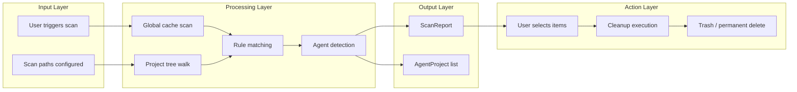
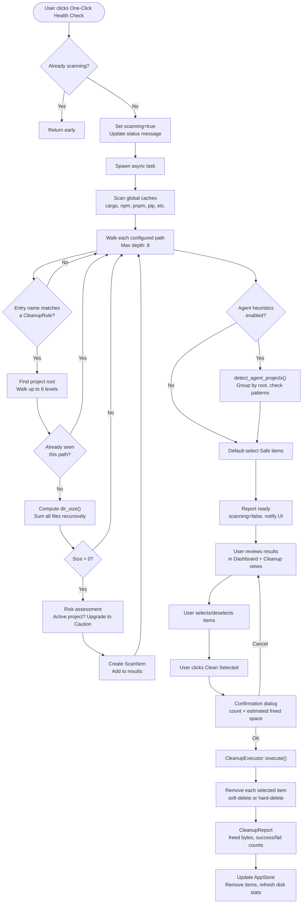
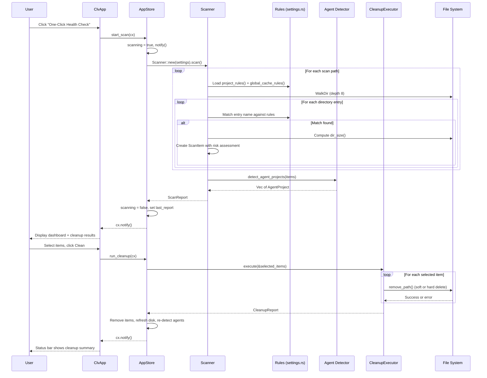
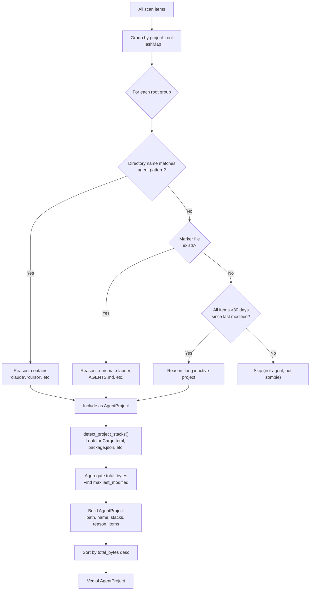
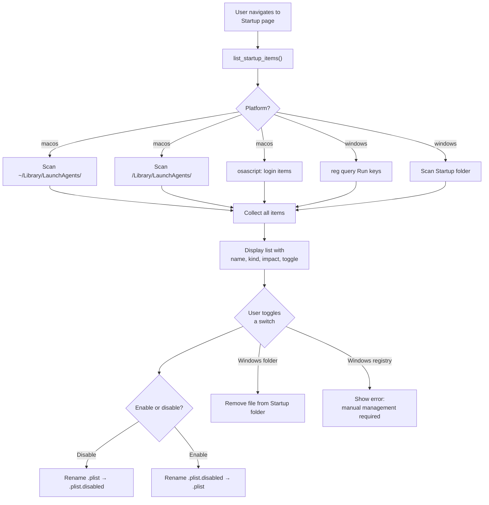

# Core Workflows

## 1. Workflow Overview

CLV3000 Plus's workflow can be understood through a simple analogy: it's like a medical checkup for your computer. The scan is the diagnosis -- you sit in the waiting room while the doctor examines you. The cleanup is the treatment -- you review the prescription and decide what to take. And the management features (startup, process) are the ongoing wellness tools that keep your system healthy between checkups.

The entire application is built around one central workflow: scan → review → clean. Everything else is a supporting feature that enhances the developer's ability to maintain their workstation.

### 1.1 Core Execution Path

---

## 2. Primary Workflows

### 2.1 One-Click Health Check (Scan + Cleanup)

This is the application's flagship workflow, designed to be as effortless as pressing a single button. It's the "check engine light" approach: press one button, get a complete picture of your system's disk health.

#### Flow Chart

#### Sequence Diagram

#### Stage Description

| Stage | Executor | Input | Output | Description |
|-------|----------|-------|--------|-------------|
| Scan preparation | `AppStore::start_scan()` | User click | `scanning=true` | Guards against double-scan, sets UI status |
| Global cache scan | `Scanner::scan()` | `global_cache_rules()` | Global items | Scans 10 home directory cache locations |
| Project tree walk | `Scanner::scan_tree()` | `project_rules()` + scan paths | Project items | Walks directories up to depth 8, matches rules |
| Size computation | `dir_size()` | File/directory path | `u64` bytes | Recursively sums file sizes |
| Risk assessment | `Scanner::try_add_rule_path()` | Path + rule + project root | `ScanItem` with risk | Upgrades risk for active projects (< 3 days) |
| Agent detection | `detect_agent_projects()` | All scan items | `Vec<AgentProject>` | Groups by root, checks 14 patterns + 7 markers |
| Default selection | `Scanner::scan()` | All items | Items with `selected` flag | Auto-selects Safe items |
| Cleanup execution | `CleanupExecutor::execute()` | Selected items | `CleanupReport` | Soft-delete (rename) or hard-delete (remove) |
| State update | `AppStore::run_cleanup()` | CleanupReport | Updated store | Removes items, refreshes disk, re-runs agent detection |

### 2.2 Agent Project Discovery

This workflow runs as a post-processing step after the main scan. It's the "second opinion" that looks specifically for AI agent experiment projects that might not be obvious from the file system alone.

#### Flow Chart

### 2.3 Startup Item Management

The startup workflow operates on a different rhythm than scan/cleanup -- it's about ongoing maintenance rather than one-time cleanup. Think of it as adjusting the thermostat: small, targeted changes that have lasting effects on system performance.

#### Flow Chart

---

## 3. Concurrency and Async Model

CLV3000 Plus takes a conservative approach to concurrency: only the scan operation runs asynchronously. Everything else -- cleanup, process listing, startup management -- runs synchronously on the main thread.

This is a deliberate "stability over speed" choice. The scan is the only operation that can take more than a few hundred milliseconds (because it traverses potentially large directory trees and computes sizes). All other operations are fast enough to be synchronous:

| Operation | Typical Duration | Async? | Rationale |
|-----------|-----------------|--------|-----------|
| Scan | 1-30 seconds | Yes (cx.spawn) | Avoids blocking UI during directory traversal |
| Cleanup | 0.1-2 seconds | No | Immediate feedback is more important than responsiveness |
| Process listing | 50-200ms | No | Fast enough to be synchronous |
| Startup listing | 100-500ms | No | osascript call is the bottleneck, still fast |

The async scan uses `cx.spawn()` with a `weak` reference to safely handle the case where the view might be dropped during the scan. The `weak.update()` pattern in the progress callback ensures no panic if the app is closed during a scan.

---

## 4. Error Handling Strategy

The error handling philosophy is "local failure, global continuity." Individual items that can't be read or removed don't stop the overall operation. This is the right approach for a utility tool where partial success is better than no success.

**During scan**: `Scanner::scan()` silently skips inaccessible paths. If a directory can't be read, it's simply not included in the results. No error is shown to the user unless the entire scan fails (which is rare).

**During cleanup**: `CleanupExecutor::execute()` collects failures in a `Vec<(PathBuf, String)>`. The summary shows "Cleaned N items, M failed" rather than aborting on first failure. This means if one file is locked by another process, the rest of the cleanup still proceeds.

**During startup management**: `set_startup_enabled()` returns `anyhow::Result<()>`. If toggling fails (e.g., Windows registry items in v0.1), a warning is logged but the UI doesn't crash. The toggle simply doesn't change state.

**During process management**: `kill_process()` returns `anyhow::Result<()>`. If the process doesn't exist (already terminated), the error is silently ignored. If the kill fails, the error is surfaced in the confirmation dialog's response.

---

## 5. Key Sequence Interactions

**Scan Sequence**: The scan is a one-way pipeline with callbacks. `AppStore::start_scan()` → `Scanner::new().scan(progress_callback)` → global cache scan → project tree walk → rule matching → size computation → risk assessment → agent detection → `ScanReport` → UI update. The progress callback runs at three points: initial, every 3 directory levels, and when items are found.

**Cleanup Sequence**: The cleanup is a synchronous request-response. `AppStore::run_cleanup()` → `CleanupExecutor::execute()` → for each item: `remove_path()` → `CleanupReport` → state update → UI refresh. The confirmation dialog is a separate pre-step that blocks until the user confirms.

**Agent Toggle Sequence**: The startup toggle is a fire-and-forget operation. User clicks switch → `set_startup_enabled(id, enabled)` → platform-specific logic (rename plist or delete file) → UI refresh. No confirmation dialog because the operation is easily reversible.

**Process Kill Sequence**: The kill follows a confirmation pattern. User clicks Kill → confirmation dialog shows PID → user confirms → `kill_process(pid)` → process receives SIGTERM → UI reflects change on next refresh.
