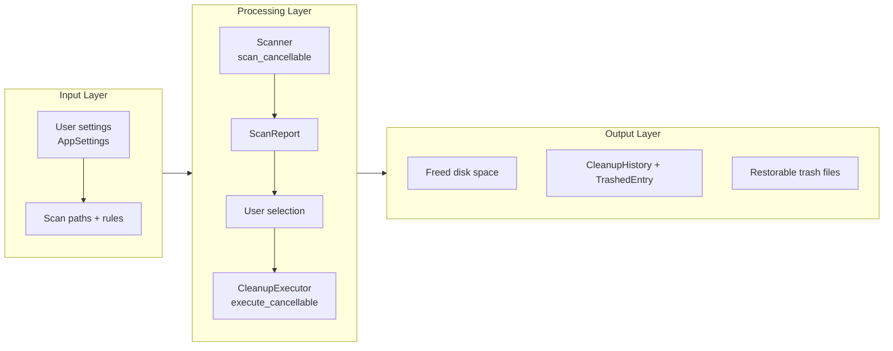
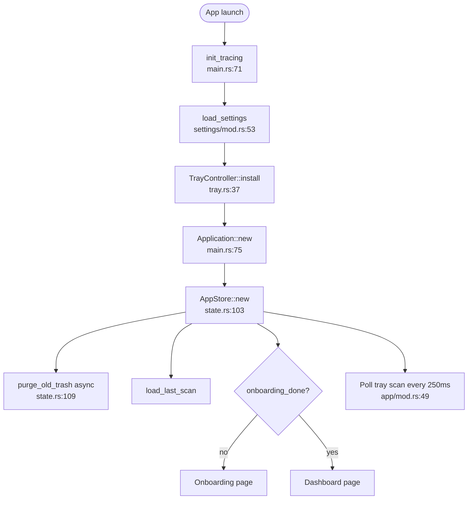
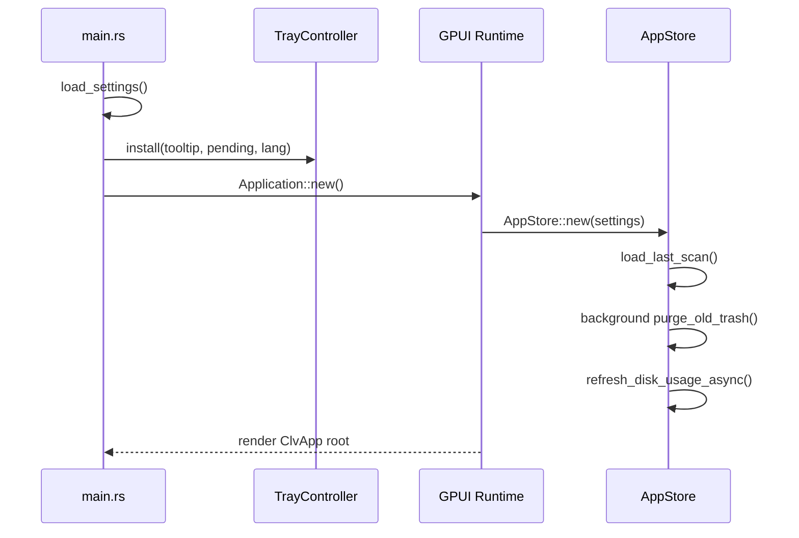
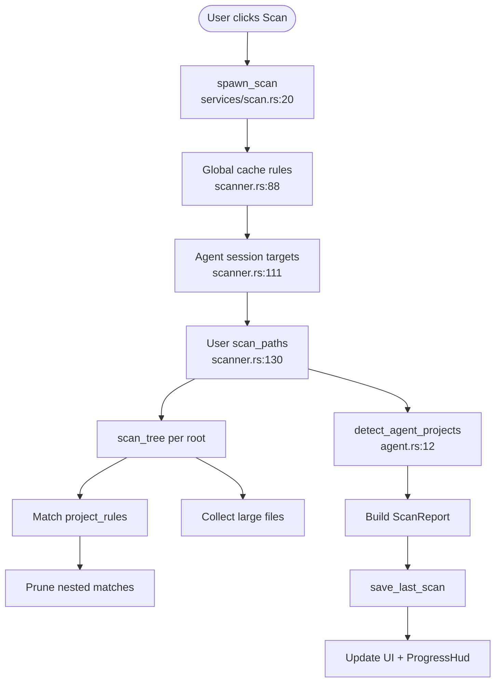
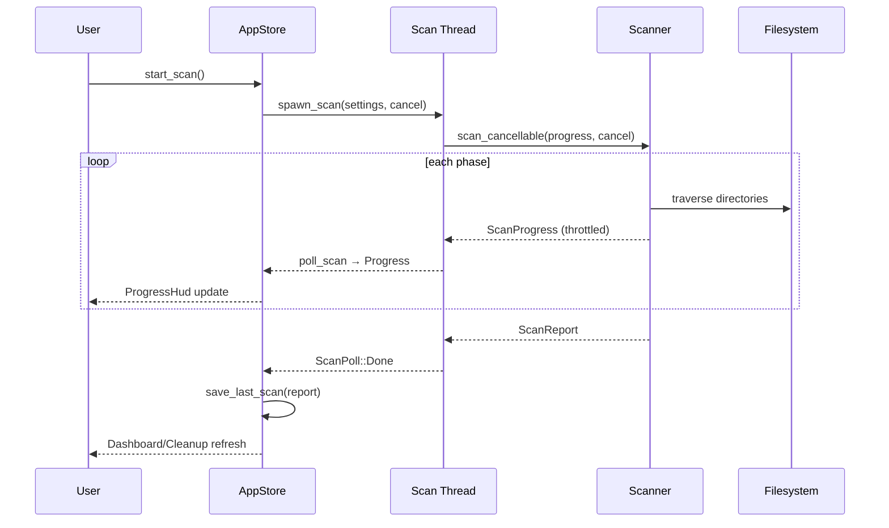
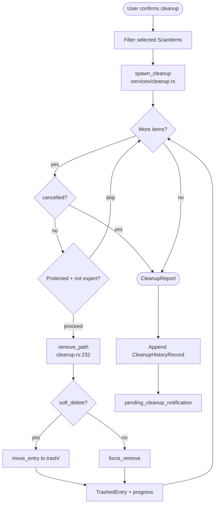
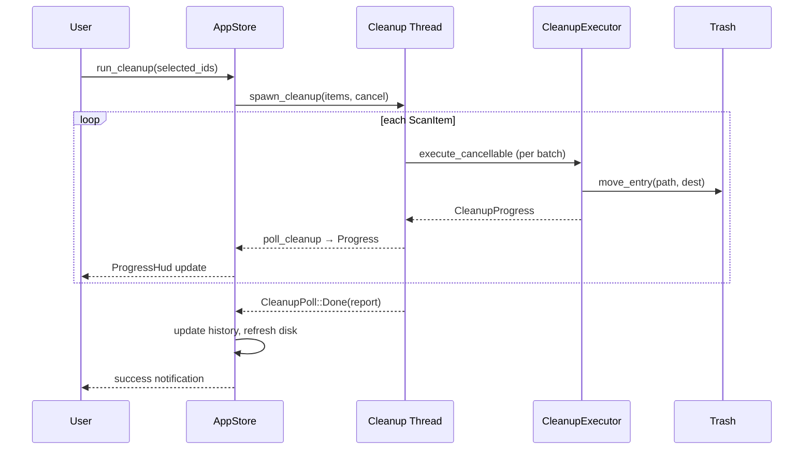

# Core Workflows

## 1. Workflow Overview

### 1.1 How to Read This Document

CLV3000 Plus workflows follow a simple mental model: **scan → review → clean → (optionally) restore**. Think of it as a recycling plant—trucks inventory what's reclaimable (scan), human sorters pick bins (UI selection), and the compactor moves material to a holding area (app trash) rather than incinerating it immediately (permanent delete).

Every workflow is local and synchronous from the user's perspective: you click a button, see progress, get a result. Under the hood, heavy filesystem work runs on background threads so the window stays responsive.

### 1.2 Core Execution Path

---

## 2. Primary Workflows

### 2.1 Application Startup

When you launch CLV3000 Plus, the app prepares its control tower before showing you anything useful. Settings load from disk, the system tray installs (if supported), stale trash gets purged, and the last scan report restores so the Dashboard is not empty.

#### Flowchart

#### Sequence

#### Phase Table

| Phase | Executor | Input | Output | Notes |
|-------|----------|-------|--------|-------|
| Tracing init | `main.rs` | env filter | log subscriber | Warn level in release |
| Settings load | `load_settings` | settings.json | `AppSettings` | Defaults if missing |
| Tray install | `TrayController` | icon + menu | tray handle | Continues if unavailable |
| Store bootstrap | `AppStore::new` | settings | populated store | Loads history + last scan |
| Page routing | `ClvApp::new` | onboarding_done | initial page | Tray scan auto-starts if flagged |

---

### 2.2 Disk Scan

The scan workflow is the app's heartbeat. It walks three territories in order: global tool caches under your home directory, known AI agent session folders, and your configured project roots.

#### Flowchart

#### Sequence

#### Phase Table

| Phase | Executor | Input | Output | Notes |
|-------|----------|-------|--------|-------|
| Preparing | `Scanner` | settings | phase label | Localized via `scan_phase_preparing` |
| Global caches | `global_cache_rules()` | home paths | ScanItems | Skips missing paths |
| Agent sessions | `discover_agent_session_targets` | env + home | ScanItems | Gated by `include_agent_heuristics` |
| Project scan | `scan_tree` | scan_paths | ScanItems + large files | Skips protected roots |
| Agent grouping | `detect_agent_projects` | items + roots | AgentProjects | Filters active repos |
| Persist | `save_last_scan` | ScanReport | last_scan.json | Enables offline Dashboard |

**Cancellation behavior**: Setting the cancel flag stops the walk; `scan_restart_pending` can trigger immediate re-scan (`state.rs`).

---

### 2.3 Cleanup

Cleanup takes your checkbox selections and moves each item to app trash (default) or permanently deletes (if soft_delete disabled). Progress shows per-item; failures are recorded without aborting the batch.

#### Flowchart

#### Sequence

---

### 2.4 Agent Project Review

After scanning, the Agent page surfaces grouped experiment folders. Users filter by name, reason, or stack before deciding to clean.

**Entry**: `AgentView` reads `AppStore.last_report.agent_projects` (`crates/clv-app/src/views/agent.rs`)

**Key logic**: `detect_agent_projects` (`agent.rs:12`) groups scan items by project root, applies name/marker/inactivity heuristics, and attaches `AgentReasonPart` enums formatted per language via `format_agent_reason`.

---

## 3. Concurrency and Async Model

The app uses a **dual-thread model**: GPUI owns the main thread for rendering and entity updates; scan and cleanup each run on a dedicated worker thread communicating through `mpsc` channels.

| Concern | Strategy | Rationale |
|---------|----------|-----------|
| UI responsiveness | Offload I/O to workers | Prevents frame drops during large walks |
| Progress delivery | Coalesced polling on timer | Scan throttles to 300ms; avoids channel flooding |
| Cancellation | `AtomicBool` shared flag | Simple, checked at loop boundaries |
| Disk refresh | GPUI `background_spawn` | Non-blocking platform call |

This is deliberately **stability-first**: no async runtime in core, no nested thread pools—just one scan thread and one cleanup thread at a time.

---

## 4. Error Handling Strategy

The philosophy is **local failure should not global abort**. A single unreadable directory or locked file should not crash the app or stop an entire cleanup batch.

| Scenario | Handling | Location |
|----------|----------|----------|
| Missing scan root | Skip silently | `scanner.rs:136` |
| Protected system path | Skip | `scanner.rs:136`, `paths.rs:165` |
| Cleanup item failure | Record in `report.failed`, continue | `cleanup.rs:216-218` |
| Corrupt settings JSON | Fall back to defaults | `load_settings:57-60` |
| Tray unavailable | Log warning, continue | `main.rs:37-39` |
| Cross-device move | Copy + delete fallback | `move_entry:256-268` |

Users see failures in cleanup summary and Expert-mode detail; the Dashboard history card tracks success/failure counts over time.
