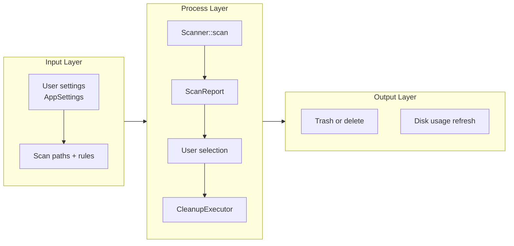
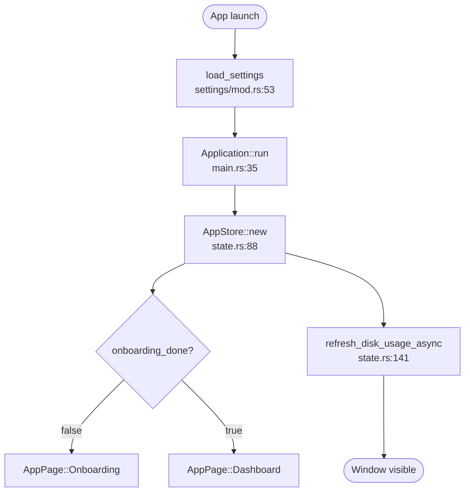
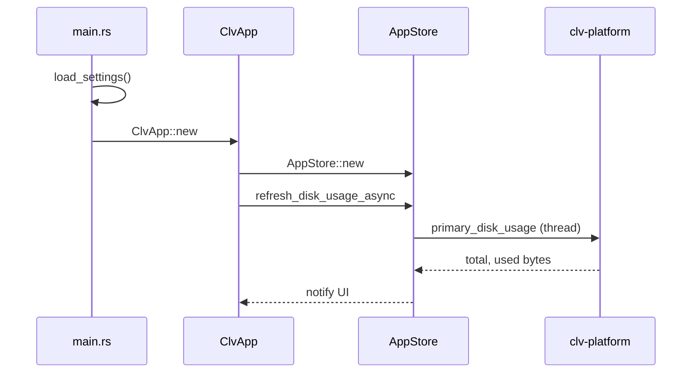
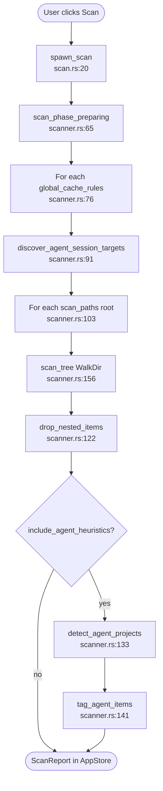
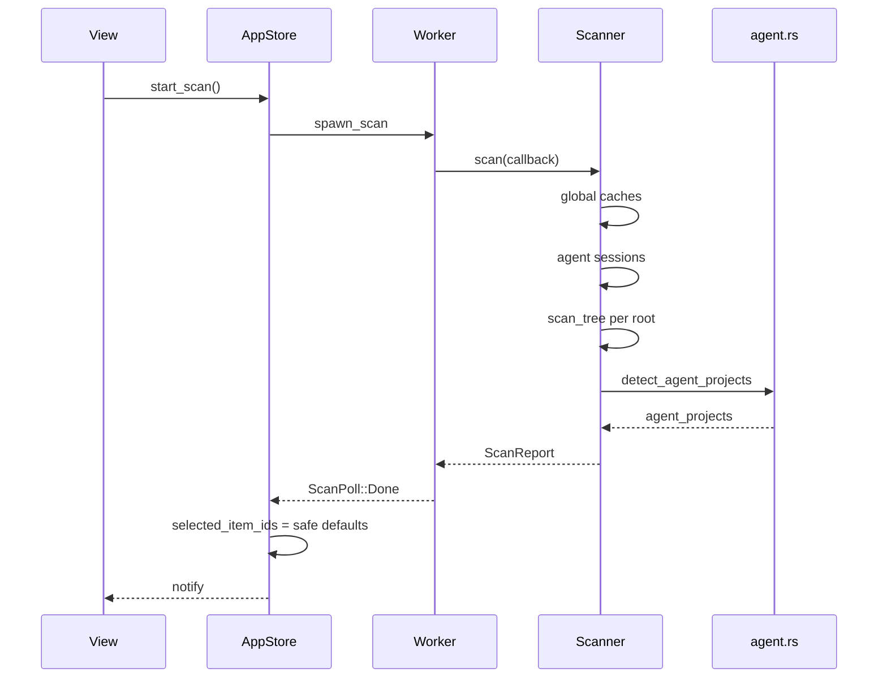
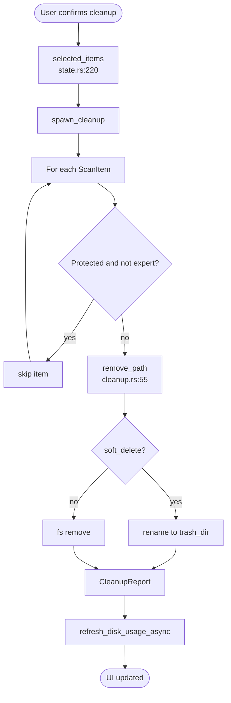
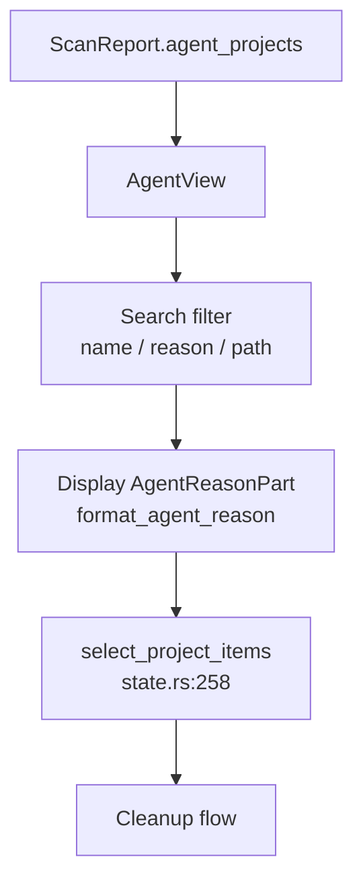

# Core Workflows

CLV3000 Plus workflows can be pictured as a **factory line**: raw filesystem state enters the scanner, gets classified and labeled, pauses on the review floor (UI lists), and only then moves to disposal (cleanup executor). Nothing is deleted without an explicit user action on selected items — the line has a mandatory human inspection station.

This document traces those lines end-to-end with diagrams tied to real functions and file paths.

---

## 1. Workflow Overview

### 1.1 Execution Model

The GPUI main thread renders UI and polls background jobs. Long I/O runs on worker threads bridged by `mpsc` channels (`services/scan.rs`, `services/cleanup.rs`). `AppStore` is the hub — views never call `Scanner` directly.

### 1.2 Core Execution Path

---

## 2. Primary Workflows

### 2.1 Application Startup

First launch shows onboarding; returning users land on the dashboard. Disk metrics load asynchronously so the window appears immediately.

#### Flowchart

#### Sequence

| Stage | Actor | Input | Output | Notes |
|-------|-------|-------|--------|-------|
| Boot | `main.rs` | None | GPUI app | Windows GUI subsystem |
| Settings | `load_settings` | JSON file | `AppSettings` | Default on missing file |
| Routing | `ClvApp` | `onboarding_done` | Initial `AppPage` | `app/mod.rs:35` |
| Metrics | `AppStore` | OS disks | `disk_total`, `disk_used` | Non-blocking thread |

---

### 2.2 Full Disk Scan

The scan workflow is the app's heartbeat. It combines three passes — global caches, agent sessions, and per-root project trees — then merges agent project intelligence.

#### Flowchart

#### Sequence

| Stage | Actor | Input | Output | Notes |
|-------|-------|-------|--------|-------|
| Global pass | `Scanner` | `global_cache_rules()` | `ScanItem` list | Skips missing paths |
| Session pass | `agent_sessions` | Known CLI paths | Session cache items | Env overrides |
| Tree pass | `scan_tree` | `project_rules()` | Project artifacts | Max depth 8 |
| Prune | `drop_nested_items` | Raw items | Deduped list | Parent wins |
| Agent merge | `detect_agent_projects` | Items + paths | `AgentProject` vec | Zombie 30d rule |

**Progress throttling** — `ProgressThrottle` emits at most every 300ms unless `force: true` on phase boundaries (`scanner.rs:22–42`).

---

### 2.3 Cleanup Execution

Cleanup is deliberately sequential per item — simpler error accounting and predictable disk I/O.

#### Flowchart

| Stage | Actor | Input | Output | Notes |
|-------|-------|-------|--------|-------|
| Select | `AppStore` | IDs + filters | `Vec<ScanItem>` | Expert hides Protected in list |
| Execute | `CleanupExecutor` | Items | Per-path Result | Failed paths collected |
| Soft delete | `remove_path` | Path | Trash path | `{stamp}-{name}-{uuid}` |
| Report | Store | `CleanupReport` | Status message | Shows freed bytes |

---

### 2.4 Agent Project Review

Users open the Agent page to see experiment folders with structured reasons — not just a flat cleanup list.

Detection logic (`agent.rs:51`): group by `project_root`, run `is_agent_project_path`, flag `InactiveOver30Days` when all items stale 30+ days.

---

## 3. Concurrency and Async Model

| Concern | Strategy | Rationale |
|---------|----------|-----------|
| Scan | Dedicated thread | walkdir blocks; UI must not stall |
| Progress | `sync_channel(64)` + poll | Coalesce progress on GPUI tick |
| Disk usage | One-shot thread | sysinfo refresh can be slow |
| Process kill | One-shot thread | Avoid blocking UI on kill syscall |
| View updates | `cx.notify()` | GPUI entity subscription model |

The design favors **predictable threads over async complexity** — no Tokio runtime, fewer surprise re-entrancy bugs in UI code.

---

## 4. Error Handling Strategy

**Scan path** — Missing roots, protected paths, and inaccessible entries are skipped; the scan continues (`scanner.rs:104`, `scanner.rs:182`). This embodies "partial information beats a crashed scan."

**Cleanup path** — Each item is independent. Failure on one path records `(path, error)` in `CleanupReport.failed` (`cleanup.rs:46–48`) while successes still increment `success_count`.

**Settings** — Corrupt JSON falls back to `AppSettings::default()` (`settings/mod.rs:57–60`).

**Protected paths** — `is_protected_system_path` prevents scanning/deleting system roots (`paths.rs`).

**UI feedback** — `AppStore.status_message` carries kill failures, cleanup summaries, and process errors to the user in the active language.

---

## Source Index

| Workflow | Entry Point | File |
|----------|-------------|------|
| App boot | `main()` | `crates/clv-app/src/main.rs:23` |
| Scan spawn | `spawn_scan` | `crates/clv-app/src/services/scan.rs:20` |
| Scan logic | `Scanner::scan` | `crates/clv-core/src/scanner.rs:54` |
| Cleanup spawn | `spawn_cleanup` | `crates/clv-app/src/services/cleanup.rs` |
| Cleanup logic | `CleanupExecutor::execute` | `crates/clv-core/src/cleanup.rs:25` |
| State hub | `AppStore` | `crates/clv-app/src/app/state.rs:57` |
