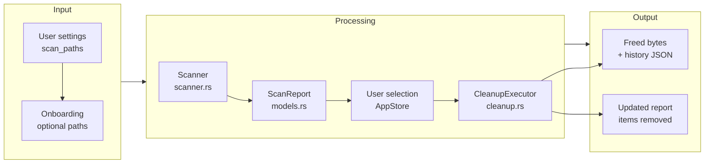
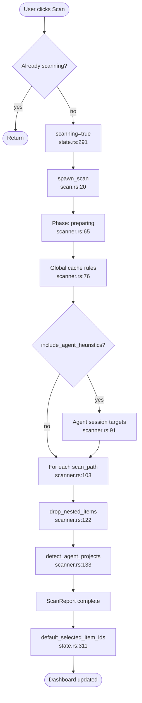
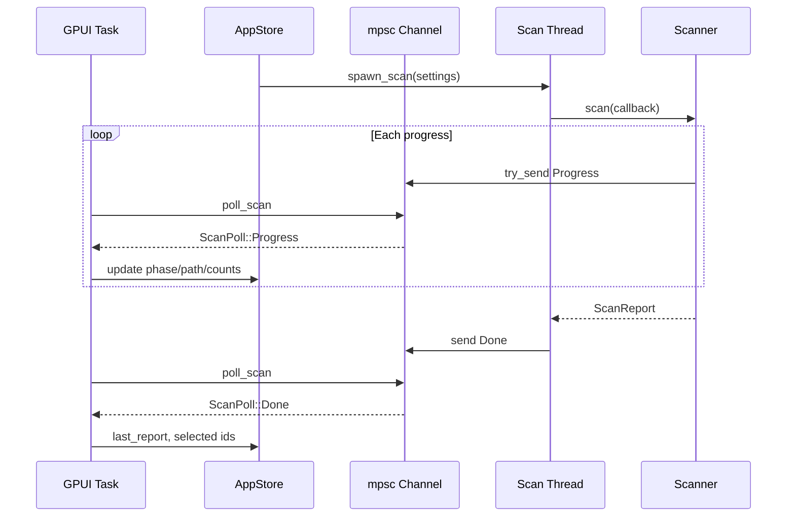
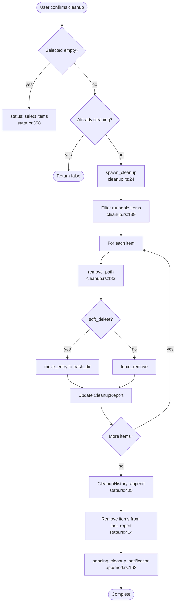
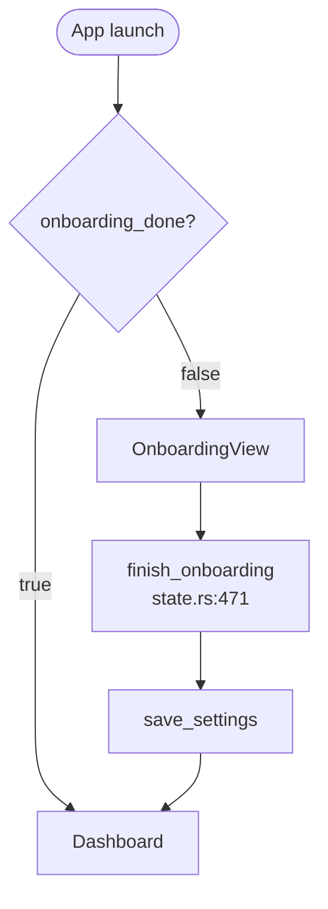

# Core Workflows

## 1. Workflow Overview

### 1.1 How to Read This Document

CLV3000 Plus behaves like a **small factory line**: raw input (your disk and settings) enters the scan station, items are labeled by risk and category, you inspect the manifest at the cleanup station, and only then the delete station moves or removes files. The GPUI window is the factory office—it never operates the heavy machinery directly, only watches progress dials and sends start/stop signals.

### 1.2 Core Execution Path

---

## 2. Main Workflows

### 2.1 Health Scan Workflow

This is the workflow users trigger from the dashboard—"one-click health check" that populates reclaimable space numbers across the app.

#### Flowchart

#### Sequence Diagram

#### Stage Table

| Stage | Executor | Input | Output | Notes |
|-------|----------|-------|--------|-------|
| Prepare | `Scanner::scan` | `AppSettings` | Progress event | `scan_phase_preparing` |
| Global caches | `global_cache_rules` | Home/env paths | `ScanItem` list | Skips protected system paths |
| Agent sessions | `discover_agent_session_targets` | Known agent homes | Session/cache dirs | Codex, Claude, Cursor, … |
| Project trees | `scan_tree` | Each `scan_paths` entry | More `ScanItem`s | Marker-based project roots |
| Prune | `drop_nested_items` | Raw items | Deduplicated list | Parent wins over nested |
| Agent projects | `detect_agent_projects` | Items + paths | `agent_projects` | For Agent page |

**Entry point:** `AppStore::start_scan` — `crates/clv-app/src/app/state.rs:287`

---

### 2.2 Cleanup Workflow

After review, selected items are deleted or moved to the app trash folder.

#### Flowchart

#### Stage Table

| Stage | Executor | Input | Output |
|-------|----------|-------|--------|
| Validate | `AppStore::run_cleanup` | `selected_item_ids` | Error status if empty |
| Execute | `CleanupExecutor::execute` | `Vec<ScanItem>` | `CleanupReport` |
| Soft delete | `remove_path` | Path | Timestamped trash entry |
| History | `CleanupHistory` | Record | `cleanup_history.json` |
| UI sync | `AppStore` | Removed paths | Updated `last_report` |

**Entry point:** `AppStore::run_cleanup` — `crates/clv-app/src/app/state.rs:356`

---

### 2.3 Onboarding Workflow

First launch routes to `AppPage::Onboarding` when `onboarding_done` is false (`app/mod.rs:36-41`).

`finish_onboarding` sets expert mode, optional custom paths, marks onboarding complete, navigates to dashboard.

---

### 2.4 Process Kill Workflow

From Process view, user kills a PID:

1. `kill_process_pid` — `state.rs:129`
2. `std::thread::spawn(|| kill_process(pid))`
3. Increment `process_refresh_trigger` for view reload
4. Status message success/failure

---

## 3. Concurrency and Async Model

The app prioritizes **UI stability over maximum parallelism**. One scan and one cleanup run at a time (guarded by `scanning` / `cleaning` flags). Worker threads are fire-and-forget with channel back-pressure (sync channel size 64).

GPUI `cx.spawn` async blocks use `background_executor().timer()` for polling—no blocking `recv()` on the UI thread.

| Operation | Thread | Communication |
|-----------|--------|---------------|
| Scan | `std::thread` | `mpsc::sync_channel` 64 |
| Cleanup | `std::thread` | Same |
| Disk refresh | `std::thread` | Join + `weak.update` |
| Render | GPUI main | `cx.notify()` |

---

## 4. Error Handling Strategy

**Philosophy:** Local failure should not abort the entire batch. A single locked file should not prevent cleaning a hundred cache folders.

| Scenario | Behavior | Code |
|----------|----------|------|
| Per-path delete error | Record in `failed` vec | `cleanup.rs:166-168` |
| Missing path on cleanup | Count as success | `cleanup.rs:184-186`, test 397-408 |
| Scan thread crash | `ScanPoll::Disconnected` | `scan.rs:45`, `state.rs:332` |
| Cleanup thread crash | `CleanupPoll::Disconnected` | `state.rs:445` |
| Settings save failure | `tracing::error` | `app/mod.rs:365` |
| Protected + simple mode | Skip in executor + hide in filter | `cleanup.rs:139`, `state.rs:200` |

Cross-volume moves on Windows fall back to copy+delete (`cleanup.rs:207-221`) when `rename` fails with cross-device error.
