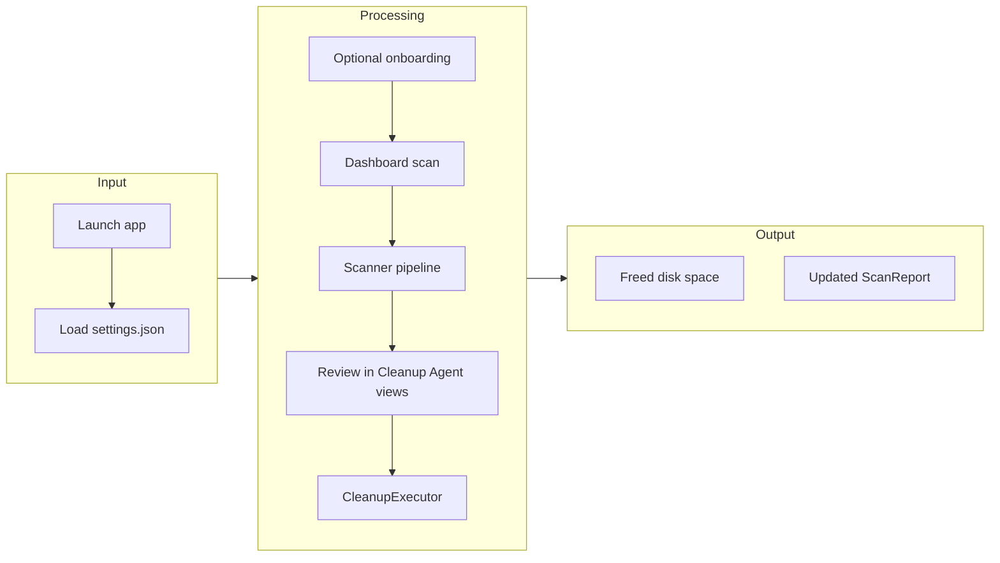
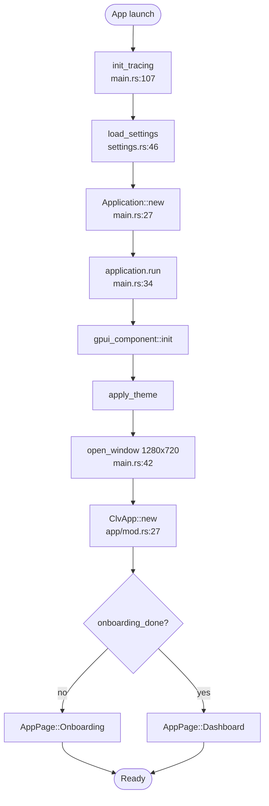
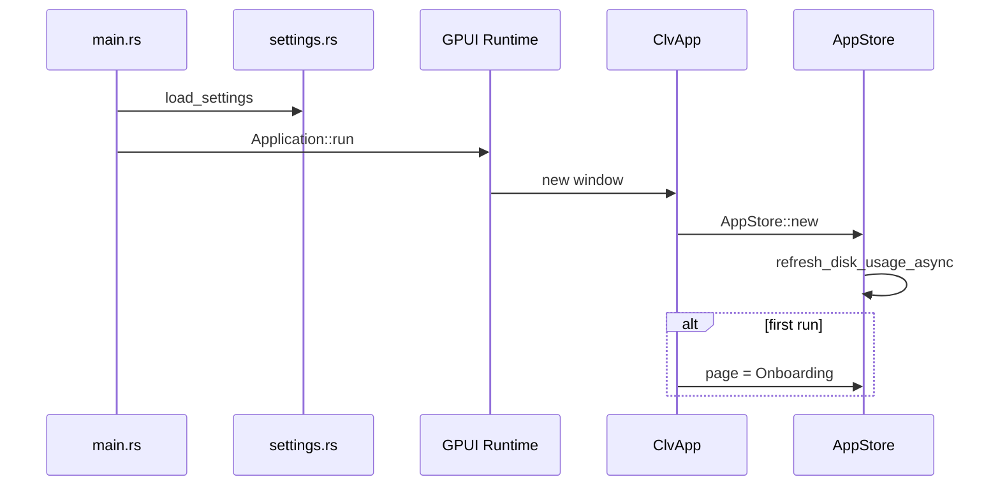
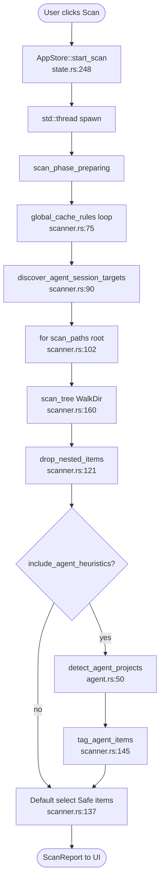
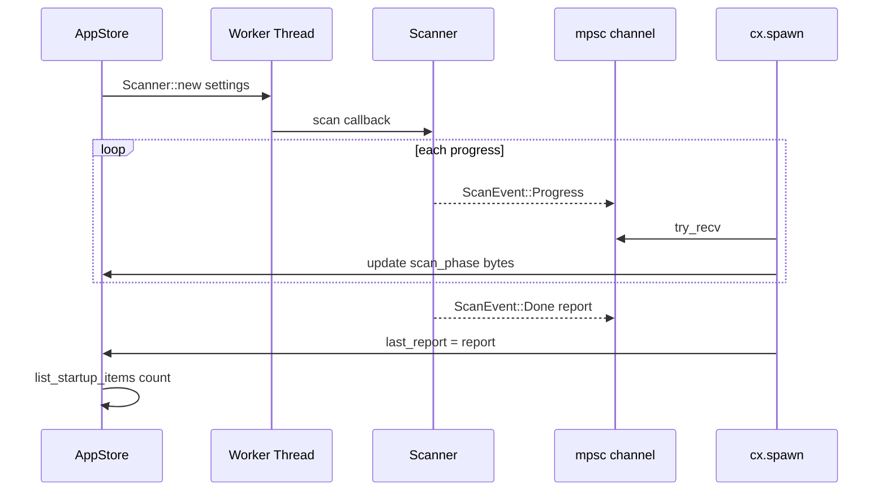
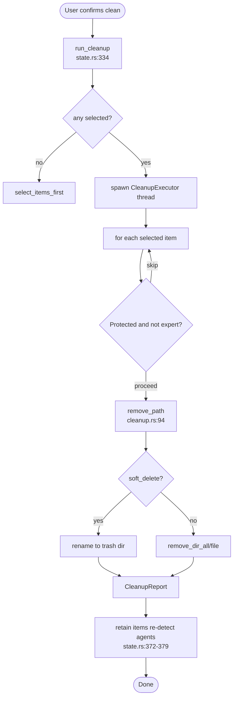

# Core Workflows

Think of CLV3000 Plus like a **home inspection followed by selective decluttering**: the app walks your digital house (configured scan roots), labels what's clutter vs what's structural, shows you a checklist, and only removes what you approve. Scans and deletes happen in back rooms (background threads) while you keep using the front desk (the UI).

## 1. Workflow Overview

### 1.1 Philosophy

Workflows are **user-gated**. Nothing is deleted without explicit selection and confirmation. Simple mode pre-selects only `RiskLevel::Safe` items after scan (`scanner.rs:137-140`). Expert mode exposes Protected entries and full filesystem paths.

Long-running work never blocks painting: scan and cleanup use worker threads and channel-based progress (`state.rs:260-331`, `state.rs:356-405`).

### 1.2 Core Execution Path

---

## 2. Main Workflows

### 2.1 Application Bootstrap

This workflow establishes the GPUI window, loads preferences, and optionally shows first-run onboarding.

#### Flowchart

#### Sequence

#### Stage Table

| Stage | Executor | Input | Output | Notes |
|-------|----------|-------|--------|-------|
| Load settings | `load_settings` | JSON file | `AppSettings` | Default if missing |
| Create store | `AppStore::new` | settings | Entity store | Disk refresh spawned |
| Onboarding gate | `ClvApp::new` | `onboarding_done` | Page selection | `app/mod.rs:35-40` |

---

### 2.2 Health Scan

The primary value workflow: discover reclaimable space across global caches, agent sessions, and project trees.

#### Flowchart

#### Sequence

#### Stage Table

| Stage | Executor | Input | Output |
|-------|----------|-------|--------|
| Global pass | `Scanner::scan` | `global_cache_rules()` | `ScanItem` list |
| Session pass | `try_add_agent_session` | `AgentSessionTarget` | Session/cache hits |
| Tree walk | `scan_tree` | `scan_paths`, `project_rules()` | Matched dirs |
| Prune | `drop_nested_items` | Raw items | Deduped list |
| Agent projects | `detect_agent_projects` | items + paths | `agent_projects` |

---

### 2.3 Cleanup Execution

Deletes (or trashes) user-selected `ScanItem` entries and updates in-memory report.

#### Flowchart

---

### 2.4 Startup Item Toggle

Platform-specific; invoked from `StartupView` calling `clv_platform::set_startup_enabled`.

| Platform | Mechanism | File |
|----------|-----------|------|
| macOS LaunchAgent | `.plist.disabled` rename + launchctl | `startup.rs:253-297` |
| macOS Login item | osascript delete | `startup.rs:299-320` |
| Windows Registry Run | StartupApproved binary flag | `startup.rs:499-508` |
| Windows Startup folder | StartupApproved by filename | `startup.rs:469-474` |

---

### 2.5 Process Kill

`AppStore::kill_process_pid` (`state.rs:114`) spawns thread → `clv_platform::kill_process` → refreshes process list on result.

---

## 3. Concurrency and Async Model

The app uses **cooperative UI + blocking worker threads**, not async Rust for filesystem work:

- **Why:** `walkdir` and `remove_dir_all` are inherently blocking; isolating them avoids stalling GPUI's frame loop.
- **Bridge:** `mpsc` channels + `cx.spawn` polling with timers—not shared `Mutex` on `ScanReport` from worker (report delivered once on Done).
- **Disk usage:** One-shot `std::thread::spawn(disk_usage)` joined inside spawn (`state.rs:139-151`).

Design intent: **stability over maximum parallelism**—one scan at a time (`scanning` guard at `state.rs:249`).

---

## 4. Error Handling Strategy

**Partial failure is acceptable for cleanup.** `CleanupReport.failed` collects `(PathBuf, String)` pairs per item (`cleanup.rs:85-87`); successful items still count toward `freed_bytes`.

**Scan interruption:** If the worker disconnects without Done, UI shows `scan_interrupted` (`state.rs:284-293`).

**Protected paths:** Skipped during scan via `is_protected_system_path` (`scanner.rs:186`, `paths.rs:146`).

**Kill process:** Errors surfaced in `status_message`; ESRCH / "No such process" treated as success on Unix (`process.rs:126-128`).

**Settings save:** Logged via `tracing::error` in `save_settings_from_store` (`app/mod.rs:333-336`)—UI continues with in-memory settings.

The philosophy: **never panic the UI on IO errors**; collect, display, and let the user retry.
