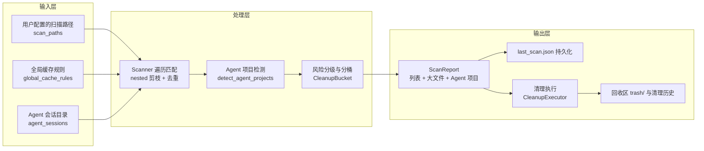
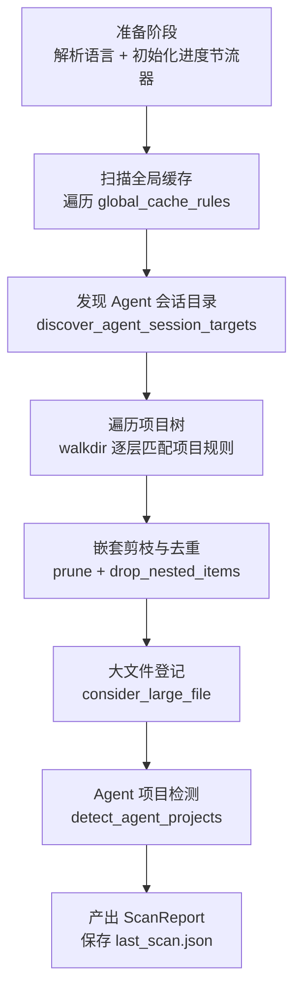
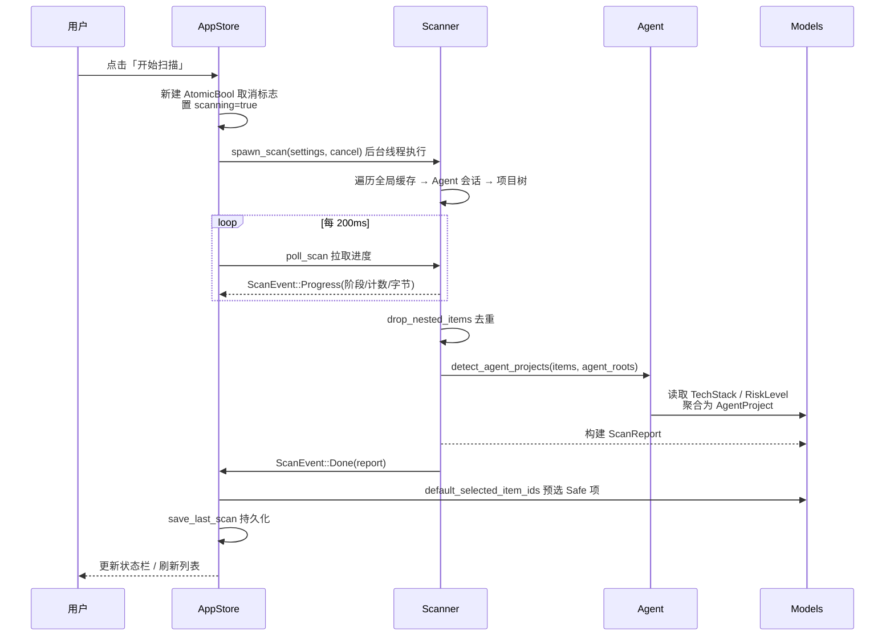
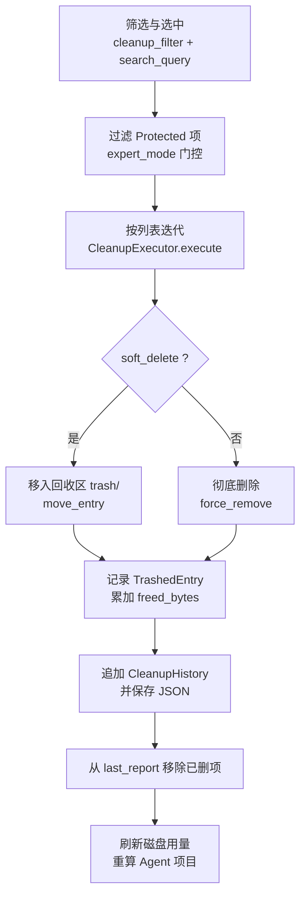
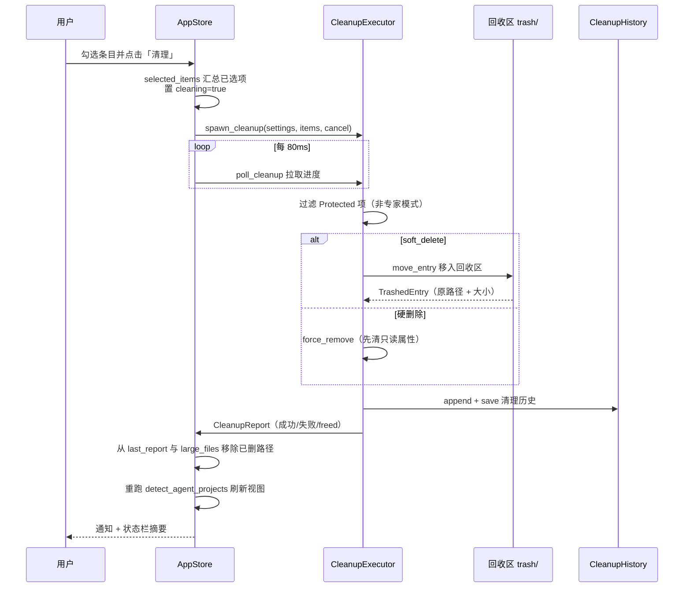
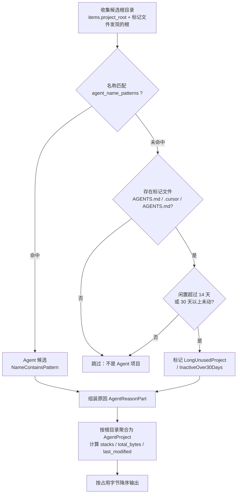

# 核心工作流

如果把 CLV3000 Plus 想象成一个专业的再生资源回收中心，那么一次完整的磁盘整理就是一条流水线：扫描器像垃圾收集车一样按固定路线四处收集"可回收物"，规则引擎像分拣工一样把每一件垃圾按类别和风险分箱，用户在界面上做最后的"裁决"——留下还是送入处置车间，最后清理引擎把确认后的废料安全地移入回收区或彻底销毁。这四个步骤（收集 → 分拣 → 裁决 → 处置）构成了系统所有工作流的骨架：它们彼此独立、逐层递进，任何一层失败都不会让整条流水线停摆。本文件将沿着这条主线，逐一剖析扫描、清理与 Agent 检测三条核心流水线的内部结构、协作方式与容错策略。

## 1. 工作流概述

CLV3000 Plus 的工作流全部围绕"输入 — 处理 — 输出"三层结构展开。输入层是规则的供给源（用户扫描路径、全局缓存规则、Agent 会话目录），处理层是规则引擎的加工车间（遍历、去重、检测、分级），输出层则是用户可以看到和操作的一切（`ScanReport`、`last_scan.json`、回收区与清理历史）。分层的意义在于"职责隔离"：输入层只负责提供候选，处理层只负责判断，输出层只负责展示与持久化——这样扫描策源地、业务逻辑和 UI 之间可以独立演进、独立测试。

为什么要坚持这条单向管道而不是"一把梭"？因为清理工具最怕的就是信息混乱和误删。若把规则匹配、去重和分级全部揉在一个大循环里，任何一个字段的改动都可能牵连其他逻辑，难以验证正确性。单向管道让每个阶段的产物都有明确边界：`ScanItem` 只携带"这条路径是什么、有多大、属于哪个栈"，`AgentProject` 只表达"这个根目录为什么被认为是 Agent 残留"，而最终是否删除由用户结合 `risk` 分级决定。管道本身不背书，决策永远留在用户手里。

## 2. 主要工作流

CLV3000 Plus 有三条核心工作流：扫描（收集与分拣）、清理（裁决与处置）、以及贯穿其中的 Agent 检测（识别 AI 工具残留）。三条工作流共用同一个数据模型——`ScanItem` / `ScanReport`——但时长、交互和风险各不相同：扫描是秒级到分钟级的前台任务，清理是逐个文件的破坏性操作，Agent 检测则是在内存中完成的纯计算。下面分别展开。

### 2.1 扫描工作流

扫描是整条流水线的"收集"阶段。`Scanner` 在 `crates/clv-core/src/scanner.rs` 中实现，一次 `scan_cancellable` 调用走完八个阶段：先做语言与节流准备的预热，再依次扫全局缓存、发现 Agent 会话目录、遍历项目树，随后在内存里做嵌套剪枝去重、登记大文件，最后把命中 Agent 规则的项目二次聚合成 `AgentProject`，输出一份可持久化的 `ScanReport`。八个阶段被刻意排成"先全局、后局部、最后聚合"的顺序：全局缓存先落地，后续项目树扫描可以复用 `seen_paths` 去重，避免同一个目录被重复计量。

扫描的协作关系可以用下面的时序图概括。UI 层（`AppStore`，见 `crates/clv-app/src/app/state.rs`）永远不直接碰文件系统，而是通过 `spawn_scan` 把任务丢给后台线程，再用 200ms 的轮询把进度事件搬回主线程——这种"干活的人与看进度的人分离"的设计，保证了无论目录多么巨大，UI 都能保持流畅。

各阶段的设计意图如下表所示。注意三个阶段——准备、项目树、产出报告——分别扮演"预热"、"主循环"和"收尾"的角色，中间的剪枝、大文件、Agent 检测则是对主循环结果的三种正交视角的加工。

| 阶段 | 引擎动作 | 关键产物 | 含义解读 |
|------|----------|----------|----------|
| 准备 | 解析语言、初始化 `ProgressThrottle`（300ms 节流） | 进度节流器 | 进度回传与渲染是按帧发生的，节流器防止高频 Update 挤占 UI 线程，让"进度条"与"实际遍历"解耦，避免为了一个数字把界面拖卡 |
| 全局缓存 | 遍历 `global_cache_rules`，经 `resolve_global_path` 解析路径 | 全局缓存 `ScanItem` | 先扫全局让覆盖面先行落地，后续项目树扫描可复用 `seen_paths` 去重；这保证 `~/.cargo/registry` 不会因碰巧落在扫描根目录里被重复计量 |
| Agent 会话 | `discover_agent_session_targets` 解析各工具目录 | Agent 会话 `ScanItem` | Agent 会话是高价值清理目标，但散落在多个工具的自定义路径里；单独成阶段可在不遍历用户硬盘的前提下，靠环境变量与默认路径精准定位它们 |
| 项目树 | `walkdir` 深度 ≤8 遍历，`filter_entry` 剪枝 | 项目内构建产物 | 只有"目录名 + 父目录 + 标记文件"三重条件全中才匹配；匹配后立刻把该目录登记为剪枝根，不再下钻其子目录——既避免误伤源码，也省掉大量无谓的 I/O |
| 嵌套去重 | `drop_nested_items` 只保留最外层父项 | 干净的 `ScanItem` 列表 | 父子同时命中（如 `node_modules/.cache` 与 `node_modules`）时只留父项；删除父项已隐式覆盖子项，同时让列表不再冗余，减少用户核对负担 |
| 大文件 | `consider_large_file` 记录超大文件 | `LargeFileEntry` 列表 | 大文件与"规则命中物"是两套正交视角；前者回答"这个项目为什么这么大"，为清理决策提供额外佐证，而不与反垃圾结果混为一谈 |
| Agent 检测 | `detect_agent_projects` 内存聚合 | `AgentProject` 列表 / 重标记 Agent 栈 | 规则扫描只回答"能删什么"，Agent 检测回答"哪些项目是 AI 留下的"；两者共用 `items` 与 `agent_roots`，但输出的是完全不同的视图，互不污染 |
| 产出报告 | `finalize_large_files` + `save_last_scan` | `ScanReport` | 一次扫描的可序列化快照，下一次启动可即时加载；这样两次扫描之间用户依然能看到上次的分拣结果，而不是面对一片空白 |

### 2.2 清理工作流

清理是整条流水线的"裁决与处置"阶段，由 `CleanupExecutor` 在 `crates/clv-core/src/cleanup.rs` 中执行。它的第一步不是删除，而是"过滤"：把 `RiskLevel::Protected` 且未开专家模式的条目挡在门外，然后对选中的列表逐个迭代。每个条目独立处置——删除一个失败并不影响下一个，失败会被记入 `CleanupReport.failed`，而不是抛异常中断整批。这正是"部分失败不应拖垮整个管道"原则在这一流程里的直接体现。

为什么默认走"软删除"而不是直接销毁？因为磁盘清理最昂贵的成本不是空间，而是"误删后追不回来"的信任成本。软删除先经过回收区这个安全网，7 天（`soft_delete_days`）内随时可从 `TrashedEntry` 恢复，之后再被 `purge_old_trash` 周期清理；硬删除路径则仅在用户关闭软删除开关时启用，且前置 `clear_readonly` 保证 Windows 上只读文件也能被干净地移除。

### 2.3 Agent 检测工作流

Agent 检测是一道独立的"分拣逻辑"，实现于 `crates/clv-core/src/agent.rs` 的 `detect_agent_projects`。它不是去遍历磁盘，而是在内存里对扫描产出的 `ScanItem` 按 `project_root` 分组，再对每个根目录做三重信号判断：名称是否命中 `agent_name_patterns`（如 `claude-*`、`cursor-*`），目录下是否存在 `agent_marker_files`（如 `AGENTS.md`、`.cursor`），以及目录的闲置天数是否超过阈值。三条信号以"或"的关系收敛到最终的 `AgentProject` 列表，每个项目都附带结构化的 `AgentReasonPart` 原因，供 UI 按语言显示。

这里隐藏着一个重要的设计取舍：**名称命中的项目永远浮出水面，而仅凭标记文件命中的项目必须等到"闲置"才上报**。原因在于名称模式（`claude-*`、`agent-*` 之类）几乎不可能出现在正经生产项目上，命中即意味着实验残留；而标记文件（`AGENTS.md`、`.cursor`）正越来越多地被真实仓库采纳，如果只要存在标记文件就列入清理建议，用户会看到自己仍在维护的仓库被误报为"残留"。于是系统用 `MARKER_INACTIVE_DAYS = 14` 的闲置门槛做了区分：正在使用的仓库每天都在更新，自然过不了这道关卡；只有真正被遗忘的 AI 项目才会在长期不动后浮出水面。这种"宁缺毋滥"的保守策略，换来的是用户对检测结果的本能信任。

## 3. 并发与异步模型

CLV3000 Plus 的并发模型遵循一个朴素的原则：**稳定性优先于速度**。磁盘遍历是 I/O 密集型任务，如果直接在 UI 线程里跑，界面上会看到窗口"冻住"几秒到几分钟，用户会以为程序崩溃了。因此系统把耗时操作全部丢到后台：`AppStore` 通过 `cx.spawn`（见 `crates/clv-app/src/app/state.rs`）启动任务，任务内用 `std::thread::spawn` 真正地开出一个工作线程执行 `Scanner` / `CleanupExecutor`，两线程之间用有界同步信道（`std::sync::mpsc::sync_channel`，容量 64）传递事件——扫描端用 `try_send` 推送进度快照，主线程用 `try_recv` 批量取回，最新进度顶替旧进度，天然形成"合并/折叠"语义，绝不让主线程积压事件。

支撑这套模型的三根支柱各有分工。第一个是**取消标志** `Arc<AtomicBool>`：扫描和清理线程在每个循环/每个条目处读取 `cancel.load`，UI 上的"取消"按钮只是把它置位，线程会在下一个检查点优雅停手并返回部分结果——这比粗暴地终止线程安全得多，因为删除中途被掐断可能留下半删的目录。第二个是**轮询节拍**：扫描进度每 200ms 轮询一次、清理进度每 80ms 一次，而 `Scanner` 内部的 `ProgressThrottle` 以 300ms 为最小间隔节流发射事件——三个节奏形成"生产端限流 + 消费端降频"的双重保险，200ms 足够 UI 平滑更新，300ms 节流避免高频路径名轰炸主线程。第三个是**后台执行器**：`cx.background_spawn` 把磁盘用量、进程枚举等零散系统调用也挪出 UI 线程，保证任何时刻主线程只做一件事——渲染。

不过也要诚实地说，这套模型放弃了跨任务的真正并行：同一时刻只允许一个扫描或清理任务在跑（`AppStore` 用 `scanning` / `cleaning` 布尔位做互斥）。这并非性能妥协，而是刻意的安全设计——两个并发的清理任务同时操作回收区可能会产生 `TrashedEntry` 的竞态，两个扫描任务同时往 `last_scan.json` 写快照也会互相覆盖。宁可排队，不可出错。

## 4. 错误处理策略

CLV3000 Plus 的错误处理哲学可以概括为一句话：**部分失败不应拖垮整个管道**。文件系统是不可信任的环境——权限不足、符号链接断裂、iCloud 文件未下载、Windows 上的文件被占用，任何情况都可能让单个目录读不了、删不掉。如果一遇错误就 `panic` 或整个流程回滚，一次扫描碰到一个无权限目录就会全军覆没，这显然不可接受。因此系统的做法是"错误就地消化，进度继续向前"。

这套策略体现在五个具体设计上。其一是 `walkdir` 遍历错误被静默跳过：`scanner.rs` 里用 `.filter_map(|e| e.ok())` 把读不到的目录项直接滤掉，扫描器看到的是"干净的流"，而权限问题只影响那一小片区域。其二是 iCloud 墓碑路径被显式过滤：macOS 上 `.icloud` / `com~apple~CloudDocs` 云盘文件在本机可能只有占位符，`is_inaccessible_path` 会过滤它们，防止把"0 字节占位符"当成可清理物，也避免 `canonicalize()` 这类可能阻塞在云盘上的调用。其三是跨卷移动的优雅降级：把文件移入回收区时若触发跨设备错误（Windows 上把文件从 D 盘移到 C 盘是典型的跨卷问题），`move_entry` 会回退为"复制 + 删除"，保证软删除在所有文件系统布局下都成立。其四是 Windows 只读属性的前置清除：`clear_readonly` / `clear_readonly_tree` 在删除前把 `FILE_ATTRIBUTE_READONLY` 剥掉——因为 Node 的 `node_modules` 里经常混着只读文件，不处理这一层，硬删除会在中途卡死。其五是所有 JSON 持久化都取"解析失败即重置"的语义：`load_settings`、`load_last_scan`、`CleanupHistory::load` 遇到损坏文件一律 `unwrap_or_default` 回退到干净状态，而不是把崩溃的配置传染给下一次运行——宁可丢失一次历史，也不让用户换个机器/升级版本后连应用都打不开。