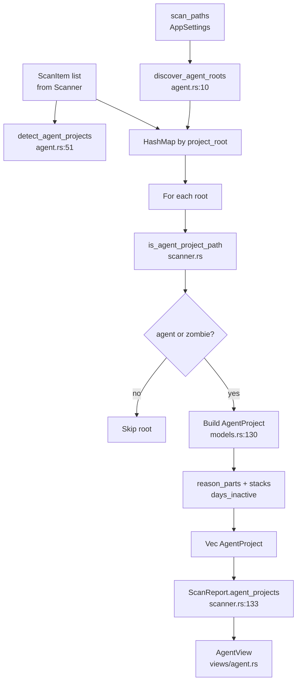

# Agent Domain

**Module path:** `crates/clv-core/src/agent.rs`  
**Generated:** 2026-08-26

---

## What This Module Does

The agent module answers a question the generic scanner cannot: "Which folders are abandoned AI coding agent trial projects?" It walks user scan roots looking for agent markers (`.cursor`, `.agents`, `AGENTS.md`, `CLAUDE.md`), groups related `ScanItem` entries into `AgentProject` records, and attaches human-readable reason codes—long unused, inactive 30+ days, agent markers present.

This is what makes CLV3000 Plus more than a cache cleaner. Developers who spin up dozens of throwaway repos with Cursor or Claude Code leave fingerprints the module recognizes and surfaces on the dedicated Agent page.

---

## Core Capabilities

1. **Agent root discovery** — `discover_agent_roots` (`agent.rs:10-49`) walks each `scan_paths` entry up to depth 8, promoting parent directories when marker dirs or files are found.

2. **Project grouping** — `detect_agent_projects` (`agent.rs:51-100+`) merges scan items by `project_root` and enriches with discovered roots that may have no matching items yet.

3. **Zombie project detection** — Projects where all items are inactive 30+ days are flagged even without explicit agent markers (`agent.rs:69-74`).

4. **Reason part assembly** — Combines `AgentReasonPart` values (`messages/agent_reason.rs`) such as `LongUnusedProject` and `InactiveOver30Days` for localized UI explanations.

5. **Stack detection** — Calls `detect_project_stacks` from scanner to populate `AgentProject::stacks` with detected tech stacks.

6. **Marker integration** — Uses `agent_marker_files()` from `settings/markers.rs` and `is_agent_project_path` from `scanner.rs` for consistent marker logic.

---

## Key Components

| Component | File path | Responsibility |
|-----------|-----------|----------------|
| `discover_agent_roots` | `agent.rs:10-49` | WalkDir scan for agent marker dirs/files |
| `detect_agent_projects` | `agent.rs:51` | Build `Vec<AgentProject>` from items + paths |
| `is_agent_project_path` | `scanner.rs` | Returns `(bool, Vec<AgentReasonPart>)` for a root |
| `agent_marker_files` | `settings/markers.rs` | Static list of marker file/dir names |
| `agent_name_patterns` | `settings/markers.rs` | Name heuristics for agent-related folders |
| `AgentReasonPart` | `messages/agent_reason.rs` | Localized reason enum for UI |
| `AgentProject` | `models.rs:130-139` | Grouped trial project with items and metadata |
| `AgentSessionTarget` | `agent_sessions.rs` | Known global agent cache/session paths |

---

## Internal Data Flow



**Key steps**

1. **Post-scan hook** — Scanner calls `detect_agent_projects` after `drop_nested_items` when `include_agent_heuristics` is true (`scanner.rs:132-136`).
2. **Root promotion** — Hidden dirs like `.cursor` cause their parent to become a project root (`agent.rs:33-36`).
3. **Zombie filter** — Roots with only stale items (>30 days) qualify via `is_zombie` check (`agent.rs:69-74`).
4. **Session pass** — Separate from this module, `discover_agent_session_targets` in `agent_sessions.rs` adds global agent cache paths during scan phase 2.

---

## Key Interfaces and Extension Points

**Public API**

```rust
pub fn discover_agent_roots(scan_paths: &[PathBuf]) -> Vec<PathBuf>;
pub fn detect_agent_projects(items: &[ScanItem], scan_paths: &[PathBuf]) -> Vec<AgentProject>;
```

Re-exported from `crates/clv-core/src/lib.rs` as `detect_agent_projects`.

**Extend markers** — Add entries to `agent_marker_files()` or `agent_name_patterns()` in `settings/markers.rs`. Scanner and agent detection share these lists.

**Extend reason codes** — Add variants to `AgentReasonPart` in `messages/agent_reason.rs` with corresponding i18n strings.

---

## Interactions With Other Modules

| Module | Direction | Interface | Notes |
|--------|-----------|-----------|-------|
| Scanner | called by | `detect_agent_projects` | Post-scan enrichment (`scanner.rs:133`) |
| Agent sessions | sibling | `discover_agent_session_targets` | Global cache paths, separate scan phase |
| Models | output | `AgentProject`, `ScanItem` | Grouped project records |
| Settings | dependency | `agent_marker_files`, `scan_paths` | Marker catalog and walk roots |
| Messages | dependency | `AgentReasonPart` | Localized reason strings |
| AppStore | consumer | `last_report.agent_projects` | Agent page data source |
| Views | consumer | `AgentView` | Virtualized project cards |

---

## Role in Core Business Flows

**Health scan flow** — After scanner completes, `agent_projects` is populated before `AppStore` stores `last_report` (`state.rs:312`). Agent page shows cards even if user never navigates there during scan.

**Agent review flow** — User opens Agent page → `AgentView` reads `store.last_report.agent_projects` → displays size, stacks, inactive days, and reason badges → `select_project_items` (`state.rs:277`) selects all items under a project root.

**Onboarding** — When `include_agent_heuristics` is true (default), first scan already includes agent session targets and project detection.

---

## Performance Considerations

- `discover_agent_roots` caps walk depth at 8 (`agent.rs:24`) to avoid traversing entire home directories.
- Protected system paths skipped via `is_protected_system_path` (`agent.rs:19-20`, `agent.rs:29-30`).
- Grouping uses `HashMap<PathBuf, Vec<ScanItem>>`—O(n) over scan items.
- Marker dir set built once per call from static `agent_marker_files()` list.

---

## Implementation Highlights

**Dual qualification** — A project enters the list if it has agent markers OR qualifies as a zombie (all items stale 30+ days). This catches abandoned repos without `.cursor` folders.

**Reason part stacking** — Zombie projects get `LongUnusedProject`; additionally inactive ones receive `InactiveOver30Days` (`agent.rs:89-94`).

**Empty root inclusion** — `discover_agent_roots` can add roots with zero scan items, surfacing trial projects that have no large cache hits yet (`agent.rs:60-62`).

**Integration test coverage** — Agent marker dir detection verified in `lib.rs:338-345` tests alongside scanner rule matching.
