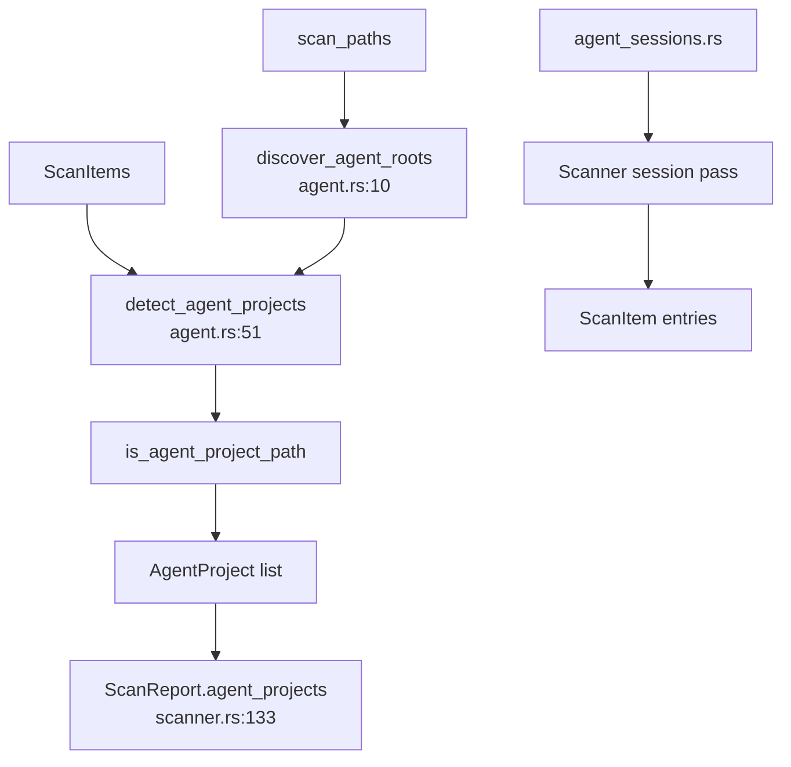

# Agent Detection Domain

**Module paths:** `crates/clv-core/src/agent.rs`, `crates/clv-core/src/agent_sessions.rs`  
**Generated:** 2026-08-23

---

## What This Module Does

Generic disk cleaners know about `node_modules` and `target`. This module understands the ecosystem of **AI coding agents** — Claude Code, Cursor, Codex, Trae, OpenCode, TraeX, and related tools. It discovers known session/cache directories, finds experiment project roots via marker files, aggregates scan items per project, and produces `AgentProject` records with structured `AgentReasonPart` explanations. This is the product differentiator described in the README.

---

## Core Capabilities

1. **Session target catalog** — `discover_agent_session_targets()` (`agent_sessions.rs:17`) enumerates Codex sessions, Claude projects, Cursor caches, Trae CLI data, OpenCode dirs, etc., with env overrides (`TRAE_DIR`, `OPENCODE_DIR`, …).

2. **Marker-based root discovery** — `discover_agent_roots` (`agent.rs:10`) walks scan paths for `.cursor`, `.claude`, `.agents`, `AGENTS.md`, `CLAUDE.md` (max depth 8).

3. **Project aggregation** — `detect_agent_projects` (`agent.rs:51`) merges `ScanItem`s by `project_root` with discovered roots.

4. **Heuristic classification** — `is_agent_project_path` (scanner) checks markers and `agent_name_patterns` from settings.

5. **Zombie detection** — Projects where all items are 30+ days inactive get `AgentReasonPart::InactiveOver30Days` (`agent.rs:92–94`).

6. **Structured reasons** — `AgentReasonPart` enum (`messages/agent_reason.rs`) — never raw Chinese strings in domain layer.

---

## Key Components

| Component | File path | Responsibility |
|-----------|-----------|----------------|
| `discover_agent_session_targets` | `agent_sessions.rs:17` | Known CLI/cache paths |
| `AgentSessionTarget` | `agent_sessions.rs:8` | Path + risk + RuleDescription |
| `discover_agent_roots` | `agent.rs:10` | Marker walk on scan paths |
| `detect_agent_projects` | `agent.rs:51` | Build `Vec<AgentProject>` |
| `AgentProject` | `models.rs` | path, size, reason_parts, stacks |
| `AgentReasonPart` | `messages/agent_reason.rs` | Typed reason fragments |
| `format_agent_reason` | `messages/agent_reason.rs` | Locale formatting |
| `agent_marker_files` | `settings/markers.rs` | Marker file list |

---

## Internal Data Flow

---

## Cross-Module Interactions

| Module | Direction | Interface | Notes |
|--------|-----------|-----------|-------|
| scanner | bidirectional | session pass + `detect_agent_projects` | Called at end of scan |
| models | produces | `AgentProject` | UI data |
| views | consumed by | `AgentView` | Search, bulk select |
| app-store | consumed by | `filtered agent projects` | From `last_report` |
| i18n | display | `format_agent_reason` | Trilingual reasons |

**In agent review workflow** — `select_project_items` (`state.rs:258`) selects all scan items under a project path for cleanup.

---

## Extension Points

- Add session path: new `push_dir` block in `agent_sessions.rs` + `RuleDescription` in translation JSON.
- Add marker: extend `agent_marker_files` in `markers.rs`.
- Add reason part: new `AgentReasonPart` variant + translations in `agent_reason.rs`.

---

## Implementation Highlights

`AgentSessionTarget` carries full rule metadata (stack, risk, category, description) so session dirs integrate into the same `ScanItem` pipeline as project rules (`agent_sessions.rs:8–14`).

Codex home resolution supports multiple candidate paths including `CODEX_HOME` env (`agent_sessions.rs` — `codex_home_paths`).
