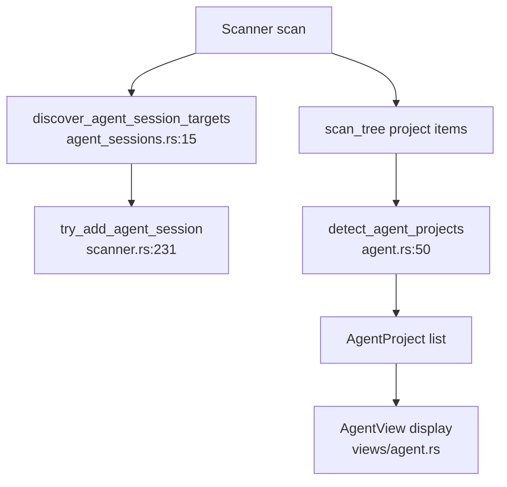

# Agent Detection Domain

**Module paths:** `crates/clv-core/src/agent.rs`, `crates/clv-core/src/agent_sessions.rs`  
**Generated:** 2026-08-22

---

## What This Module Does

AI coding tools leave two kinds of disk footprint: **abandoned project folders** (trial repos with agent markers) and **tool-internal session/cache directories** (Cursor chat DBs, Codex JSONL logs). Agent detection spans two modules—`agent.rs` groups scan hits into `AgentProject` records with human-readable reasons, while `agent_sessions.rs` knows where each vendor stores recoverable vs safe-to-delete data.

This is the product differentiator versus generic cache cleaners: rules tuned for Codex, Claude Code, Cursor, Windsurf, Trae, OpenCode, and WorkBuddy.

---

## Core Capabilities (`agent.rs`)

1. **`discover_agent_roots`** — Walks scan paths for marker directories like `.agents`, files `AGENTS.md` (`agent.rs:9-48`).
2. **`detect_agent_projects`** — Groups `ScanItem` by `project_root`, merges discovered roots (`agent.rs:50-130`).
3. **`is_agent_project_path`** — Name substring patterns + marker files (`scanner.rs:519-538`, patterns in `settings.rs:1073`).
4. **Zombie heuristic** — Projects where all items stale > 30 days (`agent.rs:68-73`, `agent.rs:94-96`).

## Core Capabilities (`agent_sessions.rs`)

1. **`discover_agent_session_targets`** — Returns `Vec<AgentSessionTarget>` with path, risk, category (`agent_sessions.rs:15-265`).
2. **Env overrides** — `CODEX_HOME`, `CLAUDE_CONFIG_DIR`, `CODEBUDDY_HOME`, `TRAE_DIR`, `TRAEX_SESSIONS_DIR`, `OPENCODE_DIR`.
3. **Platform paths** — macOS `Library/Application Support`, Windows `AppData/Roaming` (`agent_sessions.rs:323-440`).

---

## Key Components

| Component | File path | Responsibility |
|-----------|-----------|----------------|
| `AgentProject` | `crates/clv-core/src/models.rs:196` | Grouped project with reason, stacks, items |
| `AgentSessionTarget` | `crates/clv-core/src/agent_sessions.rs:6` | Session path metadata |
| `discover_agent_session_targets` | `crates/clv-core/src/agent_sessions.rs:15` | Vendor path catalog |
| `detect_agent_projects` | `crates/clv-core/src/agent.rs:50` | Build project list from scan |
| `agent_marker_files` | `crates/clv-core/src/settings.rs:1094` | `.cursor`, `.claude`, etc. |
| `agent_name_patterns` | `crates/clv-core/src/settings.rs:1073` | Folder name substrings |

---

## Internal Data Flow

**Risk labeling:** Session JSONL folders are `RiskLevel::Caution` with descriptions warning history loss (`agent_sessions.rs:26-28`). Electron caches are `Safe` (`agent_sessions.rs:54-56`).

---

## Interaction With Other Modules

| Module | Direction | Description |
|--------|-----------|-------------|
| Scanner | integrated | Sessions added during scan; projects after tree walk |
| Models | produces | `AgentProject`, `TechStack::Agent` |
| Views | consumer | `AgentView` filters and displays projects |

---

## Role in Core Business Flows

**Agent Review:** User opens Agent sidebar → `AgentView` reads `last_report.agent_projects` → search/filter by name, reason, stack (`views/agent.rs:41-59`).

**Post-cleanup:** `detect_agent_projects` re-run updates project list when project folders partially deleted (`state.rs:376-379`).

---

## Implementation Highlights

`detect_agent_projects` sorts by `total_bytes` descending—largest space hogs first (`agent.rs:128`). Reason strings are Chinese in source but displayed through i18n layer in UI for labels; reason field itself is heuristic text from detection.

Tests in `agent_sessions.rs` verify env var overrides for Codex, Trae, OpenCode paths.
