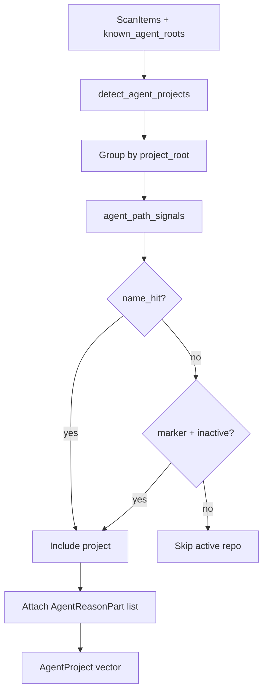

# Agent Detection Domain

**Module path:** `crates/clv-core/src/agent.rs`, `crates/clv-core/src/agent_sessions.rs`  
**Generated:** 2026-08-28

---

## What This Module Does

This module answers the question no generic disk cleaner can: **"Which folders are leftovers from AI coding experiments?"** It combines three signals—folder name patterns (`claude-experiment`), agent marker files (`.cursor`, `AGENTS.md`), and inactivity timers—to surface projects you likely forgot about, plus known session cache directories for Claude, Cursor, Codex, Trae, and OpenCode.

The design carefully avoids false positives: an active repo that adopted Cursor yesterday should not appear on the list just because `.cursor/` exists.

---

## Core Capabilities

1. **Agent project grouping** — `detect_agent_projects` (`agent.rs:12`) aggregates `ScanItem`s by project root and applies heuristics.

2. **Name-pattern always-on detection** — Folders matching `agent_name_patterns()` always surface regardless of activity.

3. **Marker-based inactive detection** — Marker files count only after 14+ days inactive (`MARKER_INACTIVE_DAYS` — `agent.rs:8`) or when all items are 30+ day zombies.

4. **Session cache discovery** — `discover_agent_session_targets` (`agent_sessions.rs:17`) enumerates Codex sessions, Claude projects, Cursor caches, Trae/OpenCode data dirs.

5. **Structured reasons** — `AgentReasonPart` enums (`messages/agent_reason.rs`) explain *why* each project was flagged, formatted per language.

---

## Key Components

| Component | File path | Responsibility |
|-----------|-----------|----------------|
| `detect_agent_projects` | `crates/clv-core/src/agent.rs:12` | Main grouping + filtering logic |
| `agent_path_signals` | `crates/clv-core/src/scanner.rs` | Name/marker signal extraction |
| `discover_agent_session_targets` | `crates/clv-core/src/agent_sessions.rs:17` | Known session/cache paths |
| `AgentSessionTarget` | `crates/clv-core/src/agent_sessions.rs:8` | Session directory descriptor |
| `AgentProject` | `crates/clv-core/src/models.rs:105` | Grouped project output type |
| `AgentReasonPart` | `crates/clv-core/src/messages/agent_reason.rs` | Typed reason enum |
| `agent_marker_files` | `crates/clv-core/src/settings/markers.rs` | Marker filename list |
| `agent_name_patterns` | `crates/clv-core/src/settings/markers.rs` | Name regex/prefix patterns |

---

## Internal Data Flow

---

## Cross-Module Interactions

| Module | Direction | Interface | Notes |
|--------|-----------|-----------|-------|
| Scanner | Called from | scan items + agent roots collected during walk | Provides raw inputs |
| Models | Produces | `AgentProject` | Consumed by AgentView |
| Messages | Uses | `AgentReasonPart`, `format_agent_reason` | i18n reasons |
| Views/agent.rs | Displays | `report.agent_projects` | Search/filter UI |

**Active repo exclusion test** (`lib.rs:355-365`): repo with `.cursor` + `AGENTS.md` but recent activity → empty agent project list.

---

## Implementation Highlights

- Environment overrides: `TRAE_DIR`, `TRAEX_SESSIONS_DIR`, `OPENCODE_DIR` for non-standard install paths.
- Session targets assigned typed `RuleDescription` IDs (R106–R112+) for consistent UI labels.
- Projects sorted by total bytes descending (`agent.rs:100`)—biggest wins surfaced first.
