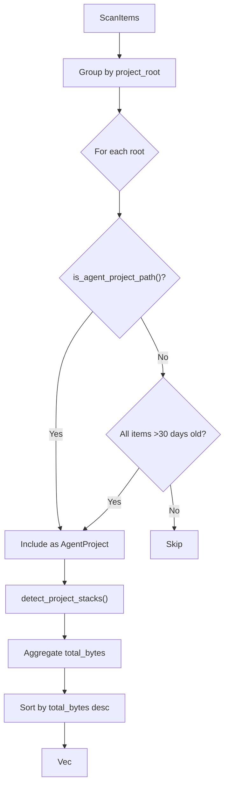

# Agent Detection Domain

**Module Path**: `crates/clv-core/src/agent.rs`
**Generated Date**: 2026-08-20

---

## Overview

The Agent module is CLV3000 Plus's unique selling point -- it detects AI coding agent experiment projects: the directories that Claude, Cursor, Codex, Copilot, and their kin create when developers use them for quick experiments. These projects accumulate silently, eating gigabytes of disk space, because developers often forget about them after the experiment is done.

Think of it as a "digital archaeology" tool. It examines directory names, looks for marker files (`.cursor/`, `CLAUDE.md`), and checks inactivity duration. A project named `claude-todo-app` that hasn't been modified in 45 days is almost certainly an abandoned experiment.

---

## Core Functionality

1. **Agent Project Detection** -- Two heuristics: name pattern matching (14 patterns like "claude", "cursor", "codex") and marker file detection (`.cursor/`, `.claude/`, `AGENTS.md`, etc.)

2. **Zombie Project Detection** -- Identifies projects where ALL items haven't been modified in 30+ days, regardless of agent patterns.

3. **Tech Stack Detection** -- Identifies stacks present in a project via marker files (`Cargo.toml` → Rust, `package.json` → Node/Web, etc.).

4. **Size Aggregation** -- Sums cleanable items within each detected project.

5. **Inactivity Tracking** -- Days since last modification for prioritization.

---

## Key Components

| Component / Type | File Path | Responsibility |
|-----------------|-----------|---------------|
| `detect_agent_projects()` | `crates/clv-core/src/agent.rs:7` | Groups items by root, identifies agents + zombies |
| `AgentProject` | `crates/clv-core/src/models.rs:106` | Data type for detected projects |

The module is compact (82 lines) because heavy lifting is delegated to `scanner.rs` functions.

---

## Internal Data Flow

---

## Interactions with Other Modules

| Interaction Module | Direction | Interface | Description |
|-------------------|-----------|-----------|-------------|
| scanner | Calls into | `is_agent_project_path()`, `detect_project_stacks()` | Detection functions |
| models | Depends on | `AgentProject`, `ScanItem`, `TechStack` | Data types |
| settings | Calls into | `agent_name_patterns()`, `agent_marker_files()` | Patterns |
| app (state.rs) | Called by | Post-scan and post-cleanup | Updates agent list |

---

## Implementation Highlights

The "zombie detection" heuristic catches stale projects that aren't agent experiments but are still cleanup candidates. The `sort_by(total_bytes)` ensures the largest projects appear first in the UI.
