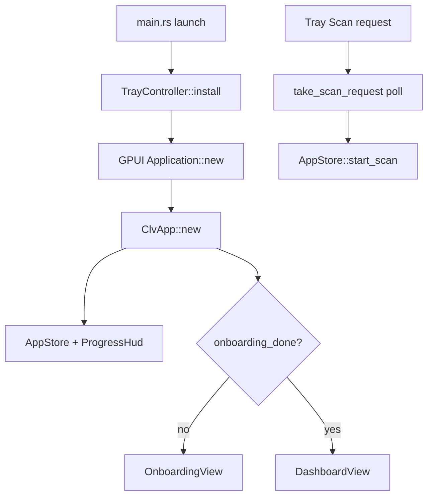

# App Shell Domain

**Module path:** `crates/clv-app/src/app/`, `crates/clv-app/src/main.rs`  
**Generated:** 2026-08-28

---

## What This Module Does

The app shell is the window frame and traffic controller—it does not scan or delete anything itself, but it decides *which page you see*, *when progress overlays appear*, and *how tray actions reach the rest of the app*. Without this layer, you would have orphaned views with no navigation, no cancel buttons during long scans, and no way to launch a scan from the menu bar.

---

## Core Capabilities

1. **GPUI bootstrap** — `main()` initializes tracing, settings, tray, and GPUI Application (`main.rs:70-189`).

2. **Lazy view singletons** — Each page entity created once on first visit (`app/mod.rs:76-100`).

3. **Progress HUD overlay** — `ProgressHud` entity attached to AppStore, renders above page content (`app/hud.rs`).

4. **Tray action polling** — 250ms loop checks `take_scan_request()` (`app/mod.rs:49-58`).

5. **Cleanup notifications** — Success toast via gpui-component notification API (`app/mod.rs`).

---

## Key Components

| Component | File path | Responsibility |
|-----------|-----------|----------------|
| `main` | `crates/clv-app/src/main.rs:70` | Application entry point |
| `ClvApp` | `crates/clv-app/src/app/mod.rs:19` | Root GPUI component |
| `AppShell` | `crates/clv-app/src/app/shell.rs` | Sidebar navigation layout |
| `ProgressHud` | `crates/clv-app/src/app/hud.rs` | Scan/cleanup progress overlay |
| `open_main_window` | `crates/clv-app/src/main.rs` | Window creation helper |
| `TrayController` | `crates/clv-app/src/tray.rs:34` | System tray integration |
| `apply_theme` | `crates/clv-app/src/theme.rs` | Theme initialization |

---

## Internal Data Flow

---

## Cross-Module Interactions

| Module | Direction | Interface | Notes |
|--------|-----------|-----------|-------|
| AppStore | Owns | `Entity<AppStore>` | Created in ClvApp::new |
| Views | Lazy creates | `dashboard()`, `cleanup()`, etc. | Cached Option<Entity> |
| Tray | Polls | `take_scan_request`, `TrayPending` mutex | Open/Scan/Quit actions |
| Theme | Applies | `apply_theme(settings.theme)` | On window open |

---

## Implementation Highlights

- Windows GUI subsystem attribute suppresses console window on double-click launch (`main.rs:3`).
- `MAIN_WINDOW` static enables tray Open to activate existing window (`main.rs:30-48`).
- Page transition keys in `AppPage::transition_key` enable navigation animations (`state.rs:40-51`).
