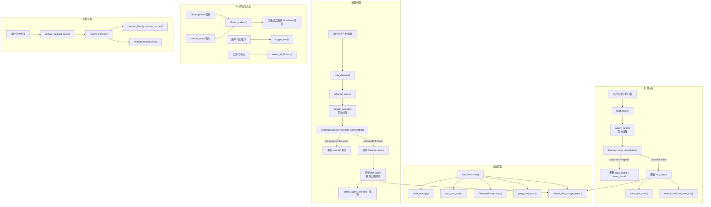

# AppStore — 应用状态管理

## 这个模块在做什么

AppStore 是 CLV3000 Plus 的"大脑"。如果说 Scanner、Cleanup、Agent、Settings 是身体的各个器官，那 AppStore 就是控制一切的中枢神经系统——它决定什么时候出发扫描、扫描结果怎么展示、用户勾选了哪些项、清理进行到哪一步、页面应该跳转到哪里。它管理着整个应用从启动到退出的完整生命周期。

想象一个餐厅经理：他不亲自做菜（那是 Scanner 和 Cleanup 的事），但他要决定什么时候开门营业、点什么菜（扫描哪些目录）、客人点了什么（用户勾选了哪些项）、后厨做到哪一步了（清理进度）、什么时候翻台（扫描完成后更新报告）。AppStore 就是这个经理。

它的核心职责分为三层。第一层是**状态持有**：管理当前页面（`AppPage`，8 个页面）、扫描/清理进度、选中项集合、磁盘使用率、清理历史等。第二层是**流程编排**：`start_scan()` 启动后台扫描线程并通过 channel 轮询进度，`run_cleanup()` 启动后台清理线程并同样轮询，两个流程都支持取消和重启。第三层是**数据转换**：`filtered_indices()` 根据当前筛选器和搜索关键词返回过滤后的项索引，`cleanup_filter_counts()` 计算每个 Tab 的计数，`select_all_filtered()` 批量操作选中状态。

## 核心功能点

1. **8 页面导航** — `AppPage` 枚举定义了 Dashboard、Cleanup、Agent、Startup、Process、LargeFiles、Settings、Onboarding 八个页面。`set_page()` 方法管理页面切换，每个页面有唯一的 `transition_key` 用于动画。
2. **后台扫描编排** — `start_scan()` 在 `scanning=true` 时拒绝重复启动（或设置 `scan_restart_pending` 等待重启）。通过 `spawn_scan()` 在后台线程启动 Scanner，UI 层每 200ms 通过 `poll_scan()` 轮询进度 channel，收到 `ScanPoll::Done` 后更新 `last_report` 并持久化。
3. **后台清理编排** — `run_cleanup()` 收集 `selected_items()` 后调用 `start_cleanup()`，后者通过 `spawn_cleanup()` 在后台线程启动 CleanupExecutor。清理完成后自动更新 `last_report`（移除已删除项）、追加 `CleanupHistory` 记录、刷新磁盘使用率。
4. **选中状态管理** — `selected_item_ids: HashSet<String>` 追踪所有选中的项 ID。支持单选（`toggle_item`）、全选/全不选（`select_all_filtered`）、按项目根选中（`select_project_items`）。`default_selected_item_ids()` 在扫描完成后自动勾选所有 Safe 级别项。
5. **6 筛选器 Tab** — `CleanupFilter` 枚举提供 All、SafeOnly、ProjectBuildCache、SharedToolCache、DevEnvironment、AiGenerated 六个筛选维度。`filtered_indices()` 根据当前筛选器 + 搜索关键词返回匹配项的索引列表。
6. **扫描/清理可取消** — `scan_cancel` 和 `cleanup_cancel` 字段持有 `Arc<AtomicBool>`，通过 `cancel_scan()` / `cancel_cleanup()` 设置标志。Scanner 和 Cleanup 在每个关键节点检查标志后中断。
7. **磁盘使用率追踪** — `disk_total` / `disk_used` 字段通过 `refresh_disk_usage_async()` 在后台异步获取。扫描/清理完成后自动刷新，系统托盘 tooltip 实时显示使用率百分比。
8. **清理历史与恢复** — `cleanup_history: CleanupHistory` 在每次清理完成后追加记录。`restore_trashed_entry()` 在后台调用 `restore_trashed()` 恢复文件，成功后从历史中移除对应记录。
9. **进度 HUD 集成** — `progress_hud` 字段持有 `Entity<ProgressHud>` 引用，扫描/清理进度通过 `notify_progress_only()` 推送到悬浮进度窗口，即使主窗口最小化也能看到进度。
10. **Onboarding 流程** — `finish_onboarding()` 设置专家模式、扫描路径和完成标志，保存配置后跳转到 Dashboard 页面。

## 关键组件

| 组件/类型 | 文件路径 | 一句话职责 |
|-----------|----------|-----------|
| `AppStore` | `crates/clv-app/src/app/state.rs:64` | 应用状态容器，管理所有 UI 状态和后台任务 |
| `AppPage` | `crates/clv-app/src/app/state.rs:22` | 8 页面导航枚举，每个页面有标题和过渡动画键 |
| `CleanupFilter` | `crates/clv-app/src/app/state.rs:54` | 6 筛选器枚举，驱动 Cleanup 页面的 Tab 分组 |
| `start_scan()` | `crates/clv-app/src/app/state.rs:423` | 启动后台扫描，管理取消/重启/进度轮询 |
| `run_cleanup()` | `crates/clv-app/src/app/state.rs:513` | 启动后台清理，管理进度轮询和结果更新 |
| `filtered_indices()` | `crates/clv-app/src/app/state.rs:271` | 根据筛选器 + 搜索返回过滤后的项索引 |
| `select_all_filtered()` | `crates/clv-app/src/app/state.rs:369` | 批量切换当前筛选结果中所有项的选中状态 |
| `restore_trashed_entry()` | `crates/clv-app/src/app/state.rs:630` | 在后台恢复已删除的文件并更新清理历史 |
| `cleanup_filter_counts()` | `crates/clv-app/src/app/state.rs:247` | 计算 6 个筛选器各自匹配的项数量 |

## 内部数据流

## 关键接口与扩展点

- **`start_scan(cx)`** — 扫描入口，自动处理重复启动、取消重启、进度轮询和结果持久化。新增扫描阶段只需在 Scanner 中添加 `ScanProgress` 发射点。
- **`run_cleanup(cx)`** — 清理入口，自动收集选中项并启动后台清理。新增清理后处理逻辑（如通知、统计）只需在 `CleanupPoll::Done` 分支中添加。
- **`filtered_indices()`** — 筛选核心，新增筛选维度只需在 `CleanupFilter` 枚举中添加变体并在 match 中添加过滤逻辑。
- **`set_page(page, cx)`** — 页面导航，新增页面只需在 `AppPage` 枚举中添加变体和对应的 `transition_key`。
- **`finish_onboarding(expert, paths, cx)`** — Onboarding 完成回调，可扩展为支持更多初始化选项（如自动扫描开关、语言选择）。

## 与其他模块的交互

| 交互模块 | 交互内容 | 说明 |
|----------|----------|------|
| `clv-core::scanner` | `Scanner::scan_cancellable()` | AppStore 通过 `spawn_scan()` 在后台调用 |
| `clv-core::cleanup` | `CleanupExecutor::execute_cancellable()`, `restore_trashed()` | AppStore 通过 `spawn_cleanup()` 在后台调用 |
| `clv-core::agent` | `detect_agent_projects()` | 清理完成后重算 AI 项目列表 |
| `clv-core::models` | `ScanItem`, `ScanReport`, `AgentProject`, `default_selected_item_ids()` | AppStore 管理的核心数据类型 |
| `clv-core::settings` | `AppSettings`, `load_settings()`, `save_settings()`, `purge_old_trash()` | AppStore 读写用户配置和触发过期清理 |
| `clv-core::cleanup` | `CleanupHistory`, `TrashedEntry` | AppStore 管理清理历史和恢复操作 |
| `clv-platform` | `primary_disk_usage()`, `pick_folders()`, `kill_process()` | AppStore 调用平台层获取磁盘信息、文件夹选择和进程管理 |
| `services` | `spawn_scan()`, `poll_scan()`, `spawn_cleanup()`, `poll_cleanup()` | 服务层提供后台任务的 spawn 和 poll API |

## 跨模块协作场景

**场景一：完整用户旅程**
用户启动应用 → `AppStore::new()` 加载上次扫描结果并展示 Dashboard → 点击"开始扫描" → `start_scan()` 在后台启动 Scanner，UI 显示进度条 → 扫描完成 → `last_report` 更新，自动勾选 Safe 项，跳转 Cleanup 页面 → 用户切换筛选器查看不同类别 → 勾选若干项 → 点击"开始清理" → `run_cleanup()` 在后台执行清理 → 完成后更新报告、追加历史、刷新磁盘使用率。

**场景二：扫描中断与智能重启**
用户在扫描过程中点击"取消" → `cancel_scan()` 设置 `AtomicBool` → Scanner 在下一个检查点中断 → `ScanPoll::Done` 带 `cancelled=true` → 用户修改扫描路径后再次点击"开始扫描" → `start_scan()` 发现 `scanning=true`，设置 `scan_restart_pending=true` 并取消当前扫描 → 当前扫描中断后，`start_scan` 被递归调用自动重启新扫描。

**场景三：Agent 页面清理**
用户切换到 Agent 页面 → 看到 `last_report.agent_projects` 列表 → 选择某个 AI 项目 → `select_project_items(project_path)` 勾选该项目下的所有 `ScanItem` → 点击"清理选中项" → `cleanup_paths(items, cx)` 启动清理 → 清理完成后 `detect_agent_projects()` 重算，该项目从列表中消失。

**场景四：启动时自动维护**
应用启动 → `AppStore::new()` 异步调用 `purge_old_trash(settings.soft_delete_days)` 清理超过 7 天的临时文件 → 同时异步调用 `refresh_disk_usage_async()` 获取最新磁盘使用率 → 两者完成后更新 UI。这个过程不阻塞启动，用户看到的是即时可用的 Dashboard。

## 性能考量

- **异步非阻塞架构**：所有 I/O 密集操作（扫描、清理、磁盘查询、文件夹选择）都在后台线程执行，通过 `cx.spawn()` + channel 轮询与 GPUI 主线程通信，UI 始终保持响应。
- **轮询间隔优化**：扫描进度轮询间隔 200ms，清理进度轮询间隔 80ms。清理轮询更频繁是因为清理操作通常更快（单个文件移动只需毫秒级），需要更及时的进度反馈。
- **HashSet 选中状态**：`selected_item_ids` 使用 `HashSet<String>` 而非 `Vec`，`contains()` / `insert()` / `remove()` 均为 O(1)，支持高频的勾选/取消操作。
- **惰性筛选计算**：`filtered_indices()` 在每次渲染时调用，但结果不缓存。对于典型扫描结果（< 1000 项），线性遍历 + 字符串匹配耗时 < 1ms，无需缓存。
- **进度通知节流**：`notify_progress_only()` 直接调用 `cx.notify()` 触发重绘，不经过完整的状态更新流程，减少不必要的计算。
- **异步垃圾清理**：`purge_old_trash()` 在 `AppStore::new()` 中通过 `cx.spawn` 异步执行，不阻塞应用启动。使用 `background_spawn` 将实际 I/O 放到线程池。
- **路径截断显示**：`truncate_path_display()` 将超过 96 字符的路径中间截断显示，避免超长路径撑坏 UI 布局，同时保留头尾信息供用户辨识。
