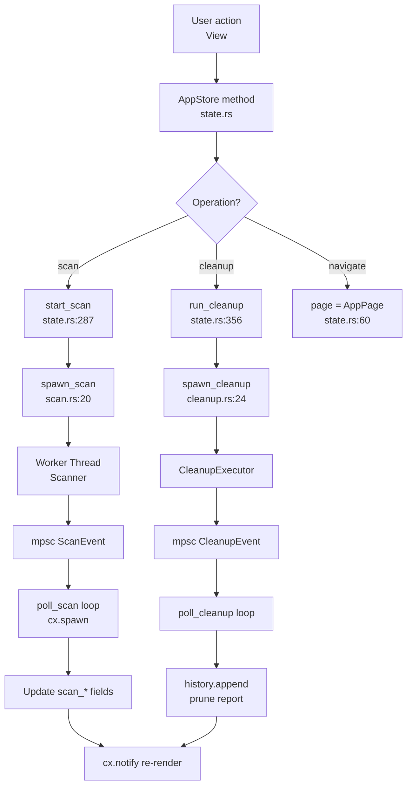

# AppStore Domain

**Module path:** `crates/clv-app/src/app/state.rs`  
**Generated:** 2026-08-26

---

## What This Module Does

`AppStore` is the control tower for the entire GPUI application. It holds user settings, the latest scan report, selection state, progress indicators, disk stats, and navigation page—all in one `Entity<AppStore>` that every view observes. When you click "Scan" on the dashboard, `start_scan` does not walk the filesystem itself; it sets flags, clones settings, spawns a worker thread via `services/scan.rs`, and polls an `mpsc` channel from a GPUI async task.

Think of it as the factory office from the workflow metaphor: it never operates heavy machinery directly, but it knows what is running, what finished, and what the UI should show next.

---

## Core Capabilities

1. **Central UI state** — `AppStore` struct (`state.rs:58-80+`) aggregates settings, scan/cleanup progress, filters, search, disk usage, and history.

2. **Navigation** — `AppPage` enum (`state.rs:19-27`) defines Dashboard, Cleanup, Agent, Startup, Process, Settings, and Onboarding routes.

3. **Scan orchestration** — `start_scan` (`state.rs:287`) guards re-entry, spawns scan thread, and runs `poll_scan` loop via `cx.spawn`.

4. **Cleanup orchestration** — `run_cleanup` (`state.rs:356`) validates selection, spawns cleanup thread, updates history and prunes report on completion.

5. **Item filtering** — `filtered_items` (`state.rs:189-231`) applies expert mode, `CleanupFilter` bucket, and search query with `rule_description_matches_query`.

6. **Selection management** — `set_item_selected`, `toggle_item`, `select_all_filtered`, `select_project_items` (`state.rs:250-285`) manage `selected_item_ids` HashSet.

7. **Background disk refresh** — `refresh_disk_usage` (`state.rs:154-167`) spawns thread for `primary_disk_usage`.

8. **Process kill** — `kill_process_pid` (`state.rs:129-151`) spawns thread calling platform `kill_process`.

9. **Onboarding completion** — `finish_onboarding` (`state.rs:471`) sets paths, expert mode, persists settings, navigates to dashboard.

---

## Key Components

| Component | File path | Responsibility |
|-----------|-----------|----------------|
| `AppStore` | `state.rs:58` | Central GPUI entity holding all UI state |
| `AppPage` | `state.rs:19-27` | Navigation enum with i18n titles |
| `CleanupFilter` | `state.rs:49-56` | Sidebar bucket filter enum |
| `start_scan` | `state.rs:287` | Scan workflow entry + poll loop |
| `run_cleanup` | `state.rs:356` | Cleanup workflow entry + poll loop |
| `filtered_items` | `state.rs:189` | Expert + filter + search item list |
| `selected_items` | `state.rs:234` | Checked items regardless of filter |
| `kill_process_pid` | `state.rs:129` | Async process termination |
| `refresh_disk_usage` | `state.rs:154` | Background disk stat refresh |
| `finish_onboarding` | `state.rs:471` | First-run wizard completion |
| `spawn_scan` | `services/scan.rs:20` | Thread + channel bridge for scan |
| `spawn_cleanup` | `services/cleanup.rs:24` | Thread + channel bridge for cleanup |

---

## Internal Data Flow



**Key steps**

1. **View triggers action** — e.g., Dashboard calls `store.update(cx, |s, cx| s.start_scan(cx))`.
2. **Guard flags** — `scanning` / `cleaning` booleans prevent concurrent operations.
3. **Clone settings** — Settings cloned into worker thread; no shared mutable state across threads.
4. **Poll loop** — GPUI `cx.spawn` with 200ms timer calls `poll_scan` / `poll_cleanup` until Done or Disconnected.
5. **Notify** — `cx.notify()` after state changes triggers view re-renders.

---

## Key Interfaces and Extension Points

**GPUI entity pattern**

```rust
pub struct AppStore {
    pub settings: AppSettings,
    pub page: AppPage,
    pub last_report: Option<ScanReport>,
    // ... progress, filters, disk stats
}
```

Constructed in `app/mod.rs` and passed as `Entity<AppStore>` to all views.

**Add a new page**

1. Add variant to `AppPage` (`state.rs:19`).
2. Add `transition_key` and i18n title mapping.
3. Create view in `views/` and lazy-init in `ClvApp` (`app/mod.rs:57-117`).
4. Add sidebar entry in `app/mod.rs:221-277`.

---

## Interactions With Other Modules

| Module | Direction | Interface | Notes |
|--------|-----------|-----------|-------|
| Services | dependency | `spawn_scan`, `poll_scan`, `spawn_cleanup`, `poll_cleanup` | Thread bridges |
| clv-core | dependency | Scanner, CleanupExecutor, models, settings | Domain logic |
| clv-platform | dependency | `primary_disk_usage`, `kill_process` | OS APIs |
| Views | observed by | `Entity<AppStore>` | All pages read/write store |
| i18n | dependency | `I18n` wrapper | Status messages and labels |

---

## Role in Core Business Flows

**Health scan flow** — `start_scan` → worker produces `ScanReport` → `default_selected_item_ids` → `last_report` stored → `refresh_disk_usage` → dashboard updates reclaimable bytes.

**Cleanup flow** — `run_cleanup` → `selected_items()` passed to worker → on Done: `CleanupHistory::append`, prune cleaned paths from `last_report`, set `pending_cleanup_notification`.

**Onboarding flow** — App opens to `AppPage::Onboarding` when `!onboarding_done` → user completes wizard → `finish_onboarding` → `AppPage::Dashboard`.

**Agent review flow** — Navigation to `AppPage::Agent` → view reads `last_report.agent_projects` → `select_project_items` links cleanup selection to project cards.

---

## Performance Considerations

- Single scan and single cleanup at a time—guarded by boolean flags, not mutexes.
- `filtered_items` recomputed on each access—acceptable for hundreds of items; clones matching subset.
- Poll intervals: 200ms for scan/cleanup UI (`state.rs:345`), 300ms scanner progress throttle (`scanner.rs:22`).
- Disk refresh on background thread—`weak.update` prevents use-after-free if window closed.
- `CleanupHistory::load()` at store init—small JSON file, not per-render.

---

## Implementation Highlights

**Disconnected channel handling** — `ScanPoll::Disconnected` sets `scan_interrupted` status (`state.rs:332`); same pattern for cleanup at `state.rs:445`.

**Selection survives filter change** — `selected_item_ids` is independent of `cleanup_filter`; user can filter view without losing checked items.

**Expert mode dual gate** — `filtered_items` hides protected items in UI (`state.rs:200`); `CleanupExecutor` also skips them unless expert (`cleanup.rs:139`)—defense in depth.

**Cleanup notification deferral** — `pending_cleanup_notification` set in store, consumed in `app/mod.rs:162` to show toast after view update cycle completes.
