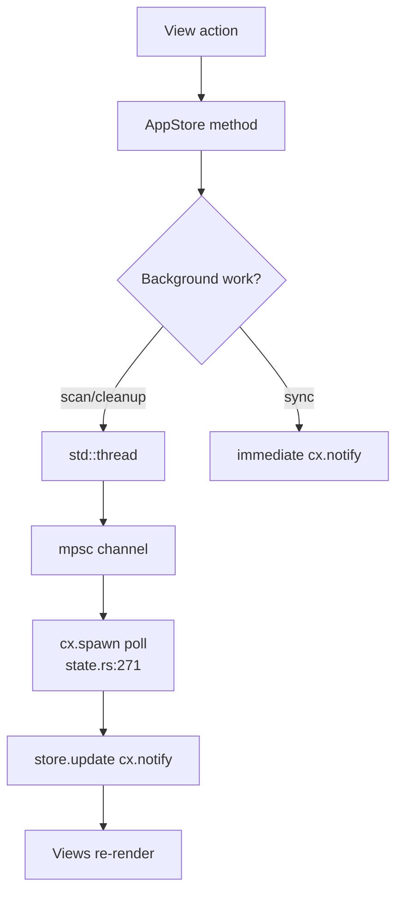

# App Store Domain

**Module path:** `crates/clv-app/src/app/state.rs`  
**Generated:** 2026-08-22

---

## What This Module Does

`AppStore` is the central state container and workflow coordinator for the entire UI. Every view reads from this `Entity<AppStore>`; every long-running operation (scan, cleanup, disk refresh, process kill) is initiated here. It bridges GPUI's reactive model with blocking Rust filesystem work—a pattern similar to a Redux store, but integrated with GPUI's `cx.notify()` rendering cycle.

---

## Core Capabilities

1. **Page navigation** — `AppPage` enum and `set_page` (`state.rs:22-30`, `state.rs:154-160`).
2. **Scan orchestration** — Thread spawn, mpsc progress, `last_report` update (`state.rs:248-332`).
3. **Cleanup orchestration** — Selected items to `CleanupExecutor`, report mutation (`state.rs:334-408`).
4. **Filtering** — `CleanupFilter` buckets, search query, expert mode gating (`state.rs:174-216`).
5. **Selection management** — Toggle, select-all-filtered (`state.rs:229-246`).
6. **Disk metrics** — sysinfo `Disks` aggregation (`state.rs:442-455`).
7. **Onboarding completion** — Saves paths and mode (`state.rs:410-423`).

---

## Key Components

| Component | File path | Responsibility |
|-----------|-----------|----------------|
| `AppStore` | `crates/clv-app/src/app/state.rs:61` | Central state struct |
| `AppPage` | `crates/clv-app/src/app/state.rs:22` | Sidebar page enum |
| `CleanupFilter` | `crates/clv-app/src/app/state.rs:52` | UI filter chips |
| `ScanEvent` / `CleanupEvent` | `crates/clv-app/src/app/state.rs:12-19` | Channel message types |
| `ClvApp` | `crates/clv-app/src/app/mod.rs:14` | View factory + layout |
| `AppShell` | `crates/clv-app/src/app/shell.rs:9` | Title bar + dialog layers |

---

## Internal Data Flow

---

## Key State Fields

| Field | Purpose |
|-------|---------|
| `last_report` | Latest `ScanReport` from scanner |
| `scanning` / `cleaning` | Mutex-like operation guards |
| `scan_phase`, `scan_items_found`, `scan_bytes_found` | Progress bar data |
| `cleanup_filter`, `search_query` | Cleanup view filters |
| `disk_total`, `disk_used` | Dashboard disk chart |
| `startup_count` | Updated after scan via `list_startup_items` |

---

## Interaction With Other Modules

| Module | Interface | Usage |
|--------|-----------|-------|
| clv-core Scanner | `Scanner::new(settings).scan` | `state.rs:264-267` |
| clv-core Cleanup | `CleanupExecutor::execute` | `state.rs:357-358` |
| clv-platform | `kill_process`, `list_startup_items` | Process/startup features |
| All views | `Entity<AppStore>` read | Render data source |

---

## Role in Core Business Flows

**Every primary workflow** starts in AppStore: bootstrap creates store in `ClvApp::new`; scan/cleanup from Dashboard/Cleanup views call store methods; status bar reads `status_message` and report totals (`app/mod.rs:296-329`).

---

## Concurrency Notes

Scan uses `sync_channel(64)` for backpressure; cleanup uses regular `mpsc::channel`. Polling intervals: 200ms scan, 80ms cleanup—balances responsiveness vs CPU.

`kill_process_pid` uses `thread::spawn` + `join` inside `cx.spawn` (`state.rs:119-124`).

---

## Implementation Highlights

`filtered_items` applies expert mode, bucket filter, and search in one iterator chain (`state.rs:181-215`)—single source for Cleanup list and selection totals.

`finish_onboarding` persists settings and navigates to Dashboard (`state.rs:410-423`).
