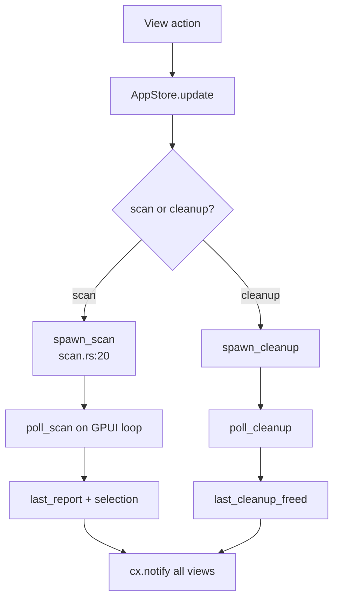

# App Store Domain

**Module path:** `crates/clv-app/src/app/state.rs`  
**Generated:** 2026-08-23

---

## What This Module Does

`AppStore` is the control tower for the entire GPUI application. Every page reads scan results, selection state, disk metrics, and job flags from this single entity — views do not own copies of `ScanReport` or maintain their own checkbox state. Long-running scan and cleanup jobs are started here, polled on the GPUI executor, and merged back into store fields that trigger `cx.notify()` for all subscribed views.

---

## Core Capabilities

1. **Page routing state** — `AppPage` enum (`state.rs:18`) — Dashboard, Cleanup, Agent, Startup, Process, Settings, Onboarding.

2. **Scan orchestration** — `start_scan` spawns `spawn_scan`, polls `poll_scan` until `ScanPoll::Done`, sets `last_report` and `default_selected_item_ids`.

3. **Cleanup orchestration** — `start_cleanup` via `spawn_cleanup` / `poll_cleanup`.

4. **Filtering** — `filtered_items` (`state.rs:176`) applies expert mode, `CleanupFilter` bucket, and search query (name, path, `rule_description_matches_query`).

5. **Selection management** — `selected_item_ids` HashSet; `select_project_items` for agent bulk select (`state.rs:258`).

6. **Async side jobs** — `refresh_disk_usage_async` (`state.rs:141`), `kill_process_pid` (`state.rs:116`) on background threads.

---

## Key Components

| Component | File path | Responsibility |
|-----------|-----------|----------------|
| `AppStore` | `app/state.rs:57` | Central state entity |
| `AppPage` | `app/state.rs:18` | Navigation pages |
| `CleanupFilter` | `app/state.rs:48` | Bucket filter enum |
| `filtered_items` | `app/state.rs:176` | List for CleanupView |
| `selected_items` | `app/state.rs:220` | Items marked for deletion |
| `spawn_scan` | `services/scan.rs:20` | Scan worker thread |
| `spawn_cleanup` | `services/cleanup.rs` | Cleanup worker thread |
| `ClvApp` | `app/mod.rs:14` | Holds `Entity<AppStore>`, lazy views |

---

## Internal Data Flow

---

## Cross-Module Interactions

| Module | Direction | Interface | Notes |
|--------|-----------|-----------|-------|
| scanner | via services | `Scanner::scan` | Worker thread |
| cleanup | via services | `CleanupExecutor` | Worker thread |
| platform | direct | `primary_disk_usage`, `kill_process` | Short threads |
| views | observe | `Entity<AppStore>` | All pages |
| i18n | uses | `I18n::from_settings` | `state.rs:80` |

---

## In Core Workflows

**Startup** — `ClvApp::new` creates store, subscribes observer, routes onboarding (`app/mod.rs:27–40`).

**Scan** — User action → `start_scan` → progress fields `scan_phase`, `scan_items_found`, `scan_bytes_found` update during poll.

**Cleanup** — `cleaning` flag blocks double-submit; completion triggers disk refresh.

---

## Implementation Highlights

Expert mode hides `RiskLevel::Protected` from `filtered_items` (`state.rs:187–189`) unless enabled — UI gate separate from cleanup executor gate.

`process_refresh_trigger` wrapping counter signals ProcessView to re-fetch without tight coupling (`state.rs:76`, `state.rs:129`).

`disk_free` and `disk_used_percent` derived helpers for Dashboard (`state.rs:164–174`).
