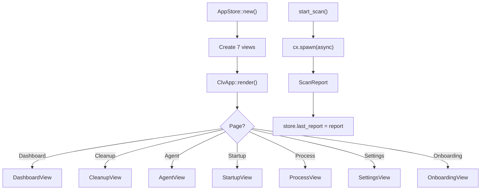

# App Module

**Module Path**: `crates/clv-app/src/app/`
**Generated Date**: 2026-08-20

---

## Overview

The App module is the "control room" -- it holds all application state in `AppStore`, manages page navigation, orchestrates scan and cleanup, and renders the window layout. Every view reads from it, every action updates it.

---

## Key Components

| Component / Type | File Path | Responsibility |
|-----------------|-----------|---------------|
| `AppPage` | `crates/clv-app/src/app/state.rs:9` | Page enum (7 variants) |
| `AppStore` | `crates/clv-app/src/app/state.rs:41` | Central state (15 fields) |
| `AppStore::start_scan()` | `crates/clv-app/src/app/state.rs:165` | Async scan orchestration |
| `AppStore::run_cleanup()` | `crates/clv-app/src/app/state.rs:202` | Sync cleanup orchestration |
| `AppStore::filtered_items()` | `crates/clv-app/src/app/state.rs:94` | Filter + search |
| `ClvApp` | `crates/clv-app/src/app/mod.rs:11` | App shell with view entities |
| `ClvApp::render()` | `crates/clv-app/src/app/mod.rs:90` | Full window layout |

---

## Internal Data Flow

---

## Implementation Highlights

The `ClvApp::render_status_bar()` derives its content from existing state fields (`scanning`, `scan_phase`, `status_message`, `last_report`) -- an elegant pattern that avoids a separate status state machine. The `nav_button()` conditional styling provides clean declarative navigation highlighting.
