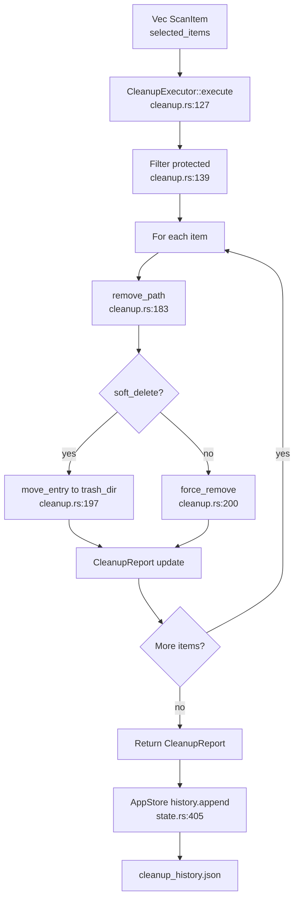

# Cleanup Domain

**Module path:** `crates/clv-core/src/cleanup.rs`  
**Generated:** 2026-08-26

---

## What This Module Does

The cleanup module is where scan results become real disk reclamation. After the scanner produces a `ScanReport`, users review and select items—but nothing is freed until `CleanupExecutor` walks the selection, optionally moves paths into a local trash quarantine, and records the outcome in a rolling history file. Think of it as the "delete station" on the factory floor: it respects risk gates, handles failures per item rather than aborting the batch, and leaves an audit trail for the dashboard.

Without soft-delete support, a mistaken click would be permanent. The module's default path moves items to `data_local_dir()/trash` with timestamped names, giving users a recovery window before `purge_old_trash` enforces retention.

---

## Core Capabilities

1. **Batch deletion with per-item error collection** — `CleanupExecutor::execute` (`cleanup.rs:127-181`) processes each `ScanItem` independently; failures land in `CleanupReport::failed` without stopping siblings.

2. **Risk-gated execution** — Protected items are skipped unless `expert_mode` is enabled (`cleanup.rs:139-144`), mirroring UI filter behavior in `AppStore::filtered_items`.

3. **Soft-delete quarantine** — When `soft_delete` is true, `remove_path` (`cleanup.rs:183-203`) moves entries to the app trash folder with `{timestamp}-{name}-{uuid}` prefixes.

4. **Cross-volume move fallback** — `move_entry` (`cleanup.rs:207-221`) retries with copy+delete when `rename` fails with a cross-device error—critical on Windows when trash lives on a different drive letter.

5. **Readonly file handling** — `force_remove` and `clear_readonly_tree` (`cleanup.rs:224-237`) clear Windows read-only attributes before deletion.

6. **Cleanup history** — `CleanupHistory` (`cleanup.rs:41-111`) persists 90-day rolling records to `cleanup_history.json` for dashboard stats like `freed_in_days`.

7. **Trash retention purge** — `purge_old_trash` (`cleanup.rs:285`) removes trash entries older than `soft_delete_days` from settings.

---

## Key Components

The cleanup pipeline spans execution, persistence, and filesystem helpers.

| Component | File path | Responsibility |
|-----------|-----------|----------------|
| `CleanupExecutor` | `cleanup.rs:118-125` | Orchestrates batch delete with progress callbacks |
| `CleanupReport` | `cleanup.rs:20-26` | Aggregates freed bytes, successes, failures, trashed paths |
| `CleanupProgress` | `cleanup.rs:11-17` | Per-item progress for UI polling |
| `CleanupHistory` | `cleanup.rs:41-111` | JSON persistence with 90-day prune |
| `CleanupHistoryRecord` | `cleanup.rs:29-34` | Single cleanup event timestamp + counts |
| `remove_path` | `cleanup.rs:183-203` | Soft or hard delete for one path |
| `move_entry` | `cleanup.rs:207-221` | Rename with cross-volume fallback |
| `force_remove` | `cleanup.rs:224-232` | Recursive delete with readonly clearing |
| `purge_old_trash` | `cleanup.rs:285` | Retention enforcement on trash folder |

---

## Internal Data Flow



**Key steps**

1. **Filter** — `AppStore::run_cleanup` passes `selected_items()` to `spawn_cleanup` (`services/cleanup.rs:24-34`).
2. **Execute** — Worker thread calls `CleanupExecutor::new(settings).execute(...)` with progress via `mpsc` channel.
3. **Persist** — On completion, `AppStore` appends a `CleanupHistoryRecord` and prunes removed paths from `last_report` (`state.rs:405-424`).
4. **Notify** — `pending_cleanup_notification` triggers a success toast in `app/mod.rs:162-170`.

---

## Key Interfaces and Extension Points

**Public API**

```rust
pub struct CleanupExecutor {
    settings: AppSettings,
}

impl CleanupExecutor {
    pub fn new(settings: AppSettings) -> Self;
    pub fn execute<F>(&self, items: &[ScanItem], on_progress: F) -> CleanupReport
    where F: FnMut(CleanupProgress);
}
```

Defined at `cleanup.rs:118-181`. Re-exported from `crates/clv-core/src/lib.rs`.

**Behavior toggles via `AppSettings`**

- `soft_delete` — Move vs permanent delete (`settings/mod.rs:21`)
- `soft_delete_days` — Trash retention window (`settings/mod.rs:22`)
- `expert_mode` — Whether protected items are runnable (`settings/mod.rs:20`)

---

## Interactions With Other Modules

| Module | Direction | Interface | Notes |
|--------|-----------|-----------|-------|
| Models | dependency | `ScanItem`, `RiskLevel` | Input items with risk gating |
| Settings | dependency | `AppSettings`, `trash_dir()` | Soft-delete config and trash path |
| Services (`clv-app`) | caller | `spawn_cleanup`, `poll_cleanup` | Thread bridge (`services/cleanup.rs`) |
| AppStore | caller | `run_cleanup` | Workflow entry (`state.rs:356`) |
| Views | indirect | Dashboard stats | Reads `CleanupHistory::freed_in_days` |

---

## Role in Core Business Flows

**Cleanup execution flow** — User confirms selection on Cleanup page → `AppStore::run_cleanup` → `spawn_cleanup` on worker thread → `CleanupExecutor::execute` → history append and report prune → notification.

**Dashboard health stats** — `CleanupHistory::load()` provides rolling freed-byte totals displayed on the dashboard without re-scanning.

**Missing path tolerance** — If a path was already deleted externally, `remove_path` returns `Ok(None)` (`cleanup.rs:184-186`); tests at `cleanup.rs:397-408` verify this counts as success.

---

## Performance Considerations

- Sequential per-item deletion—no parallel delete threads (avoids filesystem lock contention).
- Progress events emitted before and after each item for smooth UI bar updates.
- `CleanupHistory::prune_old` runs in-memory on append—no full-file scan on load.
- Cross-volume copy fallback is slower but only triggered when `rename` fails.

---

## Implementation Highlights

**Timestamped trash names** — `{stamp}-{name}-{uuid}` prevents collisions when deleting multiple folders with the same name (`cleanup.rs:191-196`).

**Fail-soft philosophy** — One locked `node_modules` file does not block cleaning a hundred cache folders; errors accumulate in `failed` for user review.

**Windows readonly trees** — `clear_readonly_tree` walks contents-first so nested read-only files do not block parent directory removal.
