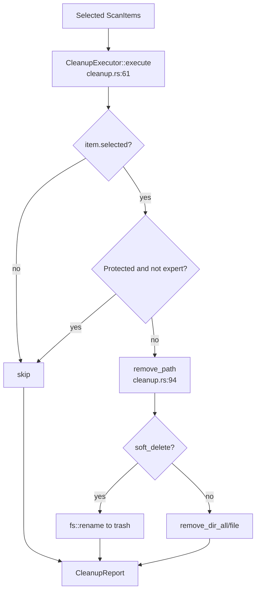

# Cleanup Domain

**Module path:** `crates/clv-core/src/cleanup.rs`  
**Generated:** 2026-08-22

---

## What This Module Does

Cleanup is where user intent becomes filesystem action. After the Scanner builds a checklist, `CleanupExecutor` removes only the paths the user selected—respecting risk gates and soft-delete preferences. Think of it as the "shredder with a recycle bin option": by default items go to an app trash folder rather than immediate permanent deletion.

---

## Core Capabilities

1. **Selective execution** — Iterates items where `selected == true` (`cleanup.rs:69-72`).
2. **Expert gating** — Skips `RiskLevel::Protected` unless `settings.expert_mode` (`cleanup.rs:73-75`).
3. **Soft delete** — Renames to timestamped path in `trash_dir()` (`cleanup.rs:99-113`).
4. **Hard delete** — `remove_dir_all` / `remove_file` when `soft_delete` is false (`cleanup.rs:115-120`).
5. **Localized summaries** — `CleanupReport::summary_for` supports zh/en/ja (`cleanup.rs:22-48`).
6. **Trash TTL** — `purge_old_trash(days)` removes aged trash entries (`cleanup.rs:125-154`).

---

## Key Components

| Component | File path | Responsibility |
|-----------|-----------|----------------|
| `CleanupExecutor` | `crates/clv-core/src/cleanup.rs:52` | Settings-aware deletion loop |
| `CleanupReport` | `crates/clv-core/src/cleanup.rs:10` | `freed_bytes`, `success_count`, `failed`, `trashed` |
| `remove_path` | `crates/clv-core/src/cleanup.rs:94` | Soft vs hard delete per path |
| `purge_old_trash` | `crates/clv-core/src/cleanup.rs:125` | Age-based trash cleanup |
| `trash_dir` | `crates/clv-core/src/settings.rs:83` | Resolves app data trash location |

---

## Internal Data Flow

**Trash naming:** `{YYYYMMDD-HHMMSS}-{basename}-{uuid}` (`cleanup.rs:102-107`).

---

## Interaction With Other Modules

| Module | Direction | Interface | Description |
|--------|-----------|-----------|-------------|
| App store | caller | `run_cleanup` → `execute` | `state.rs:357-358` |
| Settings | depends | `AppSettings`, `trash_dir` | Soft delete flag |
| Models | input | `ScanItem` | Paths and sizes |
| Agent | post-cleanup | `detect_agent_projects` | Rebuild agent list after delete |

After cleanup, `AppStore` removes deleted paths from `last_report.items` and re-runs agent detection (`state.rs:372-379`).

---

## Role in Core Business Flows

**Cleanup Execution workflow:** User confirms in `CleanupView` → `AppStore::run_cleanup` spawns thread → `CleanupExecutor::execute` → UI shows `cleanup_summary` in status bar.

---

## Performance and Safety

- Sequential per-item deletion (no parallel rm—reduces FS contention and permission surprises).
- Missing paths return `Ok(None)` without error (`cleanup.rs:95-97`).
- Failed paths accumulated; partial success is normal.

---

## Implementation Highlights

Soft delete uses `fs::rename` for both files and directories—fast for large trees on same volume. Hard delete uses `remove_dir_all` which can be slow for huge `node_modules` but is intentional for users who disable soft delete.
