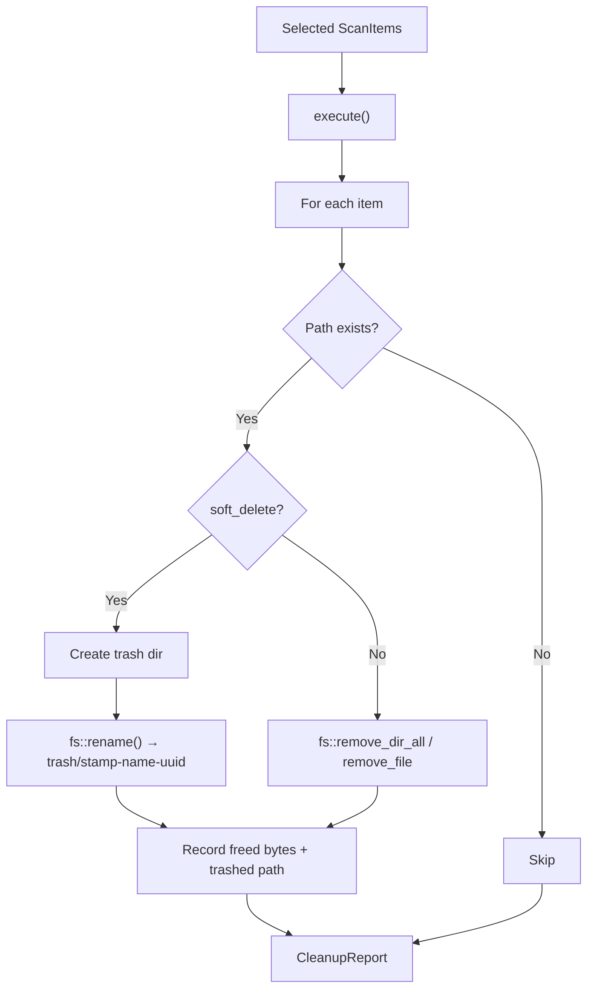

# Cleanup Domain

**Module Path**: `crates/clv-core/src/cleanup.rs`
**Generated Date**: 2026-08-20

---

## Overview

The Cleanup module is the "action arm" of CLV3000 Plus. While the scanner finds problems, cleanup fixes them. But it does so with a safety-first philosophy: by default, it doesn't destroy files -- it moves them to a timestamped trash directory where they'll hang around for 7 days before being automatically purged. This is the digital equivalent of putting old furniture on the curb for bulk pickup rather than throwing it in a dumpster immediately.

The module is deliberately simple. It receives a list of selected items, removes each one (soft or hard delete), and reports back with a summary. There's no complex retry logic, no partial rollback, and no transaction system. This simplicity is a feature -- when you're deleting files, you want predictable behavior, not clever error recovery.

---

## Core Functionality

1. **Safe Item Removal** -- Removes only items marked `selected = true`. Prevents accidental deletion.

2. **Soft-Delete Mode** -- Default. Moves files to `{ProjectDirs}/com/clv3000/plus/data/trash/` with timestamped names (`20260820-143022-target-uuid`). Gives users a 7-day recovery window.

3. **Hard-Delete Mode** -- When soft-delete is disabled. Calls `fs::remove_dir_all()` or `fs::remove_file()` directly.

4. **Trash Purging** -- `purge_old_trash()` scans the trash directory and removes entries older than N days. Standalone function, not auto-scheduled.

5. **Report Generation** -- Returns `CleanupReport` with freed bytes, success count, failure details, and trashed paths.

---

## Key Components

| Component / Type | File Path | Responsibility |
|-----------------|-----------|---------------|
| `CleanupReport` | `crates/clv-core/src/cleanup.rs:8` | Result: freed_bytes, success_count, failures, trashed paths |
| `CleanupReport::summary()` | `crates/clv-core/src/cleanup.rs:17` | Human-readable summary string |
| `CleanupExecutor` | `crates/clv-core/src/cleanup.rs:31` | Main executor, holds settings |
| `CleanupExecutor::execute()` | `crates/clv-core/src/cleanup.rs:40` | Iterates selected items, removes each |
| `CleanupExecutor::remove_path()` | `crates/clv-core/src/cleanup.rs:70` | Core deletion logic: soft or hard delete |
| `purge_old_trash()` | `crates/clv-core/src/cleanup.rs:101` | Cleans old trash entries |

---

## Internal Data Flow

**Key step details**:
1. **Existence check**: Silently returns if path already gone (`crates/clv-core/src/cleanup.rs:71-73`)
2. **Trash creation**: `fs::create_dir_all()` ensures trash dir exists (`crates/clv-core/src/cleanup.rs:77`)
3. **Unique naming**: `{stamp}-{name}-{uuid}` prevents collisions (`crates/clv-core/src/cleanup.rs:83`)

---

## Key Interfaces and Extension Points

The cleanup module is intentionally minimal:
- **Adding deletion methods**: Modify `remove_path()` to add new branches
- **Changing retention**: Modify the `days` parameter for `purge_old_trash()`
- **Pre-deletion validation**: Could be added before `remove_path()` in `execute()`

---

## Interactions with Other Modules

| Interaction Module | Direction | Interface | Description |
|-------------------|-----------|-----------|-------------|
| settings | Depends on | `AppSettings.soft_delete`, `trash_dir()` | Reads preferences |
| models | Depends on | `ScanItem`, `format_bytes()` | Receives items to clean |
| app (state.rs) | Called by | `CleanupExecutor::new().execute()` | Orchestration |

---

## Performance Considerations

File deletion is I/O-bound. `fs::rename()` (soft-delete) is faster than `fs::remove_dir_all()` (hard-delete) because rename is a metadata operation on the same filesystem.

---

## Implementation Highlights

The trash naming convention (`{stamp}-{name}-{uuid}`) makes trash entries browsable in a file manager while preventing name collisions. The UUID suffix handles cases where the user cleans multiple items with the same directory name from different projects.
