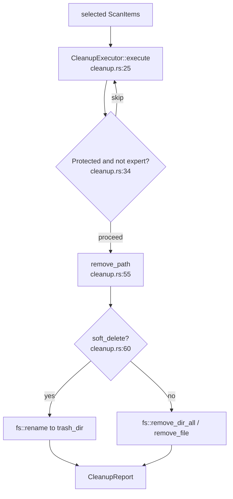

# Cleanup Domain

**Module path:** `crates/clv-core/src/cleanup.rs`  
**Generated:** 2026-08-23

---

## What This Module Does

After the user reviews scan results and checks boxes, the cleanup module performs the actual filesystem operations. `CleanupExecutor` is deliberately small: it loops selected `ScanItem`s, respects risk and expert-mode gates, and either renames paths into an app-managed trash folder (default) or deletes them permanently. Think of it as the "disposal dock" at the end of the factory line — separate from discovery so deletion policy can evolve without touching scan logic.

---

## Core Capabilities

1. **Batch execution** — `execute(&[ScanItem])` (`cleanup.rs:25`) processes items sequentially and aggregates `CleanupReport`.

2. **Risk gating** — Skips `RiskLevel::Protected` when `!settings.expert_mode` (`cleanup.rs:34–36`).

3. **Soft delete** — `remove_path` renames to `trash_dir()` with `{stamp}-{name}-{uuid}` (`cleanup.rs:60–74`).

4. **Hard delete** — When `soft_delete` is false, uses `fs::remove_dir_all` / `fs::remove_file` (`cleanup.rs:76–81`).

5. **Trash purge** — `purge_old_trash(days)` (`cleanup.rs:86`) deletes aged trash entries by modification time.

---

## Key Components

| Component | File path | Responsibility |
|-----------|-----------|----------------|
| `CleanupExecutor` | `crates/clv-core/src/cleanup.rs:16` | Deletion orchestrator |
| `CleanupReport` | `crates/clv-core/src/cleanup.rs:9` | freed_bytes, success_count, failed, trashed |
| `remove_path` | `crates/clv-core/src/cleanup.rs:55` | Per-path soft/hard delete |
| `trash_dir` | `crates/clv-core/src/paths.rs` | Quarantine directory path |
| `spawn_cleanup` | `crates/clv-app/src/services/cleanup.rs` | Background thread wrapper |

---

## Internal Data Flow

---

## Cross-Module Interactions

| Module | Direction | Interface | Notes |
|--------|-----------|-----------|-------|
| models | depends | `ScanItem`, `RiskLevel` | Input items |
| settings | depends | `AppSettings`, `trash_dir` | Mode flags |
| app-store | consumed by | `start_cleanup` | Spawns worker |
| views | triggers | CleanupView confirm | User action |

**After cleanup** — `AppStore` clears selection, stores `last_cleanup_freed`, calls `refresh_disk_usage_async` (`state.rs:141`).

---

## Safety Notes

- Scanner should not list protected system paths; executor does not re-validate `is_protected_system_path` on every delete — defense in depth relies on scan + UI gates.
- Missing paths return `Ok(None)` without error (`cleanup.rs:56–58`).
- Failed deletes preserve path in `report.failed` for user visibility.

---

## Implementation Highlights

Soft-delete naming includes UUID to avoid collisions when deleting multiple `cache` folders from different projects in one batch (`cleanup.rs:68`).
