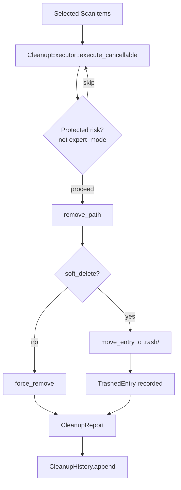

# Cleanup Domain

**Module path:** `crates/clv-core/src/cleanup.rs`  
**Generated:** 2026-08-28

---

## What This Module Does

Cleanup is the safety-conscious compactor at the end of the pipeline. Scanning tells you what *could* go; cleanup actually moves it—but by default into an app-managed holding area rather than permanent oblivion. Every moved file gets a `TrashedEntry` record so the Dashboard can offer restore, and every run appends to a 90-day history so you can see trends over time.

The module's design reflects a core product promise: **destructive operations must be reversible by default**.

---

## Core Capabilities

1. **Batch execution with progress** — `CleanupExecutor::execute_cancellable` (`cleanup.rs:163`) iterates items, emitting `CleanupProgress` before and after each deletion.

2. **Soft delete to app trash** — Timestamped + UUID-stamped destinations under `trash_dir()` (`cleanup.rs:237-247`).

3. **Cross-device move fallback** — `move_entry` copies then deletes when `rename` fails across volumes (`cleanup.rs:256-268`)—critical on Windows.

4. **Restore API** — `restore_trashed` moves files back from trash path to original location.

5. **History management** — `CleanupHistory` with 90-day prune (`cleanup.rs:86-89`) and restorable entry listing (`cleanup.rs:123-133`).

---

## Key Components

| Component | File path | Responsibility |
|-----------|-----------|----------------|
| `CleanupExecutor` | `crates/clv-core/src/cleanup.rs:147` | Deletion orchestrator |
| `execute_cancellable` | `crates/clv-core/src/cleanup.rs:163` | Batch delete with cancel |
| `remove_path` | `crates/clv-core/src/cleanup.rs:232` | Soft vs hard delete decision |
| `move_entry` | `crates/clv-core/src/cleanup.rs:256` | Robust move/rename with fallback |
| `TrashedEntry` | `crates/clv-core/src/cleanup.rs:30` | Restore metadata struct |
| `CleanupHistory` | `crates/clv-core/src/cleanup.rs:52` | JSON persistence + aggregation |
| `purge_old_trash` | `crates/clv-core/src/cleanup.rs` | Age-based trash file deletion |
| `restore_trashed` | `crates/clv-core/src/cleanup.rs` | User-initiated file recovery |

---

## Internal Data Flow

---

## Cross-Module Interactions

| Module | Direction | Interface | Notes |
|--------|-----------|-----------|-------|
| Models | Input | `ScanItem`, `RiskLevel` | Items to delete |
| Settings | Depends | `AppSettings.soft_delete`, `expert_mode`, `trash_dir()` | Behavior flags |
| AppStore | Invoked by | `spawn_cleanup` in `services/cleanup.rs` | Background execution |
| Views/Dashboard | Displays | `CleanupHistory`, restore actions | User-facing history |

**In cleanup workflow**: CleanupView selection → AppStore.run_cleanup → CleanupExecutor → history append → disk refresh → notification.

---

## Performance and Safety

- Sequential per-item deletion avoids filesystem lock contention on some platforms.
- Protected items require Expert mode to delete (`cleanup.rs:181-186`).
- Readonly file attributes cleared before remove via `force_remove` helpers.
- Failures collected in `CleanupReport.failed` without stopping batch.

---

## Implementation Highlights

- Cross-device `move_entry` tested in `lib.rs` test suite for cleanup module.
- `CleanupHistory::restorable_entries` deduplicates by trash path, filters missing files.
- Startup `purge_old_trash` prevents unbounded trash growth (`state.rs:109-114`).
