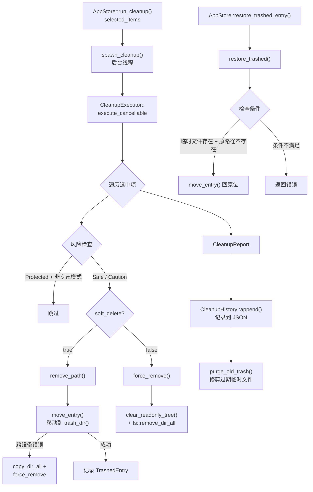

# Cleanup — 清理执行引擎

## 这个模块在做什么

Cleanup 是 CLV3000 Plus 的"回收处理中心"。如果 Scanner 是外出巡查的清运车，那 Cleanup 就是那个接收清运车卸下的垃圾、进行分类处理、并决定送往填埋场还是临时仓库的工厂。它不关心一个文件最初为什么被标记为"可清理"——那是 Scanner 和规则系统的工作。Cleanup 只负责一件事：安全地把用户选中的东西移除掉。

它的核心设计理念是"可逆优先"。默认模式下（`soft_delete = true`），Cleanup 不会真正删除文件，而是将其移动到一个受控的"临时仓库"目录（`trash_dir()`）中，就像回收站一样。只有当用户明确关闭软删除模式时，才会调用 `force_remove()` 进行不可逆的物理删除。这种设计让用户即使误操作也能通过 `restore_trashed()` 一键恢复，相当于给"删除"操作加了一个 7 天的后悔药。

Cleanup 还内置了一个"历史账本"——`CleanupHistory` 会记录每次清理的时间、释放空间、成功/失败数量，并自动保留最近 90 天的记录（`prune_old()`）。超过 `soft_delete_days`（默认 7 天）的临时文件会被 `purge_old_trash()` 自动清理。这就像超市的库存管理系统：有过期自动下架的机制，也有退货记录可查。

## 核心功能点

1. **软删除（移动到回收站）** — 默认模式，`remove_path()` 将文件/目录移动到 `trash_dir()`（`com.clv3000.plus` 本地数据目录下的 `trash/` 子目录），文件名附加时间戳和 UUID 防冲突。跨设备移动时自动降级为复制+删除。
2. **硬删除（物理移除）** — `force_remove()` 直接调用 `fs::remove_dir_all` / `fs::remove_file`，在 Windows 上先通过 `clear_readonly_tree()` 清除只读属性。适用于关闭软删除模式的场景。
3. **受保护项跳过** — `execute_cancellable()` 在执行前过滤掉 `RiskLevel::Protected` 级别的项（除非 `expert_mode` 开启），相当于对"危险品"设置了安全锁。
4. **清理历史追踪** — `CleanupHistory` 将每次清理记录追加到 JSON 文件，自动修剪超过 90 天的旧记录。支持按天数查询释放空间（`freed_in_days()`）和成功次数（`success_count_in_days()`）。
5. **恢复已删除项** — `restore_trashed()` 检查原始路径是否仍不存在、临时文件是否存在后，将文件移回原位。UI 层通过 `AppStore::restore_trashed_entry()` 调用此功能。
6. **自动清理过期临时文件** — `purge_old_trash(days)` 扫描 `trash_dir()` 中超过指定天数的文件并物理删除，启动时由 `AppStore` 异步触发。
7. **可取消执行** — `execute_cancellable()` 在每个 item 处理前检查 `AtomicBool` 标志，确保用户可以随时中断清理过程。
8. **跨设备兼容** — `move_entry()` 检测 `CrossesDevices` 错误（跨分区/卷移动），自动降级为 `copy_dir_all()` + `force_remove()` 的组合操作。

## 关键组件

| 组件/类型 | 文件路径 | 一句话职责 |
|-----------|----------|-----------|
| `CleanupExecutor` | `crates/clv-core/src/cleanup.rs:147` | 清理执行器主体，持有 `AppSettings` 并驱动清理流程 |
| `CleanupReport` | `crates/clv-core/src/cleanup.rs:20` | 清理结果报告，含释放空间、成功/失败路径和临时文件列表 |
| `TrashedEntry` | `crates/clv-core/src/cleanup.rs:29` | 单条临时文件记录，含原始路径、临时路径、大小和名称 |
| `CleanupHistory` | `crates/clv-core/src/cleanup.rs:47` | 清理历史容器，支持追加、修剪和按天数统计 |
| `CleanupHistoryRecord` | `crates/clv-core/src/cleanup.rs:37` | 单次清理记录，含时间戳、释放空间和临时文件列表 |
| `CleanupProgress` | `crates/clv-core/src/cleanup.rs:12` | 清理进度事件，含已完成数、总数、当前路径和已释放字节 |
| `force_remove` | `crates/clv-core/src/cleanup.rs:273` | 物理删除函数，处理目录递归和只读属性清除 |
| `purge_old_trash` | `crates/clv-core/src/cleanup.rs:334` | 清理过期临时文件，返回释放的总字节数 |
| `restore_trashed` | `crates/clv-core/src/cleanup.rs:361` | 从临时目录恢复文件到原始路径 |

## 内部数据流

## 关键接口与扩展点

- **`CleanupExecutor::execute(items, on_progress)`** — 非可取消版本，简单场景下使用。
- **`CleanupExecutor::execute_cancellable(items, cancel, on_progress)`** — 可取消版本，`cancel` 为 `AtomicBool` 引用。UI 层通过 `AppStore::cancel_cleanup()` 控制。
- **`purge_old_trash(days)`** — 独立的过期清理函数，可被定时任务或启动流程调用，与主清理流程解耦。
- **`restore_trashed(entry)`** — 单条恢复函数，接受 `TrashedEntry` 结构体。可在任意时间点调用，不依赖当前扫描状态。
- **`CleanupHistory::freed_in_days(days)`** — 历史统计 API，可供 Dashboard 展示趋势图。新增统计维度只需在 `CleanupHistory` 上添加方法。

## 与其他模块的交互

| 交互模块 | 交互内容 | 说明 |
|----------|----------|------|
| `models` | `ScanItem`, `RiskLevel` | Cleanup 读取 `ScanItem` 列表进行处理，根据 `RiskLevel` 决定是否跳过 |
| `settings` | `AppSettings.soft_delete`, `expert_mode`, `soft_delete_days` | 驱动软/硬删除模式、专家模式和过期天数配置 |
| `settings` | `trash_dir()` | 提供临时文件存储目录的路径 |
| `app-state` | `AppStore::run_cleanup()`, `restore_trashed_entry()` | UI 层的清理触发和恢复入口 |

## 跨模块协作场景

**场景一：标准清理流程**
用户在 Cleanup 页面勾选若干 `ScanItem`，点击"开始清理"。`AppStore::run_cleanup()` 收集选中项后调用 `start_cleanup()`，后者在后台线程启动 `CleanupExecutor::execute_cancellable()`。每个 item 处理完毕后通过 `on_progress` 回调更新 UI 进度条。完成后，`CleanupHistory` 追加记录，`purge_old_trash()` 异步清理过期临时文件。

**场景二：误删恢复**
用户发现刚清理的某个目录是误操作，在 Settings 页面找到对应 `TrashedEntry` 并点击"恢复"。`AppStore::restore_trashed_entry()` 在后台调用 `restore_trashed()`，成功后从 `CleanupHistory` 中移除该条记录并保存。如果原始路径已被占用则返回错误提示。

**场景三：启动时自动清理**
`AppStore::new()` 在初始化时异步调用 `purge_old_trash(settings.soft_delete_days)`，自动清理超过 7 天的临时文件。这个操作与用户交互完全异步，不阻塞 UI 启动。

## 性能考量

- **`force_remove` 的只读清除**：Windows 上 `.cargo`、`node_modules` 等目录常含只读文件，`clear_readonly_tree()` 使用 `WalkDir`（`contents_first=true`）从叶子节点向上清除属性，确保 `remove_dir_all` 不会因权限问题失败。
- **跨设备降级**：`move_entry()` 优先使用 `fs::rename()`（零拷贝），仅在跨分区时降级为复制+删除，避免不必要的 I/O 开销。
- **历史修剪**：`CleanupHistory::prune_old()` 在每次 `append()` 时执行 `retain()`，保持记录数组不超过 90 条有效记录，防止 JSON 文件无限增长。
- **后台线程执行**：清理操作在独立线程运行，不阻塞 GPUI 主线程。UI 通过 `on_progress` 回调以事件驱动方式更新，轮询间隔 80ms。
- **`dir_size_quick`**：`purge_old_trash()` 中使用的快速大小计算不检查取消标志，因为临时文件清理是轻量操作。对大目录使用 `walkdir` 迭代器（惰性求值），内存开销恒定。
