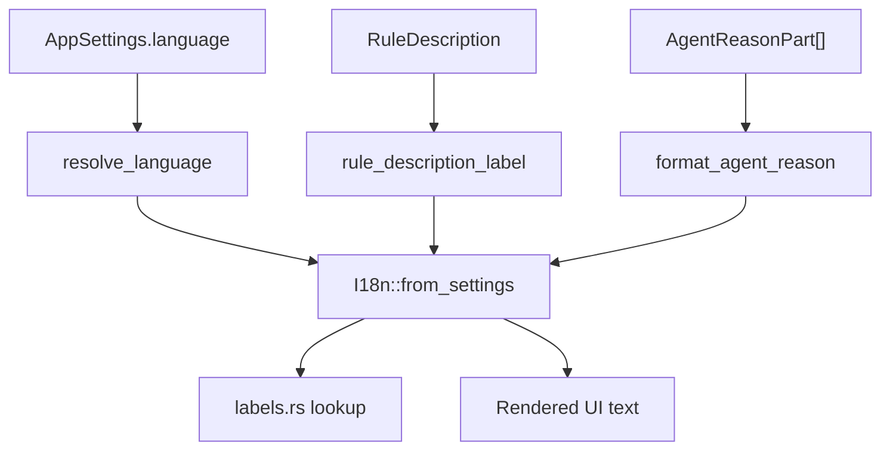

# App Internationalization Domain

**Module path:** `crates/clv-app/src/i18n/`  
**Generated:** 2026-08-28

---

## What This Module Does

While `clv-core` stores typed message enums, the app i18n layer is the interpreter—it provides every button label, page title, status message, tray menu string, and notification text in Chinese, English, and Japanese. Simple mode uses friendly phrasing; Expert mode exposes more technical detail, but both modes pull from the same catalog to stay consistent.

---

## Core Capabilities

1. **I18n facade** — `I18n::from_settings` resolves language from `AppSettings` (`i18n/mod.rs`).

2. **Label catalog** — Hundreds of UI strings in `labels.rs` organized by feature area.

3. **Rule description labels** — `rule_description_label` wraps core `RuleDescription::text`.

4. **Agent reason formatting** — Delegates to core `format_agent_reason` with language context.

5. **Page titles** — `AppPage::title(i18n)` returns localized navigation labels (`state.rs:35`).

---

## Key Components

| Component | File path | Responsibility |
|-----------|-----------|----------------|
| `I18n` | `crates/clv-app/src/i18n/mod.rs` | Main i18n facade struct |
| `labels.rs` | `crates/clv-app/src/i18n/labels.rs` | Static label tables zh/en/ja |
| `Language` | `crates/clv-core/src/locale.rs` | Core language enum |
| `resolve_language` | `crates/clv-core/src/locale.rs` | System locale → Language |
| `scan_phase_*` helpers | `crates/clv-core/src/locale.rs` | Localized scan phase strings |
| Tray menu labels | `crates/clv-app/src/tray.rs` | Built via `I18n` in `build_menu` |

---

## Internal Data Flow

---

## Cross-Module Interactions

| Module | Direction | Interface | Notes |
|--------|-----------|-----------|-------|
| All Views | Uses | `store.i18n()` or `I18n::from_settings` | Every visible string |
| clv-core messages | Delegates | `.text(lang)` on enums | Domain text resolution |
| Tray | Uses | `I18n` for menu items | Platform menu strings |
| Scanner progress | Uses | `scan_phase_*` in core locale | Background thread safe |

---

## Implementation Highlights

- Language resolved at startup for tray install before window opens (`main.rs:36-37`).
- Core test ensures English rule descriptions contain no CJK characters (`lib.rs:325-341`).
- Three languages cover primary user bases; adding a language requires both `labels.rs` and translation JSON updates.
