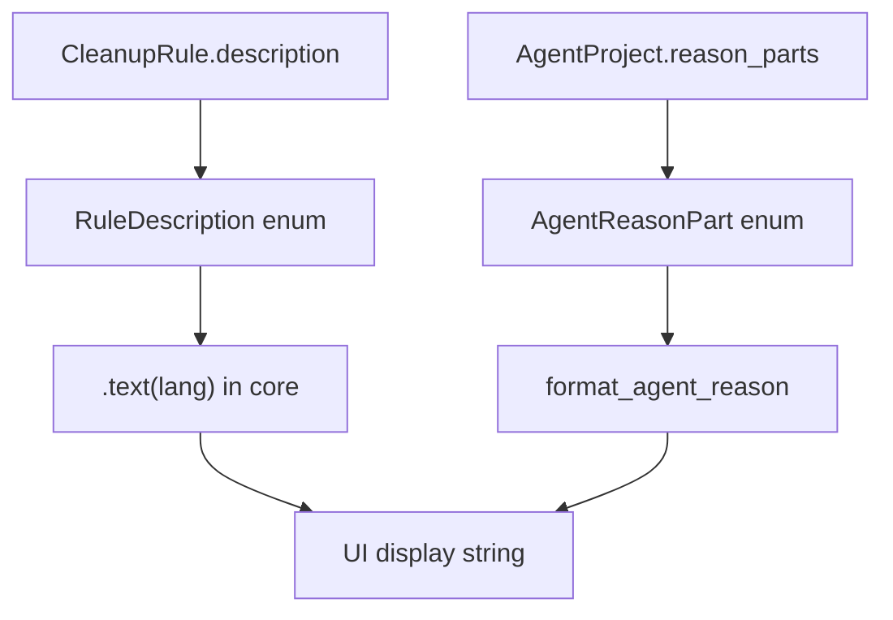

# Typed Messages Domain

**Module path:** `crates/clv-core/src/messages/`  
**Generated:** 2026-08-28

---

## What This Module Does

The messages module is the app's phrasebook—it stores *what* to say (as typed enums) separately from *how* to say it in each language. Instead of scattering English strings through scanner rules, every cleanup target references a `RuleDescription` variant (R001–R140), and every agent flag references an `AgentReasonPart`. The UI resolves these to localized text at render time.

This design prevents the embarrassing mixed-language bug where a Japanese UI shows English cache descriptions.

---

## Core Capabilities

1. **RuleDescription enum** — 140 codegen'd variants with `.text(Language)` method (`rule_description.rs`).

2. **AgentReasonPart enum** — Structured agent detection reasons with `.text(Language)` (`agent_reason.rs`).

3. **Search helpers** — `rule_description_matches_query`, `agent_reason_matches_query` for filtered views.

4. **Formatting** — `format_agent_reason` chains reason parts into display strings.

5. **Codegen pipeline** — `scripts/generate-rule-descriptions.py` reads `rule-description-translations.json` and regenerates Rust enum + translation table.

---

## Key Components

| Component | File path | Responsibility |
|-----------|-----------|----------------|
| `RuleDescription` | `crates/clv-core/src/messages/rule_description.rs` | Cleanup rule label enum |
| `AgentReasonPart` | `crates/clv-core/src/messages/agent_reason.rs` | Agent flag reason enum |
| `format_agent_reason` | `crates/clv-core/src/messages/agent_reason.rs` | Multi-reason string builder |
| `generate-rule-descriptions.py` | `scripts/generate-rule-descriptions.py` | Translation codegen |
| `rule-description-translations.json` | `scripts/rule-description-translations.json` | Source translation data |

---

## Internal Data Flow

---

## Cross-Module Interactions

| Module | Direction | Interface | Notes |
|--------|-----------|-----------|-------|
| Settings/rules | References | `RuleDescription::Rxxx` per rule | Compile-time IDs |
| Scanner | Sets | `ScanItem.description` | From matched rule |
| Agent | Sets | `AgentProject.reason_parts` | Heuristic output |
| App i18n | Wraps | `rule_description_label` | UI-layer helper |
| Tests | Validates | `lib.rs:325` — no CJK in English text | Quality gate |

---

## Implementation Highlights

- Adding a new rule requires: JSON translation entry → run codegen → assign ID in rule table.
- Expert mode may show rule IDs; Simple mode shows `.text(lang)` human phrases only.
- Core never stores rendered strings on persisted models—only enum variants in JSON via serde.
