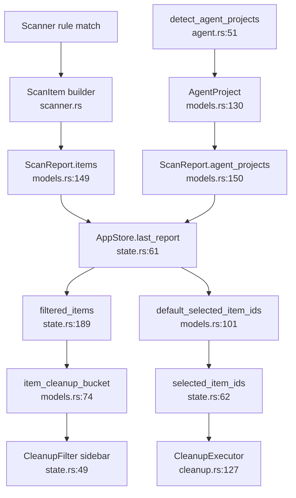

# Models Domain

**Module path:** `crates/clv-core/src/models.rs`  
**Generated:** 2026-08-26

---

## What This Module Does

The models module defines the shared vocabulary every other crate agrees on. When the scanner finds a reclaimable folder, it becomes a `ScanItem`. When multiple items belong to an abandoned agent trial, they group into an `AgentProject`. When a full scan completes, everything lands in a `ScanReport`. Risk levels, tech stacks, and cleanup buckets give the UI consistent labels and filtering semantics.

Without this module, scanner, cleanup, agent detection, and GPUI views would each invent their own structs—and "safe to delete" would mean different things in different places.

---

## Core Capabilities

1. **Tech stack taxonomy** — `TechStack` enum (`models.rs:9-28`) covers 18 stacks from Rust and Node to Agent and System, with `all()` iterator for UI filters.

2. **Risk classification** — `RiskLevel` (`models.rs:56-60`) orders Safe < Caution < Protected; drives default selection and executor gating.

3. **UI bucket mapping** — `CleanupBucket` (`models.rs:63-72`) groups items into ProjectBuildCache, SharedToolCache, DevEnvironment, and AiGenerated for sidebar filters.

4. **Scan item record** — `ScanItem` (`models.rs:110-121`) carries id, path, size, stack, risk, category, localized description, project root, and last-modified timestamp.

5. **Agent project aggregate** — `AgentProject` (`models.rs:130-139`) bundles path, stacks, inactive days, reason parts, and child items.

6. **Scan report container** — `ScanReport` (`models.rs:148-154`) holds items, agent projects, timing metadata, and scanned roots.

7. **Helper functions** — `default_selected_item_ids`, `item_cleanup_bucket`, `format_bytes` (`models.rs:74-107`, `models.rs:101-107`) centralize cross-cutting logic.

---

## Key Components

| Component | File path | Responsibility |
|-----------|-----------|----------------|
| `TechStack` | `models.rs:9-53` | 18-value enum with `all()` static slice |
| `RiskLevel` | `models.rs:56-60` | Safe / Caution / Protected ordering |
| `CleanupBucket` | `models.rs:63-72` | UI filter category enum |
| `item_cleanup_bucket` | `models.rs:74-98` | Maps ScanItem to CleanupBucket |
| `default_selected_item_ids` | `models.rs:101-107` | Safe-only default selection set |
| `ScanItem` | `models.rs:110-127` | Single reclaimable path record |
| `AgentProject` | `models.rs:130-145` | Grouped agent trial project |
| `ScanReport` | `models.rs:148-160` | Full scan output with aggregates |
| `format_bytes` | `models.rs` | Human-readable size strings |
| `CleanupCategory` | `category.rs` | Finer-grained category with bucket mapping |

---

## Internal Data Flow



**Key steps**

1. **Scanner creates items** — Each rule match produces a `ScanItem` with generated `id`, computed `size_bytes`, and `RuleDescription`.
2. **Report assembly** — Scanner returns `ScanReport` with timing and roots metadata.
3. **UI consumption** — `AppStore` stores report; views read items/projects through store methods.
4. **Cleanup input** — `selected_items()` filters `last_report.items` by `selected_item_ids`.

---

## Key Interfaces and Extension Points

**Core types (serde-enabled)**

```rust
pub struct ScanItem { /* id, path, name, size_bytes, stack, risk, category, ... */ }
pub struct AgentProject { /* path, name, total_bytes, stacks, reason_parts, items */ }
pub struct ScanReport { /* items, agent_projects, scanned_at, scan_duration_ms, roots_scanned */ }
```

All defined in `models.rs` and re-exported from `lib.rs`.

**Extend taxonomy**

- New `TechStack` variant → add to enum and `all()` slice (`models.rs:31-52`).
- New `CleanupBucket` → extend enum and update `item_cleanup_bucket` logic (`models.rs:74-98`).
- New `RiskLevel` would require updating scanner rules, UI filters, and executor gates—a rare change.

---

## Interactions With Other Modules

| Module | Direction | Interface | Notes |
|--------|-----------|-----------|-------|
| Scanner | producer | `ScanItem`, `ScanReport` | Creates and fills model instances |
| Agent | producer | `AgentProject` | Populates `agent_projects` field |
| Cleanup | consumer | `ScanItem`, `RiskLevel` | Input to `CleanupExecutor::execute` |
| Settings | indirect | `CleanupRule` → item fields | Rules define stack/risk/category |
| Category | dependency | `CleanupCategory` | Finer category enum |
| Messages | dependency | `RuleDescription`, `AgentReasonPart` | Localized description fields |
| AppStore | consumer | All report types | Central UI state holder |
| Views | consumer | Via AppStore | Display and selection |

---

## Role in Core Business Flows

**Health scan flow** — Scanner produces `ScanReport` → `AppStore` stores as `last_report` → `default_selected_item_ids` initializes `selected_item_ids` with safe items only.

**Cleanup filter flow** — User picks sidebar filter (`CleanupFilter` in `state.rs:49`) → `filtered_items` calls `item_cleanup_bucket` per item → list re-renders.

**Agent review flow** — `ScanReport.agent_projects` drives `AgentView` cards; each card's `items` are `ScanItem` references grouped by `project_root`.

---

## Performance Considerations

- `ScanItem` and `AgentProject` use owned `PathBuf` and `String`—cloned when crossing thread boundaries (scan worker → UI).
- `default_selected_item_ids` is O(n) over items—called once per scan completion.
- `item_cleanup_bucket` does string contains checks for AI markers—acceptable for UI filter, not per-directory during scan.
- `format_bytes` used for display only—no hot-path allocation concerns.

---

## Implementation Highlights

**Ordered RiskLevel** — `PartialOrd` on `RiskLevel` (`models.rs:55`) enables sort-by-risk in UI if needed.

**AI bucket heuristics** — `item_cleanup_bucket` checks both `TechStack::Agent` and path substring markers (`.cursor`, `.claude`, etc.) at `models.rs:80-95`.

**Report aggregates** — `ScanReport::total_reclaimable()` (`models.rs:157-160`) sums non-protected item sizes for dashboard display.

**Human-readable sizes** — `ScanItem::size_human()` and `AgentProject::size_human()` delegate to `format_bytes` for consistent "1.2 GB" formatting.
