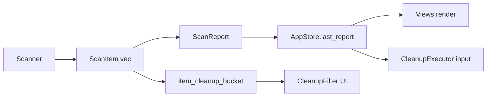

# Models Domain

**Module path:** `crates/clv-core/src/models.rs`  
**Generated:** 2026-08-22

---

## What This Module Does

`models.rs` defines the shared vocabulary of the application—every scan result, risk label, and UI filter bucket flows through these types. Keeping them in one module ensures Scanner, Cleanup, AppStore, and Views agree on what a "scan item" means without circular dependencies.

---

## Core Types

### Enumerations

| Enum | Lines | Purpose |
|------|-------|---------|
| `TechStack` | `models.rs:6-73` | 17 stack labels (Rust, NodeWeb, Agent, ...) |
| `RiskLevel` | `models.rs:76-90` | Safe, Caution, Protected (ordered) |
| `CleanupBucket` | `models.rs:93-122` | UI filter categories with hints |
| `UserMode` | `models.rs:261-273` | Simple vs Expert labels |

### Structures

| Struct | Lines | Key fields |
|--------|-------|------------|
| `ScanItem` | `models.rs:174-187` | id, path, size_bytes, risk, selected, project_root |
| `AgentProject` | `models.rs:196-205` | path, reason, days_inactive, items |
| `ScanReport` | `models.rs:213-220` | items, agent_projects, scan_duration_ms |
| `ScanProgress` | `models.rs:252-258` | phase, current_path, counts |

All major structs implement `Serialize`/`Deserialize` where persisted or exportable.

---

## Key Functions

| Function | Path | Role |
|----------|------|------|
| `item_cleanup_bucket` | `models.rs:124` | Maps ScanItem → CleanupBucket for UI filters |
| `format_bytes` | `models.rs:275` | Human-readable sizes |
| `ScanReport::total_reclaimable` | `models.rs:223` | Sum excluding Protected |
| `ScanReport::safe_reclaimable` | `models.rs:235` | Sum of Safe items only |

---

## CleanupBucket Logic

`item_cleanup_bucket` (`models.rs:124-172`) uses:
- `TechStack::Agent` → `AiGenerated`
- Category strings "Agent 会话", "Agent 缓存"
- Path substring markers (.cursor, .codex, ...)
- Category heuristics for global cache vs dev environment

This centralizes filter logic so `AppStore::filtered_items` stays declarative (`state.rs:188-202`).

---

## Internal Data Flow

---

## Interaction With Other Modules

Consumed by entire workspace; no dependencies on other clv-core modules except used by settings for `RiskLevel` in rules.

---

## Implementation Highlights

`RiskLevel` derives `PartialOrd` so Safe < Caution < Protected—usable in comparisons.

`ScanItem::size_human` delegates to `format_bytes` for consistent UI formatting (`models.rs:189-193`).

Agent project `reason` is a free-form string from heuristics (Chinese in detector); UI may display alongside localized labels.

---

## Role in Core Business Flows

Dashboard shows `total_reclaimable_human` and item counts from `ScanReport` helpers. Status bar uses same for idle message (`app/mod.rs:307-308`).

Default selection after scan sets `selected` on Safe items only in Scanner—not in models—but models carry the `selected` flag mutated by UI toggles.
