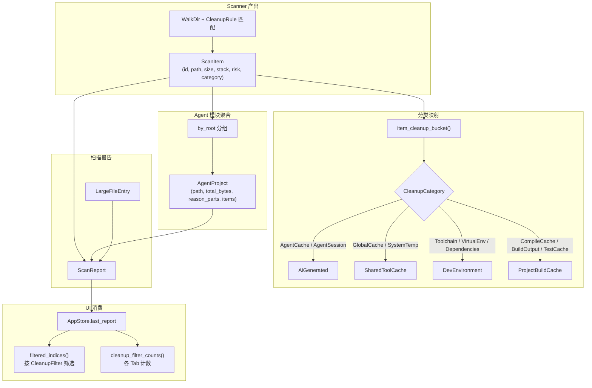

# Models — 核心数据模型

## 这个模块在做什么

Models 是 CLV3000 Plus 的"蓝图工厂"。如果整个系统是一座城市，Scanner 是清运车、Cleanup 是回收站、Agent 是侦探，那么 Models 就是定义"什么是垃圾箱、什么是运单、什么是项目标签"的标准化局。它不包含任何业务逻辑，只负责定义数据的形状和关系——就像一份建筑蓝图，规定了每面墙的位置和尺寸，但不负责砌墙。

这个模块的重要性在于它是所有模块的"共同语言"。Scanner 产出的 `ScanItem` 要传给 Cleanup 去执行删除，又要传给 UI 层展示给用户——如果数据结构不统一，整个管线就会断裂。`ScanItem` 就是这样一张"标准运单"：它携带路径（`path`）、名称（`name`）、大小（`size_bytes`）、技术栈（`stack`）、风险等级（`risk`）、清理类别（`category`）、规则描述（`description`）、所属项目根（`project_root`）和最后修改时间（`last_modified`）。无论这个运单经过哪个处理环节，它携带的信息都是完整的、一致的。

Models 还定义了整个系统的分类体系。`TechStack` 枚举用 18 个变体覆盖了 Rust、Node/Web、Android、iOS、Flutter、KMP、Java、Python、.NET、C++、Go、Ruby、PHP、Unity、Infra、Agent、System、Other。`RiskLevel` 用三个有序等级（`Safe < Caution < Protected`）编码了安全性语义。`CleanupBucket` 用四个分类桶（ProjectBuildCache、SharedToolCache、DevEnvironment、AiGenerated）将 27 种细粒度 `CleanupCategory` 映射为用户界面的四个 Tab 页签。这种"从细到粗"的分层分类设计，让同一份数据既能支持精确的规则匹配，又能支撑直观的 UI 分组。

## 核心功能点

1. **`ScanItem` — 清理候选项** — 系统中最核心的数据结构，每个被 Scanner 标记为"可清理"的文件或目录都会生成一个 `ScanItem`。它携带完整上下文：路径、名称、大小、技术栈、风险等级、清理类别、规则描述、项目根和修改时间。UUID `id` 字段用于 UI 层的选中状态追踪。
2. **`AgentProject` — AI 项目聚合** — 将属于同一项目根的多个 `ScanItem` 聚合为一个实体，附带总大小、技术栈列表、不活跃天数和结构化识别原因（`reason_parts`）。UI 层的 Agent 页面按此实体分组展示。
3. **`ScanReport` — 扫描结果快照** — Scanner 的完整产出物，包含候选项列表、AI 项目列表、大文件列表、扫描时间戳、耗时、已扫描根目录列表、是否取消和大小是否截断等元数据。支持持久化（`save_last_scan`）和恢复（`load_last_scan`）。
4. **`TechStack` — 技术栈枚举** — 18 个变体覆盖主流编程语言和平台，驱动清理规则的技术栈匹配和 UI 的技术栈筛选。`Agent` 变体专门用于 AI 工具产出物。
5. **`RiskLevel` — 风险等级** — 三级有序枚举（`Safe=0, Caution=1, Protected=2`），定义了清理项的安全性语义。`Safe` 默认勾选，`Caution` 需用户手动确认，`Protected` 默认跳过（除非专家模式）。
6. **`CleanupBucket` — 清理分桶** — 四分类枚举（ProjectBuildCache、SharedToolCache、DevEnvironment、AiGenerated），将 27 种 `CleanupCategory` 映射为 UI 的四个筛选页签。`item_cleanup_bucket()` 函数是映射的实现。
7. **`ScanProgress` — 扫描进度事件** — 包含阶段描述、当前路径、已发现项数和字节数，通过 `on_progress` 回调在 Scanner 和 UI 之间传递实时进度。
8. **`format_bytes` — 人类可读格式化** — 将字节数转换为 `B / KB / MB / GB` 格式字符串，`ScanItem::size_human()` 和 `AgentProject::size_human()` 均委托此函数。
9. **`default_selected_item_ids` — 默认选中策略** — 返回所有 `Safe` 级别项的 ID 集合，扫描完成后自动勾选低风险项，减少用户操作负担。

## 关键组件

| 组件/类型 | 文件路径 | 一句话职责 |
|-----------|----------|-----------|
| `ScanItem` | `crates/clv-core/src/models.rs:84` | 清理候选项数据结构，系统中最核心的流转单元 |
| `AgentProject` | `crates/clv-core/src/models.rs:104` | AI 项目聚合实体，含路径、大小、原因和子项列表 |
| `ScanReport` | `crates/clv-core/src/models.rs:122` | 扫描结果快照，支持 JSON 序列化/反序列化 |
| `TechStack` | `crates/clv-core/src/models.rs:8` | 18 变体技术栈枚举，驱动规则匹配和 UI 分组 |
| `RiskLevel` | `crates/clv-core/src/models.rs:30` | 三级有序风险枚举，编码安全性语义 |
| `CleanupBucket` | `crates/clv-core/src/models.rs:37` | 四分类清理桶枚举，驱动 UI 的筛选页签 |
| `ScanProgress` | `crates/clv-core/src/models.rs:162` | 扫描进度事件，连接 Scanner 和 UI 的实时通道 |
| `CleanupCategory` | `crates/clv-core/src/category.rs:7` | 27 变体细粒度清理类别，每个映射到一个 `CleanupBucket` |
| `item_cleanup_bucket` | `crates/clv-core/src/models.rs:49` | 将 `ScanItem` 映射到 `CleanupBucket` 的核心函数 |
| `format_bytes` | `crates/clv-core/src/models.rs:170` | 字节数的人类可读格式化函数 |

## 内部数据流

## 关键接口与扩展点

- **`ScanItem` 的 `Serialize` / `Deserialize`** — 所有字段均可 JSON 序列化，支持 `save_last_scan()` / `load_last_scan()` 持久化。新增字段需保持向后兼容（`#[serde(default)]`）。
- **`item_cleanup_bucket(item)`** — 分桶映射函数，新增 `CleanupCategory` 变体时需在此函数中添加映射规则。当前通过路径关键词检查补充 `TechStack::Agent` 的检测。
- **`default_selected_item_ids(items)`** — 默认选中策略，当前仅勾选 `Safe` 级别。可扩展为基于 `CleanupBucket` 的更精细策略。
- **`CleanupCategory::cleanup_bucket()`** — 枚举方法，将 27 种细分类别映射为 4 个桶。新增类别时需在此方法中添加 match arm。
- **`ScanReport::total_reclaimable()`** — 可回收空间计算，排除 `Protected` 级别。可供 Dashboard 展示总可回收空间。

## 与其他模块的交互

| 交互模块 | 交互内容 | 说明 |
|----------|----------|------|
| `category` | `CleanupCategory` 枚举及其 `cleanup_bucket()` 方法 | Models 引用 CleanupCategory 进行分桶映射 |
| `messages` | `RuleDescription`, `AgentReasonPart` | Models 的 ScanItem 描述字段和 AgentProject 的原因字段 |
| `scanner` | 产出 `ScanItem` 和 `ScanReport` | Scanner 是 Models 类型的主要生产者 |
| `cleanup` | 消费 `ScanItem` | Cleanup 是 Models 类型的主要消费者 |
| `agent` | 产出 `AgentProject` | Agent 模块聚合 ScanItem 为 AgentProject |
| `app-state` | 读取 `ScanReport`，管理 `selected_item_ids` | UI 层是 Models 类型的最终消费者 |

## 跨模块协作场景

**场景一：类型即契约**
Scanner 在 `try_add_rule_path()` 中构造 `ScanItem`，设置 `stack: TechStack::Rust`、`risk: RiskLevel::Safe`、`category: CleanupCategory::CompileCache`。Cleanup 在 `execute_cancellable()` 中读取 `item.risk` 决定是否跳过。UI 在 `filtered_indices()` 中调用 `item_cleanup_bucket(item)` 判断属于哪个 Tab。三个模块通过 `ScanItem` 这个"类型契约"解耦协作。

**场景二：风险等级驱动 UI 行为**
`RiskLevel` 的有序性（`Safe < Caution < Protected`）被 `AppStore::cleanup_filter_counts()` 利用来计算"SafeOnly"筛选的计数。`default_selected_item_ids()` 利用 `risk == RiskLevel::Safe` 过滤默认勾选项。`CleanupExecutor` 利用 `risk == RiskLevel::Protected && !expert_mode` 决定是否跳过。三个不同模块各自独立使用同一枚举的不同语义面。

**场景三：分桶映射驱动 Tab 分组**
用户在 Cleanup 页面切换筛选器时，`filtered_indices()` 根据 `CleanupFilter` 枚举值调用 `item_cleanup_bucket(item)` 返回对应的 `CleanupBucket`，然后与筛选器匹配。同一机制也被 `cleanup_filter_counts()` 用于计算每个 Tab 的计数徽标。数据从 27 种 `CleanupCategory` 经 `cleanup_bucket()` 方法收窄为 4 种 `CleanupBucket`，再经 `item_cleanup_bucket()` 函数附加 AI 路径关键词检查，最终驱动 UI 分组。

## 性能考量

- **零分配设计**：`ScanItem`、`AgentProject` 等类型均使用 `PathBuf`（堆分配）但避免内部 `String` 拷贝，`name` 字段通过 `to_string_lossy()` 一次性转换。
- **枚举紧凑布局**：`RiskLevel` 和 `CleanupBucket` 使用 `Copy` + `Eq`，编译器可将其放入寄存器，match 分支零开销。
- **`format_bytes` 无分配路径**：小于 1KB 的值直接格式化为整数字符串，仅 KB/MB/GB 级别使用浮点格式化。
- **序列化兼容性**：`ScanReport` 和 `CleanupHistory` 使用 `#[serde(default)]` 标注可选字段，确保新版本读取旧版本数据时不丢失信息。
- **`item_cleanup_bucket` 短路优化**：函数首先检查 `TechStack::Agent`，命中则立即返回 `AiGenerated`，跳过后续 10 个路径关键词的逐一检查。对于 AI 项目占比较高的扫描结果，这能显著减少分桶计算时间。
