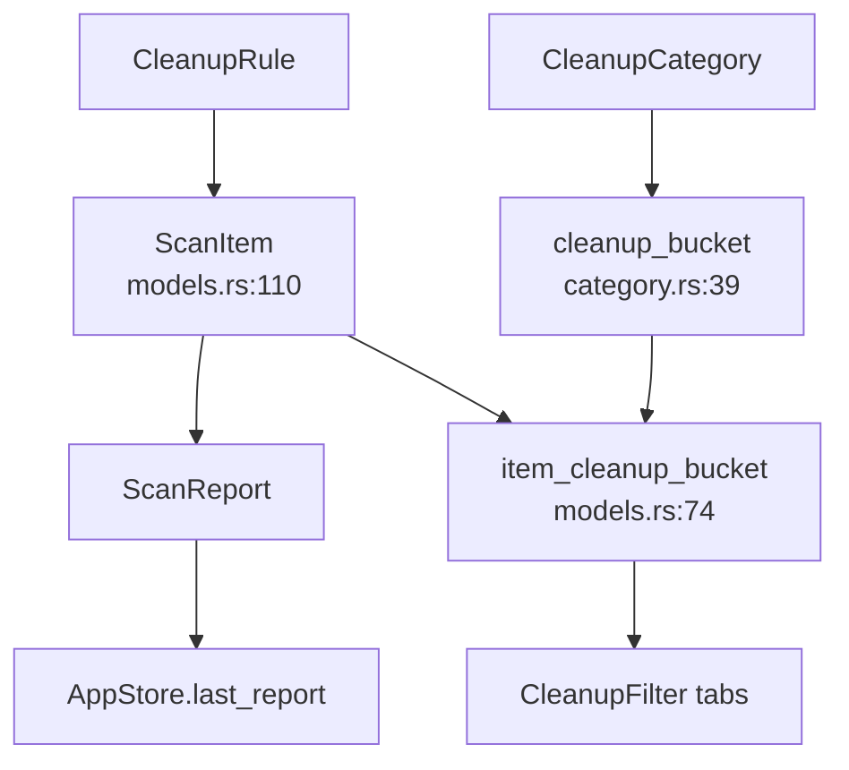

# Models Domain

**Module paths:** `crates/clv-core/src/models.rs`, `crates/clv-core/src/category.rs`  
**Generated:** 2026-08-23

---

## What This Module Does

Models defines the shared vocabulary of CLV3000 Plus — what a scannable item looks like, how risky deletion is, which technology stack it belongs to, and how the UI groups items into cleanup buckets. Centralizing these types in `clv-core` lets scanner, cleanup, AppStore, and views agree on semantics without stringly-typed categories or duplicated risk logic.

---

## Core Capabilities

1. **Tech stack taxonomy** — `TechStack` enum with 18 values (`models.rs:9–28`): Rust, NodeWeb, Android, Ios, Flutter, Agent, System, etc.

2. **Risk levels** — `RiskLevel::Safe | Caution | Protected` with ordering (`models.rs:56–60`) drives default selection and expert visibility.

3. **Cleanup buckets** — `CleanupBucket` (`models.rs:63–72`) — four UI groups: ProjectBuildCache, SharedToolCache, DevEnvironment, AiGenerated.

4. **Fine categories** — `CleanupCategory` (`category.rs:7–36`) maps to buckets via `cleanup_bucket()` (`category.rs:39`).

5. **Scan artifacts** — `ScanItem`, `ScanReport`, `ScanProgress`, `AgentProject` with serde for potential future export.

6. **Selection helpers** — `default_selected_item_ids` (Safe only), `item_cleanup_bucket` (path heuristics for agent dirs).

---

## Key Components

| Component | File path | Responsibility |
|-----------|-----------|----------------|
| `TechStack` | `models.rs:9` | Technology classification |
| `RiskLevel` | `models.rs:56` | Deletion risk gate |
| `CleanupBucket` | `models.rs:63` | UI filter tabs |
| `CleanupCategory` | `category.rs:7` | Fine-grained rule category |
| `ScanItem` | `models.rs:110` | Single cleanable path |
| `ScanReport` | `models.rs` | Full scan output |
| `AgentProject` | `models.rs` | Aggregated agent experiment |
| `item_cleanup_bucket` | `models.rs:74` | Bucket with path fallback |
| `default_selected_item_ids` | `models.rs:101` | Post-scan safe defaults |

---

## Internal Data Flow

`ScanItem.description` is `RuleDescription` (`models.rs:118`) — not a display string.

---

## Cross-Module Interactions

| Module | Direction | Interface | Notes |
|--------|-----------|-----------|-------|
| scanner | produces | `ScanItem`, `ScanReport` | Primary consumer |
| cleanup | consumes | `ScanItem`, `RiskLevel` | Per-item delete |
| category | consumed by | `CleanupCategory` on ScanItem | Bucket mapping |
| messages | consumed by | `RuleDescription`, `AgentReasonPart` | Typed text IDs |
| app-store | filters | `filtered_items`, buckets | `state.rs:176` |

---

## Design Decisions

**Bucket path fallback** — `item_cleanup_bucket` checks path substrings for `.cursor`, `.claude`, etc. (`models.rs:80–95`) even when category alone might not mark AI content — catches edge cases in session paths.

**Selection not on ScanItem** — Per `AGENTS.md`, `selected_item_ids` lives on `AppStore`, keeping `ScanReport` an immutable snapshot.

---

## Implementation Highlights

Unit tests in `lib.rs` validate bucket classification for cargo cache, rustup toolchains, target dirs, and agent sessions (`lib.rs:179–251`).

`TechStack::all()` provides complete stack list for filter UI (`models.rs:31`).
