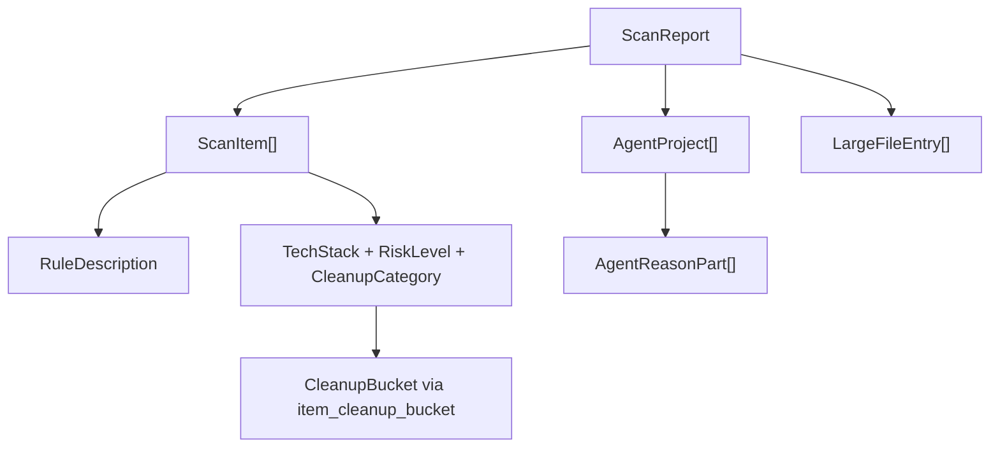

# Domain Models

**Module path:** `crates/clv-core/src/models.rs`, `crates/clv-core/src/category.rs`  
**Generated:** 2026-08-28

---

## What This Module Does

Models define the shared vocabulary of the app—the structs and enums that travel from scanner through AppStore to views. If you understand `ScanItem`, `ScanReport`, and `RiskLevel`, you understand what data flows through every workflow.

---

## Core Types

| Type | File:line | Purpose |
|------|-----------|---------|
| `TechStack` | `models.rs:9` | 18-variant enum (Rust, NodeWeb, Agent, …) |
| `RiskLevel` | `models.rs:31` | Safe / Caution / Protected ordering |
| `CleanupBucket` | `models.rs:38` | UI grouping: ProjectBuildCache, SharedToolCache, DevEnvironment, AiGenerated |
| `ScanItem` | `models.rs:85` | Single cleanable finding with typed description |
| `AgentProject` | `models.rs:105` | Grouped agent experiment folder |
| `ScanReport` | `models.rs:123` | Complete scan output with metadata flags |
| `ScanProgress` | `models.rs:163` | In-flight scan progress snapshot |
| `CleanupCategory` | `category.rs` | Fine-grained category → bucket mapping |

---

## Key Functions

| Function | File:line | Purpose |
|----------|-----------|---------|
| `item_cleanup_bucket` | `models.rs:49` | Derives UI bucket from item path/stack/category |
| `default_selected_item_ids` | `models.rs:76` | Pre-selects Safe-risk items after scan |
| `format_bytes` | `models.rs:170` | Human-readable size strings |
| `ScanReport::total_reclaimable` | `models.rs:137` | Sum non-protected item sizes |

---

## Internal Relationships

---

## Cross-Module Interactions

| Module | Usage | Notes |
|--------|-------|-------|
| Scanner | Produces | Builds ScanItem vector |
| Cleanup | Consumes | Takes ScanItem references |
| Agent | Produces/consumes | AgentProject aggregation |
| Views | Displays | All UI rendering derives from these types |
| serde | Serializes | ScanReport persisted to last_scan.json |

---

## Implementation Highlights

- `CleanupBucket` path heuristics detect AI markers in path strings (`models.rs:55-70`) even when category alone would not classify as AiGenerated.
- `ScanReport` includes `cancelled` and `sizes_truncated` flags for honest UI messaging after partial scans.
- Risk level ordering enables sort/filter in CleanupView without custom comparators.
