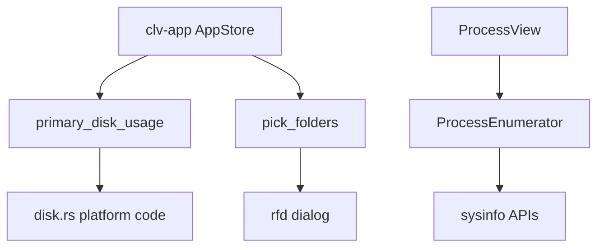

# Platform Adapter Domain

**Module path:** `crates/clv-platform/src/`  
**Generated:** 2026-08-28

---

## What This Module Does

Platform adapters are the loading dock where the app meets the operating system. Domain logic in `clv-core` deliberately avoids GPUI and most OS APIs; this crate provides thin wrappers for disk statistics, native folder pickers, process management, and startup item control—keeping platform differences in one place.

---

## Core Capabilities

1. **Disk usage** — `primary_disk_usage()` returns total/used bytes for main volume; `list_disk_volumes()` enumerates mounts (`disk.rs`).

2. **Folder picker** — `pick_folders()` opens native multi-select dialog via `rfd` (`dialog.rs`).

3. **Process management** — `ProcessEnumerator` wraps sysinfo for list/sort; `kill_process(pid)` terminates processes (`process.rs`).

4. **Startup items** — `list_startup_items()` and `set_startup_enabled()` for macOS/Windows login items (`startup.rs`).

---

## Key Components

| Component | File path | Responsibility |
|-----------|-----------|----------------|
| `primary_disk_usage` | `crates/clv-platform/src/disk.rs` | Main disk used/total |
| `list_disk_volumes` | `crates/clv-platform/src/disk.rs` | All volume metadata |
| `DiskVolume` | `crates/clv-platform/src/disk.rs` | Volume info struct |
| `pick_folders` | `crates/clv-platform/src/dialog.rs` | Native folder picker |
| `ProcessEnumerator` | `crates/clv-platform/src/process.rs` | Process listing |
| `ProcessInfo` | `crates/clv-platform/src/process.rs` | Single process record |
| `list_startup_items` | `crates/clv-platform/src/startup.rs` | OS startup enumeration |
| `set_startup_enabled` | `crates/clv-platform/src/startup.rs` | Toggle startup entry |

---

## Internal Data Flow

---

## Cross-Module Interactions

| Module | Direction | Interface | Notes |
|--------|-----------|-----------|-------|
| clv-app | Only consumer | All pub exports from `lib.rs` | clv-core never imports platform |
| AppStore | Calls | disk usage, folder picker | Async disk refresh |
| ProcessView | Calls | ProcessEnumerator via refresh trigger | Visibility-aware |
| StartupView | Calls | startup list/toggle | macOS + Windows |

---

## Implementation Highlights

- macOS disk usage is mount-aware; Windows sums multiple drives where applicable.
- Platform crate has zero dependency on clv-core—clean adapter boundary.
- Process categories (`ProcessCategory`) aid UI grouping in ProcessView.
