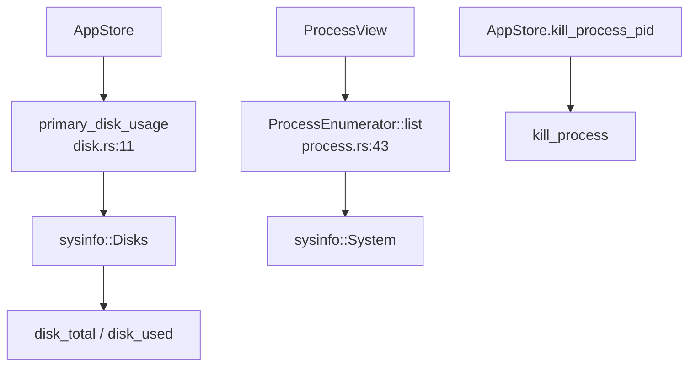

# Platform Domain

**Module path:** `crates/clv-platform/src/`  
**Generated:** 2026-08-23

---

## What This Module Does

`clv-platform` is the thin operating-system adapter crate. Domain logic in `clv-core` stays free of sysinfo calls and platform-specific startup APIs; when the dashboard needs disk usage or the process page needs to kill a PID, it calls into this crate. Think of it as the "lab" that talks to the OS while the "clinic" (`clv-core`) stays pure.

---

## Core Capabilities

1. **Disk usage** — `primary_disk_usage()` (`disk.rs:11`) returns `(total_bytes, used_bytes)` with mount-aware logic.

2. **Process enumeration** — `ProcessEnumerator` (`process.rs:32`) reuses `sysinfo::System` for efficient polling; `list_processes` for one-shot lists.

3. **Process metadata** — `ProcessInfo` with pid, name, CPU%, memory, `ProcessCategory` (System/User/Dev/Agent).

4. **Process kill** — `kill_process(pid)` with error propagation to UI status messages.

5. **Startup items** — `list_startup_items`, `set_startup_enabled` (`startup.rs`) for StartupView.

---

## Key Components

| Component | File path | Responsibility |
|-----------|-----------|----------------|
| `primary_disk_usage` | `clv-platform/src/disk.rs:11` | Primary volume disk stats |
| `disk_usage_from_disks` | `disk.rs:16–28` | Platform-specific aggregation |
| `ProcessEnumerator` | `process.rs:32` | Reusable sysinfo wrapper |
| `ProcessInfo` | `process.rs:23` | Process row data |
| `ProcessCategory` | `process.rs:15` | UI classification |
| `kill_process` | `process.rs` | Terminate by PID |
| `list_startup_items` | `startup.rs` | OS startup/login items |

---

## Internal Data Flow

---

## Platform-Specific Behavior

**macOS** — Uses `/System/Volumes/Data` as disk target to avoid APFS double-counting `/` and Data volume (`disk.rs:33–38`).

**Windows** — Sums all local fixed drive letters, excludes removable (`disk.rs:16–24`, `sum_local_fixed_disks`).

**Linux** — Targets volume hosting user home (`disk.rs:27–28`).

---

## Cross-Module Interactions

| Module | Direction | Interface | Notes |
|--------|-----------|-----------|-------|
| app-store | calls | `primary_disk_usage`, `kill_process` | Async threads |
| views | calls | ProcessView, StartupView, Dashboard | Direct platform use |
| clv-core | none | — | No dependency on platform |

**Dependency rule** — `clv-app` → `clv-platform`; `clv-core` does not import platform (keeps domain tests headless).

---

## Implementation Highlights

`ProcessEnumerator` avoids `System::new_all()` on every UI tick — refresh only inside `list()` (`process.rs:43–46`).

`is_listable_process` filters zombie/dead processes from display (`process.rs:55–57`).

Agent-related process names get `ProcessCategory::Agent` for visual grouping in ProcessView.
