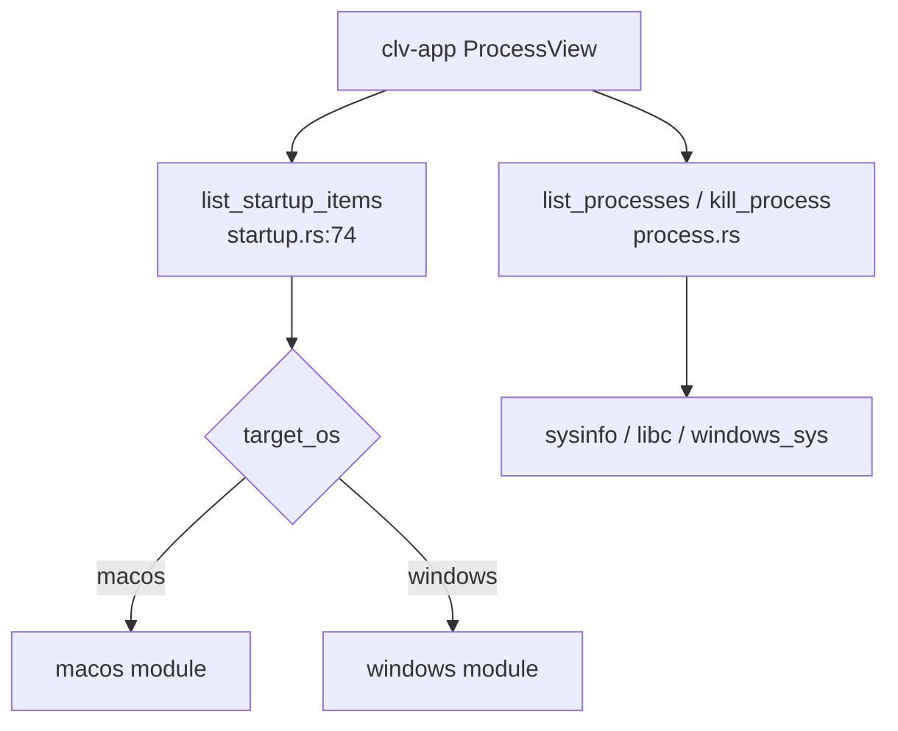

# Platform Domain

**Module path:** `crates/clv-platform/src/`  
**Generated:** 2026-08-22

---

## What This Module Does

`clv-platform` is the OS adapter crate. macOS and Windows differ wildly in how startup items and processes are managed; this crate hides that behind small public functions so `clv-app` never imports `winreg` or `launchctl` directly. Linux support is partial—startup listing returns empty on non-macOS/non-Windows targets.

---

## Process Module (`process.rs`)

### Capabilities
- List processes with CPU/memory via sysinfo (`process.rs:60-64`).
- Reusable `ProcessEnumerator` avoids reallocating `System` on each poll (`process.rs:43-58`).
- Kill by PID: Unix uses `/bin/kill -9` then `libc::kill` with process group (`process.rs:115-146`); Windows uses `TerminateProcess` (`process.rs:149-187`).
- Category heuristics: System, User, Dev, Agent (`process.rs:189-206`).

### Key Types
| Type | Path | Role |
|------|------|------|
| `ProcessInfo` | `process.rs:34` | pid, name, cpu, memory, category |
| `ProcessSort` | `process.rs:8` | Memory, Cpu, Name ordering |
| `kill_process` | `process.rs:102` | Platform dispatch |

Filters zombie/dead processes from listings (`process.rs:66-68`).

---

## Startup Module (`startup.rs`)

### Public API
- `list_startup_items()` — Platform dispatch (`startup.rs:74-87`)
- `set_startup_enabled(id, enabled)` — Toggle (`startup.rs:89-103`)

### macOS (`startup.rs:106-321`)
- Scans `~/Library/LaunchAgents`, `/Library/LaunchAgents`
- Parses login items via osascript System Events (`startup.rs:172-198`)
- Disable LaunchAgent: rename to `.plist.disabled`, launchctl bootout (`startup.rs:253-297`)
- Disable login item: osascript delete—requires Automation permission (`startup.rs:299-320`)

### Windows (`startup.rs:323-560`)
- Registry Run/RunOnce keys HKCU + HKLM (`RUN_SOURCES` at `startup.rs:347-383`)
- User and common Startup folders (`startup.rs:418-441`)
- Enable/disable via `StartupApproved` registry binary—Task Manager compatible (`startup.rs:499-508`)

---

## Internal Architecture

---

## Interaction With Other Modules

| Caller | API | Context |
|--------|-----|---------|
| `AppStore::kill_process_pid` | `kill_process` | `state.rs:120` |
| `AppStore::start_scan` (on done) | `list_startup_items` | `state.rs:306` |
| `StartupView` | `set_startup_enabled` | Toggle UI |

---

## Role in Core Business Flows

**Startup management:** Independent of scan—user toggles items from Startup sidebar.

**Process kill:** Supplementary utility for freeing RAM; not tied to cleanup pipeline.

---

## Testing

`process.rs` kill tests spawn `sleep 999` and verify exit (`process.rs:214-245`).

Windows `approval_roundtrip` test writes/deletes StartupApproved entries (`startup.rs:545-558`).

---

## Implementation Highlights

Windows startup disable does not delete Registry Run values—it flips approval flags so items remain but don't launch—mirrors Task Manager behavior.

macOS LaunchAgent enable only calls `launchctl enable` without bootstrap—to avoid immediately running disabled agents (`startup.rs:272-273` comment).
