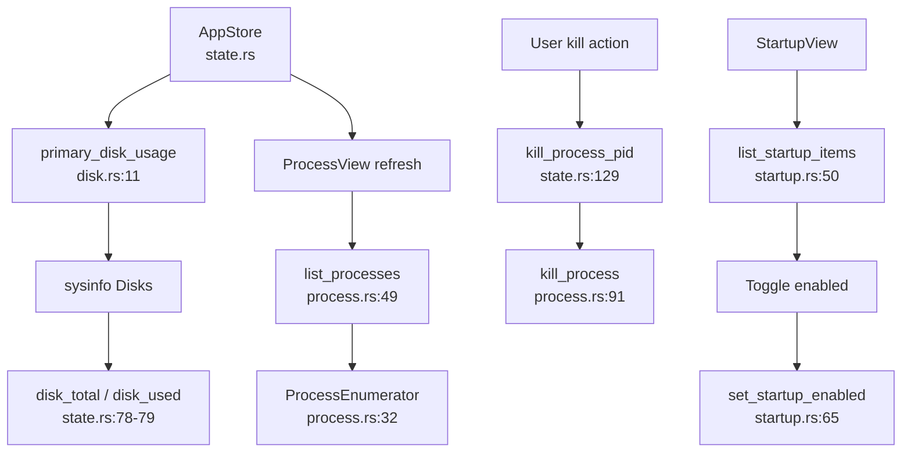

# Platform Domain

**Module path:** `crates/clv-platform/src/`  
**Generated:** 2026-08-26

---

## What This Module Does

The platform crate is CLV3000 Plus's operating-system adapter layer. While `clv-core` stays portable and UI-agnostic, this module talks to macOS and Windows APIs for disk capacity, process enumeration, process termination, and startup item management. It is the bridge between the GPUI app and the machine it runs on—like a localized facilities manager who knows whether boot items live in LaunchAgents or the Registry.

Keeping OS specifics here means `clv-core` never imports `sysinfo` startup quirks or APFS mount-point edge cases. The app crate calls a small, stable public API from `lib.rs`.

---

## Core Capabilities

1. **Primary disk usage** — `primary_disk_usage()` (`disk.rs:11-14`) returns `(total_bytes, used_bytes)` with platform-specific volume selection logic.

2. **macOS APFS handling** — Picks `/System/Volumes/Data` as the user data volume to avoid double-counting APFS container mounts (`disk.rs:32-43`).

3. **Windows multi-drive summation** — Sums all local fixed drive letters, excluding removable and network volumes (`disk.rs:54-71`).

4. **Process listing** — `list_processes(sort)` (`process.rs:49`) returns categorized `ProcessInfo` records via `sysinfo`.

5. **Process termination** — `kill_process(pid)` (`process.rs:91`) sends kill signal to a target PID.

6. **Reusable enumerator** — `ProcessEnumerator` (`process.rs:32`) holds a refreshed `sysinfo::System` instance to avoid repeated allocation on page refresh.

7. **Startup item management** — `list_startup_items()` and `set_startup_enabled(id, enabled)` (`startup.rs:50-65`) wrap macOS LaunchAgents/Login Items and Windows Registry entries.

---

## Key Components

| Component | File path | Responsibility |
|-----------|-----------|----------------|
| `primary_disk_usage` | `disk.rs:11` | Total/used bytes for dashboard |
| `disk_usage_from_disks` | `disk.rs:17-28` | Platform-specific disk aggregation |
| `primary_disk_target` | `disk.rs:32-43` | macOS user data volume selection |
| `sum_local_fixed_disks` | `disk.rs:54-71` | Windows drive letter summation |
| `ProcessEnumerator` | `process.rs:32-46` | Cached sysinfo System instance |
| `list_processes` | `process.rs:49` | Sorted process list with categories |
| `kill_process` | `process.rs:91` | Terminate process by PID |
| `ProcessInfo` | `process.rs` | Name, PID, memory, CPU, category |
| `list_startup_items` | `startup.rs:50` | Enumerate boot/login items |
| `set_startup_enabled` | `startup.rs:65` | Toggle startup item on/off |
| `StartupItem` | `startup.rs` | Id, name, kind, impact, enabled state |

---

## Internal Data Flow



**Key steps**

1. **Disk refresh** — `AppStore` spawns `std::thread` calling `primary_disk_usage`, then updates via `weak.update` (`state.rs:154-167`).
2. **Process page** — `ProcessView` calls `list_processes` with sort order; `ProcessEnumerator` reused across refreshes.
3. **Kill workflow** — `kill_process_pid` spawns thread, calls `kill_process`, increments `process_refresh_trigger` (`state.rs:129-151`).
4. **Startup page** — `StartupView` lists items; toggle calls `set_startup_enabled` then reloads list.

---

## Key Interfaces and Extension Points

**Public API** (`crates/clv-platform/src/lib.rs`)

```rust
pub fn primary_disk_usage() -> Option<(u64, u64)>;
pub fn list_processes(sort: ProcessSort) -> Vec<ProcessInfo>;
pub fn kill_process(pid: u32) -> anyhow::Result<()>;
pub struct ProcessEnumerator { /* ... */ }
pub fn list_startup_items() -> Vec<StartupItem>;
pub fn set_startup_enabled(id: &str, enabled: bool) -> anyhow::Result<()>;
```

**Linux limitations** — Startup APIs return empty lists and bail on toggle (`startup.rs:59-78`). Process and disk APIs still work via `sysinfo`.

**No direct UI dependency** — Platform crate has no GPUI imports; safe to test headlessly.

---

## Interactions With Other Modules

| Module | Direction | Interface | Notes |
|--------|-----------|-----------|-------|
| AppStore | caller | `primary_disk_usage`, `kill_process` | Disk stats and process kill |
| Views | caller | `list_processes`, `list_startup_items` | Process and Startup pages |
| clv-core | none | — | Core crate does not depend on platform |
| clv-app | dependency | `Cargo.toml` depends on `clv-platform` | Only app layer uses OS APIs |

---

## Role in Core Business Flows

**Dashboard health display** — Disk used percentage (`state.rs:181-187`) comes from `primary_disk_usage` refreshed after scan completion and on app init.

**System maintenance flows** — Startup and Process pages are separate from scan/cleanup but share the same `AppStore` navigation model (`AppPage::Startup`, `AppPage::Process`).

**Not in scan path** — Scanner and cleanup in `clv-core` use `walkdir` and `std::fs` directly; platform crate is not involved in filesystem walks.

---

## Performance Considerations

- `ProcessEnumerator` reuses one `sysinfo::System`—avoids allocating a new System per list refresh.
- Disk query runs on background thread—never blocks GPUI render loop.
- Windows disk summation filters zero-total and removable drives to avoid bogus totals.
- Startup enumeration is on-demand when user navigates to Startup page—not at app launch.

---

## Implementation Highlights

**APFS double-count prevention** — macOS exposes `/` and `/System/Volumes/Data` for the same container; summing both would inflate capacity. `primary_disk_target` selects the Data volume (`disk.rs:32-43`).

**Windows drive letter filter** — `is_windows_drive_letter` (`disk.rs:75-80`) ensures only `C:\`-style fixed mounts are summed.

**Cross-platform process categories** — `ProcessCategory` enum groups processes for UI filtering (system, user, background, etc.).

**Startup impact labels** — `StartupImpact` (High/Medium/Low) helps users prioritize which boot items to disable.
