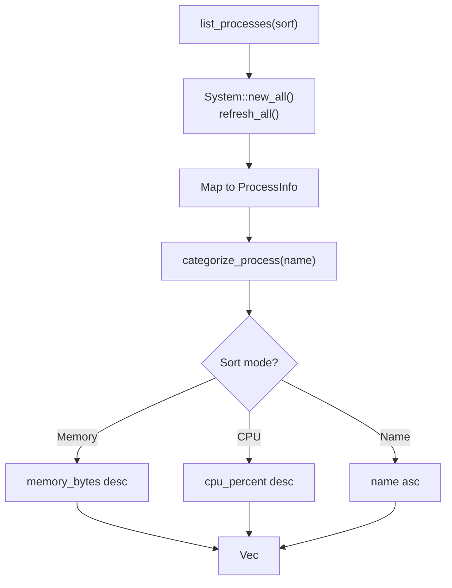

# Platform Process Domain

**Module Path**: `crates/clv-platform/src/process.rs`
**Generated Date**: 2026-08-20

---

## Overview

The Process module is the system's "health monitor" -- it snapshots every running process and presents them sorted by resource usage. It's like embedding Activity Monitor directly in the cleanup tool, so users can see which processes are hogging resources while deciding what to clean.

Processes are categorized into four groups (System, User, Dev, Agent) based on name patterns, helping users quickly identify dev-related processes versus system processes they shouldn't touch.

---

## Core Functionality

1. **Process Enumeration** -- Uses sysinfo to snapshot all running processes with PID, name, CPU usage, and memory.

2. **Process Categorization** -- Dev (cargo, node, gradle, java, python, cursor, claude, etc.), Agent ("agent", "workbuddy"), System (kernel, launchd, svchost), User (everything else).

3. **Sorting** -- Three modes: by memory (default), by CPU, or by name.

4. **Process Termination** -- Sends SIGTERM by PID with confirmation dialog.

---

## Key Components

| Component / Type | File Path | Responsibility |
|-----------------|-----------|---------------|
| `ProcessSort` | `crates/clv-platform/src/process.rs:4` | Sort mode enum |
| `ProcessCategory` | `crates/clv-platform/src/process.rs:12` | Classification enum |
| `ProcessInfo` | `crates/clv-platform/src/process.rs:31` | Process data struct |
| `list_processes()` | `crates/clv-platform/src/process.rs:39` | Snapshot and sort |
| `kill_process()` | `crates/clv-platform/src/process.rs:71` | Terminate by PID |
| `categorize_process()` | `crates/clv-platform/src/process.rs:85` | Name-based classification |

---

## Internal Data Flow

---

## Interactions with Other Modules

| Interaction Module | Direction | Interface | Description |
|-------------------|-----------|-----------|-------------|
| views (process.rs) | Called by | `list_processes()`, `kill_process()` | UI triggers |
| app (state.rs) | Triggers | `refresh_processes()` | Tick to force re-render |

---

## Implementation Highlights

The `categorize_process()` keyword list categorizes `node` as "Dev" even though it could be a production server. This is the right tradeoff for a developer utility tool. The kill confirmation dialog shows the PID specifically (not just the name) because multiple processes can share names.
