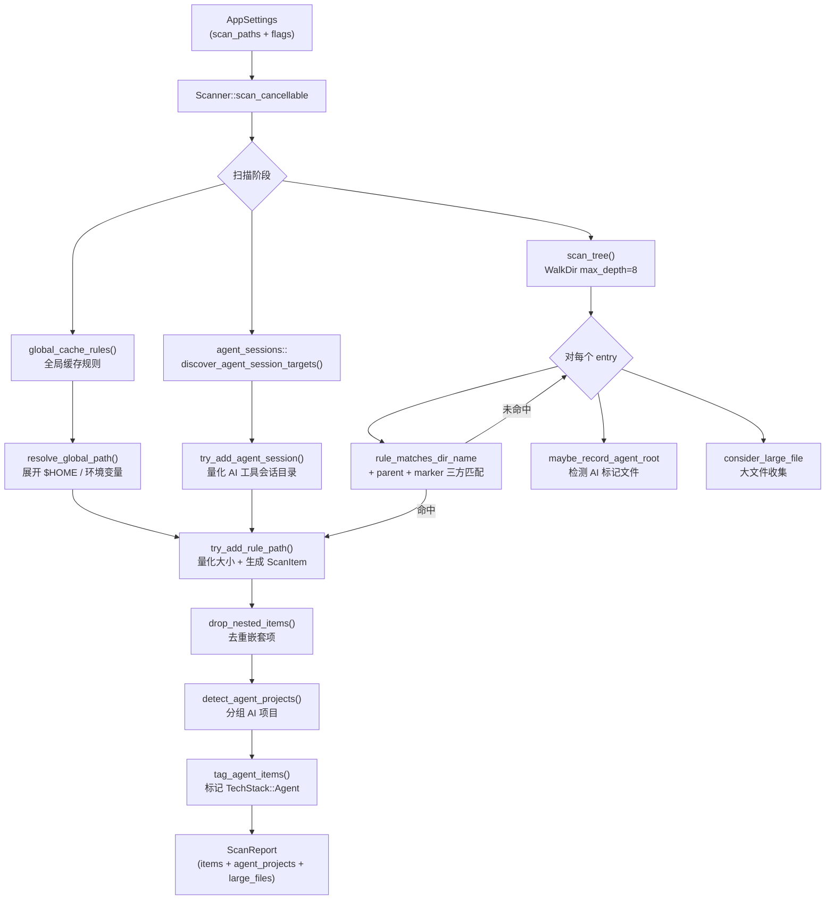

# Scanner — 系统扫描引擎

## 这个模块在做什么

Scanner 是 CLV3000 Plus 的"环卫清运车"。如果说用户的硬盘是一座城市，那 Scanner 就是那辆每天准时出发、按既定路线巡查每条街道的垃圾清运车。它不会自行判断什么是垃圾——而是严格依据 settings 模块提供的"法规清单"（`CleanupRule`），逐目录、逐文件地巡查，发现匹配项就贴上标签、量好体积，装车等候处理。

它的工作模式类似于快递公司的分拣系统：从用户配置的扫描根目录出发，用 `WalkDir`（最大深度 8 层）递归遍历整个文件树。每遇到一个目录名，就和 60+ 条项目规则（`project_rules()`）做三方匹配——名称匹配（`rule_matches_dir_name`）、父目录匹配（`rule_matches_parent`）、标记文件匹配（`rule_matches_marker`）。只有三项全部通过，才会将该路径纳入清理候选。这种"三重验证"机制相当于快递分拣时要核对运单号、收件人、发件地址三者一致才确认投递，极大降低了误判率。

除了项目级规则，Scanner 还会主动扫描用户主目录下的全局缓存（`global_cache_rules()`）和 AI 编程工具的会话目录（`discover_agent_session_targets()`）。扫描完成后，它调用 `drop_nested_items()` 去重——如果 `node_modules` 整个目录已被选中，其下的 `.cache` 子目录就不再重复列出。最终产出一份结构化的 `ScanReport`，包含所有候选清理项、AI 项目检测结果、大文件列表和扫描元数据。

## 核心功能点

1. **规则驱动的目录遍历** — 使用 `WalkDir`（`max_depth=8`）遍历用户配置的每个扫描根目录，结合 `project_rules()` 中定义的 60+ 条静态规则进行三方匹配（名称、父目录、标记文件），确保只有符合特定技术栈上下文的目录才会被标记为清理候选。
2. **全局缓存扫描** — 调用 `global_cache_rules()` 获取 Rust、Node、Python、Go 等工具的全局缓存路径（如 `.cargo/registry/cache`、`.npm/_cacache`），通过 `resolve_global_path()` 展开环境变量后逐一检查并量化大小。
3. **AI 工具会话检测** — 当 `include_agent_heuristics` 启用时，调用 `agent_sessions::discover_agent_session_targets()` 发现 Cursor、Claude、Codex、Windsurf、Trae 等 10+ 种 AI 编程工具的会话和缓存目录，为每个目标计算大小并生成 `ScanItem`。
4. **嵌套项剪枝** — `drop_nested_items()` 函数对扫描结果按路径排序后线性扫描，自动移除已被父目录覆盖的子项（如 `target/debug` 在 `target` 下），避免用户对同一批文件重复操作。
5. **进度节流回调** — `ProgressThrottle` 结构体将高频进度回调限制在 300ms 间隔内，既保证 UI 流畅更新，又不会因为每秒数百次回调拖慢扫描速度。
6. **可取消扫描** — `scan_cancellable()` 方法接受 `AtomicBool` 取消标志，在遍历、大小计算、规则匹配等每个关键节点检查取消状态，确保用户随时可以中断扫描而不会产生不一致状态。
7. **目录大小精确计算** — `dir_size()` / `dir_size_dir()` 使用栈式迭代（非递归）遍历目录，单目录最多处理 100,000 个条目后标记 `sizes_truncated`，防止超大目录卡住扫描。
8. **活跃项目保护** — `is_likely_active_project()` 检查项目根目录的最后修改时间，若 3 天内有活动则将风险等级从 `Safe` 提升为 `Caution`，避免误删正在开发中的项目。
9. **大文件发现** — 扫描过程中调用 `large_files::consider_large_file()` 记录超阈值的单个文件，与目录级清理项并行收集，丰富清理报告的信息维度。
10. **macOS iCloud 路径过滤** — `is_inaccessible_path()` 检测 `.icloud` 和 `com~apple~CloudDocs` 路径并跳过，避免尝试统计无法直接访问的 iCloud 云端文件。

## 关键组件

| 组件/类型 | 文件路径 | 一句话职责 |
|-----------|----------|-----------|
| `Scanner` | `crates/clv-core/src/scanner.rs:46` | 扫描引擎主体，持有 `AppSettings` 并驱动整个扫描流程 |
| `ScanReport` | `crates/clv-core/src/models.rs:122` | 扫描结果的完整快照，包含候选项、AI 项目、大文件和元数据 |
| `ScanProgress` | `crates/clv-core/src/models.rs:162` | 扫描进度事件，包含当前阶段、路径、已发现项数和字节数 |
| `MIN_SCAN_ITEM_BYTES` | `crates/clv-core/src/scanner.rs:21` | 1MB 阈值常量，低于此大小的命中项被静默忽略 |
| `ProgressThrottle` | `crates/clv-core/src/scanner.rs:23` | 节流包装器，将高频回调限制在 300ms 间隔 |
| `CleanupRule` | `crates/clv-core/src/settings/rule.rs:7` | 清理规则定义，含路径模式、技术栈、风险等级和匹配条件 |
| `rule_matches_dir_name` | `crates/clv-core/src/scanner.rs:540` | 判断目录名是否匹配规则的路径模式（精确匹配或前缀/后缀通配） |
| `drop_nested_items` | `crates/clv-core/src/scanner.rs:514` | 路径排序后线性扫描，移除嵌套在已选目录内的子项 |
| `detect_project_stacks` | `crates/clv-core/src/scanner.rs:644` | 根据项目根目录下的标记文件推断技术栈列表 |

## 内部数据流

## 关键接口与扩展点

- **`Scanner::scan(on_progress)`** — 主入口，接受进度回调，返回完整 `ScanReport`。非可取消版本，适用于不需要中断的场景。
- **`Scanner::scan_cancellable(on_progress, cancel)`** — 可取消版本，`cancel` 为 `AtomicBool` 引用，可在任意扫描阶段中断。UI 层通过 `AppStore::cancel_scan()` 设置此标志。
- **`rule_matches_dir_name` / `rule_matches_parent` / `rule_matches_marker`** — 三个公开的匹配函数，构成规则匹配管线。新增匹配维度只需添加新函数并在 `scan_tree()` 中调用。
- **`detect_project_stacks(root)`** — 公开的项目技术栈推断函数，可根据项目根目录的标记文件返回 `Vec<TechStack>`。可供 Agent 模块复用。
- **`MIN_SCAN_ITEM_BYTES`** — 可调整的噪声过滤阈值。调小可发现更多小文件，调大可加速大型扫描。

## 与其他模块的交互

| 交互模块 | 交互内容 | 说明 |
|----------|----------|------|
| `settings` | `project_rules()`, `global_cache_rules()`, `AppSettings` | Scanner 的全部规则来源；扫描路径、专家模式等配置项 |
| `models` | `ScanItem`, `ScanReport`, `TechStack`, `RiskLevel` | 扫描产物的数据结构定义 |
| `agent` | `detect_agent_projects()` | 扫描完成后调用，将候选项分组为 `AgentProject` |
| `agent_sessions` | `discover_agent_session_targets()` | 提供 AI 工具会话目录列表，Scanner 负责量化并生成 `ScanItem` |
| `large_files` | `consider_large_file()`, `finalize_large_files()` | 扫描过程中并行收集大文件信息 |
| `paths` | `is_scan_skip_dir()`, `is_protected_system_path()` | 跳过不应扫描的系统目录和受保护路径 |
| `locale` | `resolve_language()`, `scan_phase_*()` | 根据用户语言偏好生成多语言进度阶段描述 |

## 跨模块协作场景

**场景一：完整扫描流程**
用户点击"开始扫描"后，`AppStore::start_scan()` 通过 `spawn_scan()` 在后台线程启动 `Scanner::scan_cancellable()`。扫描过程中，`ProgressThrottle` 每 300ms 向 UI 发送进度更新。扫描完成后，`ScanReport` 被传回 UI 层，由 `AppStore` 保存到磁盘（`save_last_scan`）并自动勾选所有 `Safe` 级别项。

**场景二：扫描中断与重启**
用户在扫描过程中点击"取消"，`AppStore::cancel_scan()` 设置 `AtomicBool` 标志。Scanner 在下一个检查点（遍历 entry、大小计算、规则匹配）感知到取消信号后立即返回。如果用户在取消后又发起新扫描，`scan_restart_pending` 标志确保当前扫描停止后自动重启。

**场景三：AI 项目识别增强**
扫描器在遍历过程中通过 `maybe_record_agent_root()` 收集发现的 AI 标记文件父目录。扫描完成后，这些路径连同候选项一起传给 `detect_agent_projects()`，后者根据名称模式和不活跃天数判定哪些应归类为 AI 项目，最终由 `tag_agent_items()` 将对应项的 `stack` 字段改为 `TechStack::Agent`。

## 性能考量

- **WalkDir 深度限制**：`max_depth=8` 防止在深层嵌套目录（如 `node_modules` 内部）浪费时间，典型项目在 3-4 层内即可覆盖所有清理目标。
- **大小计算条目上限**：`DIR_SIZE_MAX_ENTRIES = 100,000`，单目录超过此数量后停止遍历并标记 `sizes_truncated`，防止 `node_modules` 等超大目录占用数十秒。
- **进度回调节流**：`ProgressThrottle` 以 300ms 为最小间隔，避免在 SSD 上每秒触发上千次回调导致 UI 渲染压力。
- **跳过不可访问路径**：macOS 上 iCloud 文件（`.icloud`、`com~apple~CloudDocs`）直接跳过，避免 I/O 阻塞。
- **避免 `canonicalize()`**：路径处理中刻意不使用 `canonicalize()`，因为它在网络挂载点或 iCloud 目录上可能阻塞数秒。
- **栈式迭代替代递归**：`dir_size_dir()` 使用显式栈而非递归遍历，避免深目录导致栈溢出。
- **LazyLock 延迟初始化**：`project_rules()` 和 `global_cache_rules()` 使用 `LazyLock` 确保规则表只在首次调用时构建一次，后续调用零开销。
