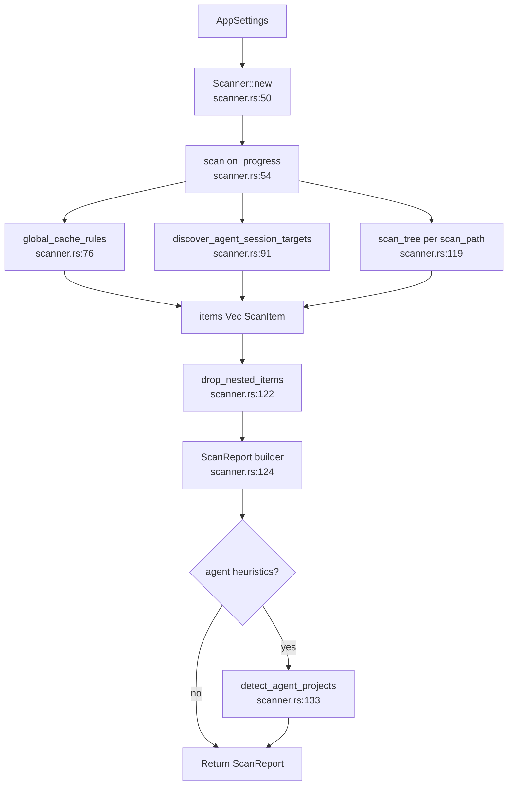

# Scanner Domain

**Module path:** `crates/clv-core/src/scanner.rs`  
**Generated:** 2026-08-26

---

## What This Module Does

The scanner is CLV3000 Plus's inventory system. Before the user can decide what to delete, something has to walk the disk, apply hundreds of stack-specific rules, and return a structured list of reclaimable paths with sizes, risk levels, and human-readable explanations. That is this module's job—it turns a messy filesystem into a `ScanReport` the UI can render.

Without the scanner, the app would be a generic "find large folders" utility. With it, the product understands that `cmake-build-debug` under a C++ project is different from `.rustup/toolchains` under your home directory.

---

## Core Capabilities

1. **Global cache scanning** — Applies `global_cache_rules()` to resolved home and environment paths (`scanner.rs:76-89`), covering Cargo, npm, Gradle, and dozens of other tool caches.

2. **Agent session discovery** — When `include_agent_heuristics` is true, calls `discover_agent_session_targets()` (`scanner.rs:91-100`) for Codex, Claude, Cursor, Windsurf, and related session/cache folders.

3. **Project tree walks** — For each entry in `settings.scan_paths`, runs `scan_tree` (`scanner.rs:103-120`) with depth limits and protected-path guards.

4. **Progress reporting** — `ProgressThrottle` (`scanner.rs:22-42`) limits UI updates to once per 300ms unless forced, keeping GPUI responsive during long walks.

5. **Noise reduction** — Items below `MIN_SCAN_ITEM_BYTES` (1 MB, `scanner.rs:20`) are ignored; `drop_nested_items` (`scanner.rs:122`) removes child hits already covered by a parent match.

6. **Agent enrichment** — After scan, `detect_agent_projects` and `tag_agent_items` (`scanner.rs:132-136`) link items to trial agent projects.

---

## Key Components

These types and functions form the scanner pipeline from settings input to `ScanReport` output.

| Component | File path | Responsibility |
|-----------|-----------|----------------|
| `Scanner` | `scanner.rs:45-52` | Holds `AppSettings`, exposes `scan()` |
| `ProgressThrottle<F>` | `scanner.rs:22-42` | Debounces progress callbacks |
| `MIN_SCAN_ITEM_BYTES` | `scanner.rs:20` | 1 MB floor for listing items |
| `try_add_rule_path` | `scanner.rs` | Applies one `CleanupRule` to a path |
| `scan_tree` | `scanner.rs` | Walks project roots with rules |
| `rule_matches_dir_name` | `scanner.rs` | Prefix/suffix name patterns |
| `rule_matches_marker` | `scanner.rs` | Validates `requires_marker` rules |
| `is_agent_project_path` | `scanner.rs` | Agent marker detection |
| `drop_nested_items` | `scanner.rs:122` | Prunes nested duplicates |

---

## Internal Data Flow



**Key steps**

1. **Prepare phase** — Emits localized `scan_phase_preparing` (`scanner.rs:65-73`).
2. **Global pass** — Each global rule resolves via `resolve_global_path` (`settings/mod.rs:11`, used in scanner).
3. **Tree pass** — `WalkDir` with project marker detection; rules from `project_rules()` (`settings/project_rules.rs`).
4. **Prune** — Parent `node_modules` subsumes nested `.cache` (verified in `lib.rs:57-93`).

---

## Key Interfaces and Extension Points

**Public API**

```rust
pub struct Scanner {
    settings: AppSettings,
}

impl Scanner {
    pub fn new(settings: AppSettings) -> Self;
    pub fn scan<F>(&self, on_progress: F) -> ScanReport
    where F: FnMut(ScanProgress);
}
```

Defined at `scanner.rs:45-57`.

**Extend detection** — Add `CleanupRule::project(...)` or `CleanupRule::global(...)` in:

- `crates/clv-core/src/settings/global_rules.rs`
- `crates/clv-core/src/settings/project_rules.rs`

Use `.marker()`, `.prefix()`, `.parent()` builders from `rule.rs:63-82`.

---

## Interactions With Other Modules

| Module | Direction | Interface | Notes |
|--------|-----------|-----------|-------|
| Settings | dependency | `AppSettings`, `global_cache_rules`, `project_rules` | Rule source |
| Models | output | `ScanItem`, `ScanReport`, `ScanProgress` | Scan results |
| Agent | output | `detect_agent_projects` | Post-scan grouping |
| Agent sessions | dependency | `discover_agent_session_targets` | Pre-tree agent paths |
| Locale | dependency | `scan_phase_*` helpers | Localized progress strings |
| Services (`clv-app`) | caller | `Scanner::new(settings).scan(...)` | `scan.rs:24-27` |

---

## Role in Core Business Flows

**Health scan flow** — `spawn_scan` constructs `Scanner::new(settings)` and calls `scan` on a worker thread (`services/scan.rs:24-27`). Progress flows to `AppStore` via `ScanPoll::Progress`; completion sets `last_report` (`state.rs:312`).

**Agent page** — Scan output's `agent_projects` field is populated here before `AgentView` reads it (`agent.rs:32-38`).

---

## Performance Considerations

- Walk depth capped in agent root discovery (`agent.rs:24` — `max_depth(8)`).
- Progress throttling avoids flooding the UI channel during fast directory enumeration.
- `seen_paths: HashSet` prevents duplicate entries when multiple rules hit the same path.
- Protected system paths skipped via `is_protected_system_path` (`scanner.rs:104`, `paths.rs`).

---

## Implementation Highlights

**Rule prefix matching** — Supports `cmake-build-*` prefixes and `*.egg-info` suffix patterns (`lib.rs:127-158` tests).

**Sibling build dirs** — Android `build` and `app/build` remain separate items when both match (`lib.rs:96-124`).

**Agent marker dirs** — Hidden folders like `.agents` trigger project root promotion (`lib.rs:338-345`).
