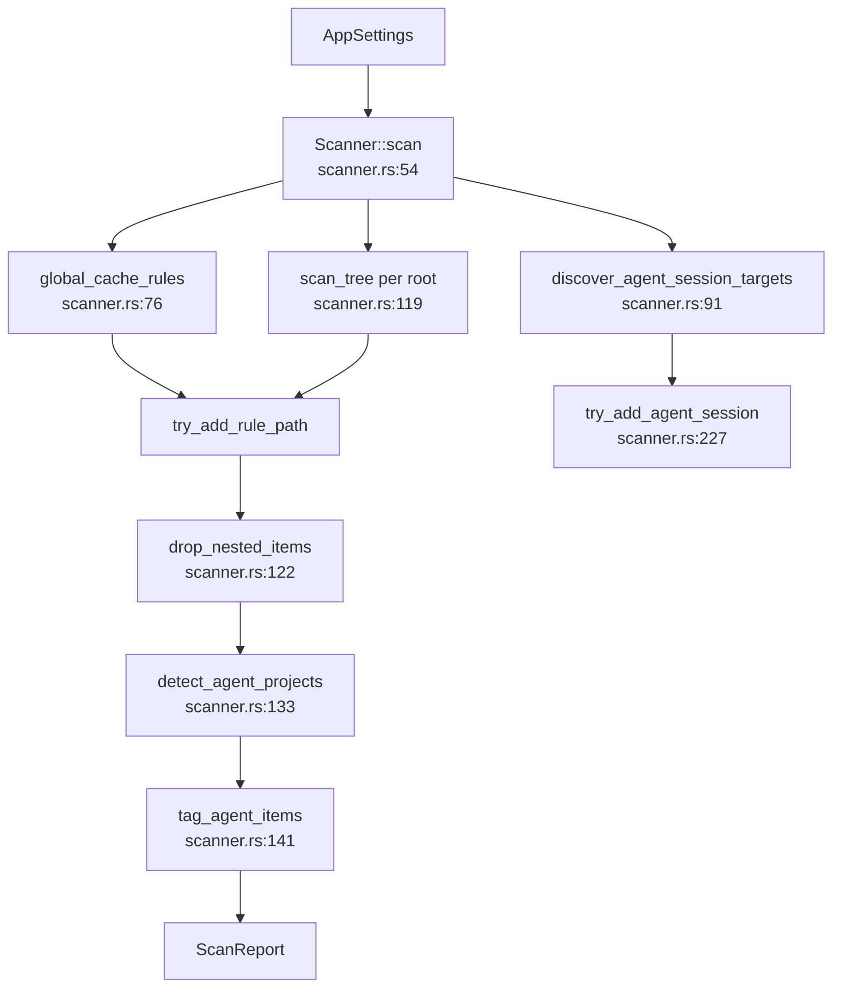

# Scanner Domain

**Module path:** `crates/clv-core/src/scanner.rs`  
**Generated:** 2026-08-23

---

## What This Module Does

The scanner is CLV3000 Plus's inventory system. Before anything can be cleaned, the application must walk the filesystem, measure directories, classify them by tech stack and risk, and attach human-readable rule IDs. `Scanner` orchestrates three passes — global tool caches, agent session directories, and per-root project trees — then prunes nested duplicates and enriches results with agent project metadata. Without this module, the UI would have no `ScanReport` to display.

---

## Core Capabilities

1. **Global cache discovery** — Iterates `global_cache_rules()` and resolves paths via `resolve_global_path` (`scanner.rs:76–89`). Covers Cargo registry, npm cache, Xcode DerivedData, Trae/OpenCode caches, and platform-specific `%LOCALAPPDATA%` paths.

2. **Agent session targets** — When `include_agent_heuristics` is true, calls `discover_agent_session_targets()` (`scanner.rs:91–99`) and adds session/cache dirs from `agent_sessions.rs`.

3. **Project tree matching** — `scan_tree` (`scanner.rs:156`) walks each `scan_paths` root with WalkDir (max depth 8), matching `project_rules()` by directory name, prefix, parent constraint, and project markers (`package.json`, `Cargo.toml`, etc.).

4. **Nested pruning** — `drop_nested_items` (`scanner.rs:122`) removes child hits when a parent directory already matched — e.g. `node_modules/.cache` inside listed `node_modules`.

5. **Agent tagging** — `tag_agent_items` (`scanner.rs:141`) sets `TechStack::Agent` on items whose `project_root` is a detected agent experiment.

6. **Progress throttling** — `ProgressThrottle` (`scanner.rs:22–42`) limits UI updates to 300ms intervals except on forced phase boundaries.

---

## Key Components

The scanner is mostly implemented in one file but depends on settings tables and agent modules for rule data.

| Component | File path | Responsibility |
|-----------|-----------|----------------|
| `Scanner` | `crates/clv-core/src/scanner.rs:45` | Scan orchestrator |
| `ProgressThrottle` | `crates/clv-core/src/scanner.rs:22` | Rate-limits progress callbacks |
| `MIN_SCAN_ITEM_BYTES` | `crates/clv-core/src/scanner.rs:20` | 1MB minimum item size |
| `scan_tree` | `crates/clv-core/src/scanner.rs:156` | Per-root WalkDir + rule loop |
| `try_add_rule_path` | `crates/clv-core/src/scanner.rs` | Size check, dedup, ScanItem push |
| `is_agent_project_path` | `crates/clv-core/src/scanner.rs` | Agent marker heuristics |
| `project_rules` | `crates/clv-core/src/settings/project_rules.rs` | In-project rule table |
| `global_cache_rules` | `crates/clv-core/src/settings/global_rules.rs` | Global cache rule table |

---

## Internal Data Flow

**Step notes:**
1. `scan_phase_preparing` — Localized progress string from `locale.rs` (`scanner.rs:65–73`).
2. `prune_roots` RefCell — Skips re-scanning inside already-matched directories (`scanner.rs:168–178`).
3. `seen_paths` HashSet — Prevents duplicate `ScanItem` entries for the same path.

---

## Interfaces and Extension Points

New cleanup targets are added by extending `CleanupRule` tables in settings — not by editing scanner control flow. Pattern from `AGENTS.md`:

- Add rule in `project_rules.rs` / `global_rules.rs`
- Add `RuleDescription` translation in JSON
- Run `generate-rule-descriptions.py --patch`

Scanner matching functions: `rule_matches_dir_name`, `rule_matches_marker`, `rule_matches_parent`.

---

## Cross-Module Interactions

| Module | Direction | Interface | Notes |
|--------|-----------|-----------|-------|
| settings | depends | `CleanupRule`, `AppSettings` | Rule source |
| agent | depends | `detect_agent_projects` | Post-scan enrichment |
| agent_sessions | depends | `AgentSessionTarget` | Session pass |
| models | produces | `ScanItem`, `ScanReport` | Output types |
| app-store | consumed by | `spawn_scan` → `Scanner::new` | Worker thread |

**In scan workflow** — `services/scan.rs:24` constructs `Scanner::new(settings)` and passes progress to mpsc channel.

---

## Performance Considerations

- Blocking walk on worker thread — UI stays responsive via `poll_scan`.
- Depth limit 8 — bounds runaway trees under deep `node_modules`.
- `should_skip_dir` — skips `.git`, VCS internals, and known noise dirs.
- Size threshold 1MB — reduces list clutter for tiny caches.

---

## Implementation Highlights

- **Unit tests in `lib.rs`** — `scanner_prunes_nested_cleanup_inside_matched_parent` validates nested pruning behavior (`lib.rs:57–93`).
- **Protected path guard** — `is_protected_system_path` at scan entry (`scanner.rs:104`, `scanner.rs:182`).
- **Locale-aware phases** — `scan_phase_scanning_path`, `scan_phase_agent_sessions` for trilingual progress UI.
